# Maven开发笔记

## 学习内容 

## 1.Maven概述

## 2.Maven基本使用

## 3.Maven基本命令

## 4.Maven与开发工具的集成

## 5.聚合工程和父子工程

## 6.Maven私服

# 一. Maven概述

## 1. 什么是Maven

- Maven是一个项目管理工具，主要用来做项目构建
- 项目构建的概念
    - 项目有生命周期：可行性分析-->需求分析-->概要设计-->详细设计-->编码-->测试-->部署-->试运行
    - 一组标准工作集合
- 基于**项目对象模型**（POM Project Object Model）
    - Maven可以通过一小段描述信息（pom.xml）来管理项目的构建
- 基于项目依赖管理系统（Dependency Management System）
    - 自动导包
- Maven 除了以程序构建能力为特色之外，还提供高级项目管理工具。由于 Maven 的缺省构建规则有较高的可重用性，所以常常用两三行 Maven 构建脚本就可以构建简单的项目。由于 Maven 的面向项目的方法，许多 Apache Jakarta 项目发文时使用 Maven，而且公司项目采用 Maven 的比例在持续增长。
- Maven这个单词来自于意第绪语（犹太语），意为知识的积累，最初在Jakata Turbine项目中用来简化构建过程。当时有一些项目（有各自Ant build文件），仅有细微的差别，而JAR文件都由[CVS](https://baike.baidu.com/item/CVS)来维护。于是希望有一种标准化的方式构建项目，一个清晰的方式定义项目的组成，一个容易的方式发布项目的信息，以及一种简单的方式在多个项目中共享JARs

## 2. Maven的概述

### 2.1 官网

- https://maven.apache.org/

```markdown
Maven, a [Yiddish word](https://en.wikipedia.org/wiki/Maven) meaning *accumulator of knowledge*, began as an attempt to simplify the build processes in the Jakarta Turbine project. There were several projects, each with their own Ant build files, that were all slightly different. JARs were checked into CVS. We wanted a standard way to build the projects, a clear definition of what the project consisted of, an easy way to publish project information and a way to share JARs across several projects.
The result is a tool that can now be used for building and managing any Java-based project. We hope that we have created something that will make the day-to-day work of Java developers easier and generally help with the comprehension of any Java-based project.
```

### 2.2 Maven目标

```markdown
Maven’s primary goal is to allow a developer to comprehend the complete state of a development effort in the shortest period of time. In order to attain this goal, there are several areas of concern that Maven attempts to deal with:

Making the build process easy
Providing a uniform build system
Providing quality project information
Providing guidelines for best practices development
Allowing transparent migration to new features
```

- 自动导入第三方jar包，能够解决包的版本的冲突
- 自动编译、测试、打包、安装
- 提供了大量的插件
- 父子工程和聚合工程符合当今分布式和微服务开发的架构思想


## 3. Maven基本工作原理

​     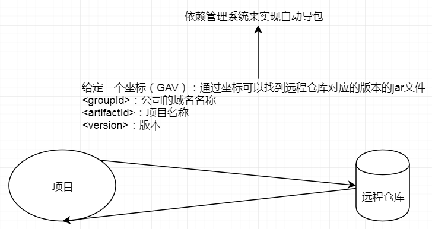


## 4. Maven体系结构

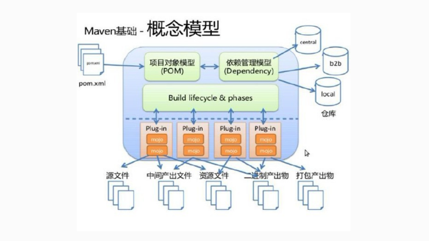

- POM（项目对象模型）：描述了坐标以及插件...
- Dependency Management System：
- Build Lifecycle
- Plug-in
- 生成的文件以及报表等


# 二. Maven的基本使用

## 2.1 Maven的安装

### 2.1.1 下载

- https://maven.apache.org/download.cgi

### 2.1.2 安装

- 解压下载的文件

​      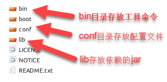

- 配置环境变量（重点）
    - 配置MAVEN_HOME：D:\Program Files\apache-maven-3.5.4
    - 配置PATH：D:\Program Files\apache-maven-3.5.4\bin

- 测试环境变量是否配置成功

​      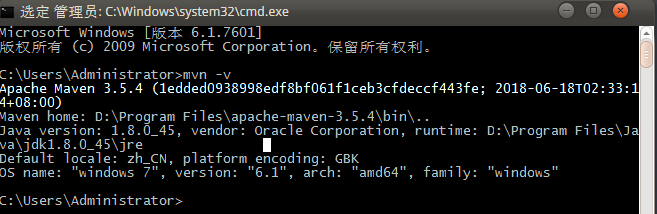


## 2.2 Maven的仓库

- 本地仓库
    - 用来存储从远程仓库或中央仓库下载的jar文件
    - 项目优先查找本地仓库
- 远程仓库（remote repository）
    - 如果本地仓库没有jar或插件，那么就从远程仓库下载
    - 远程仓库可以是在同一个局域网内也可以是外网

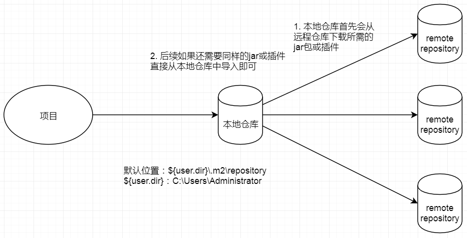

- 中央仓库（central repository）

    - Maven库
    - 服务于整个互联网，由Maven团队成员来管理
    - https://repo1.maven.org/maven2
    - ...

- 配置本地库（重点）

    - 将原有的repository.rar文件解压
    - 找到D:\Program Files\apache-maven-3.5.4\conf下的文件settings.xml文件
    - 修改settings.xml文件

    ​      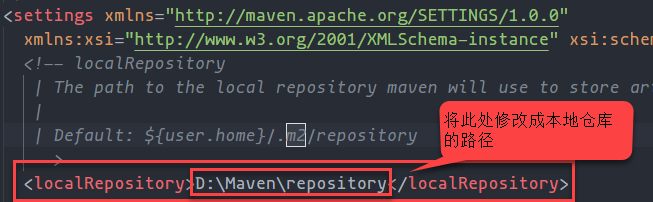

    - 添加一个阿里云镜像（加速）

        ```xml
        <repository>  
            <id>alimaven</id>
            <name>aliyun maven</name>
            <url>http://maven.aliyun.com/nexus/content/groups/public/</url>
        </repository>
        ```

    - 全局配置和用户配置

        - 全局配置：所有的项目都使用settings.xml文件中指定的仓库
        - 用户配置：仅仅这个项目使用这个本地库，其他项目不一定使用
            - D:\Program Files\apache-maven-3.5.4\conf\settings.xml文件拷贝一份到${user.dir}/.m2/下
            - 再进行上述的修改
        - Maven首先找用户配置，如果找到则使用，如果没有找到则使用全局配置

# 三. Maven基本命令 

## 3.1 Maven项目的基本结构

​         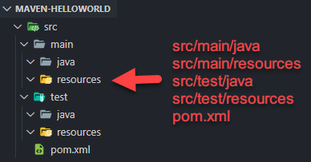

## 3.2 编写pom.xml

```xml
<?xml version="1.0" encoding="UTF-8"?>
<project xmlns="http://maven.apache.org/POM/4.0.0" 
    xmlns:xsi="http://www.w3.org/2001/XMLSchema-instance" xsi:schemaLocation="http://maven.apache.org/POM/4.0.0 http://maven.apache.org/xsd/maven-4.0.0.xsd">

    <modelVersion>4.0.0</modelVersion>

    <groupId>com.bjlemon</groupId>
    <artifactId>maven-helloworld</artifactId>
    <version>1.0-SNAPSHOT</version>

    <dependencies>
        <dependency>
            <groupId>junit</groupId>
            <artifactId>junit</artifactId>
            <version>4.12</version>
            <scope>test</scope>
        </dependency>
    </dependencies>
</project>
```

## 3.3 编写程序

```java
package com.bjlemon.maven;

public class Helloworld {

    public String sayHello(String content) {
        return "Helloworld " + content;
    }
}
```

## 3.4 编写测试

```java
package com.bjlemon.maven.test;

import com.bjlemon.maven.Helloworld;
import org.junit.*;

public class HelloworldTest {

    @Test 
    public void testSayHello() {
        Helloworld helloworld = new Helloworlod();
        String result = helloworld.sayHello("Maven");
        System.out.println(result);
    }
}
```

## 3.5 Maven命令构建项目

### 3.5.1 编译命令

```shell
mvn compile
```

 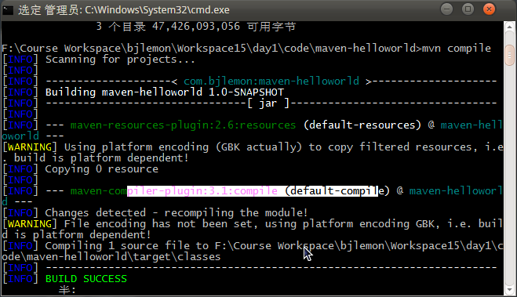

- 成功后会在工程下生成一个target文件夹


### 3.5.2 清除命令

```shell
mvn clean
```

 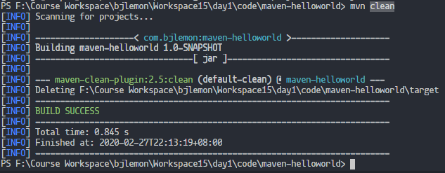

### 3.5.3 单元测试命令

```shell
mvn test
```

 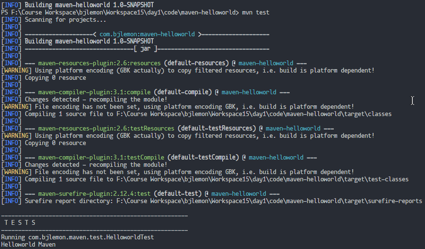

### 3.5.4 打包命令

```shell
mvn package
```

 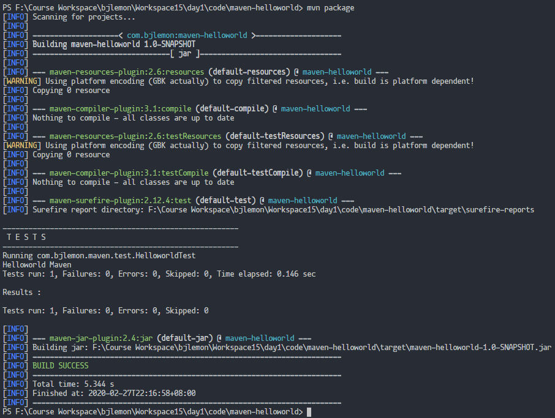

### 3.5.5 安装命令

```shell
mvn install
```

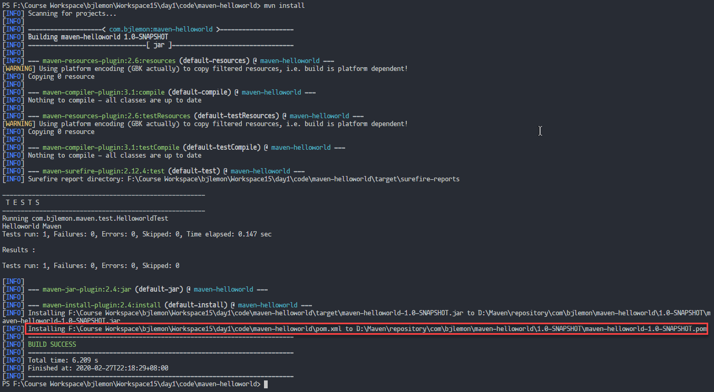

### 3.5.6 组合命令

```shell
mvn clean install
```

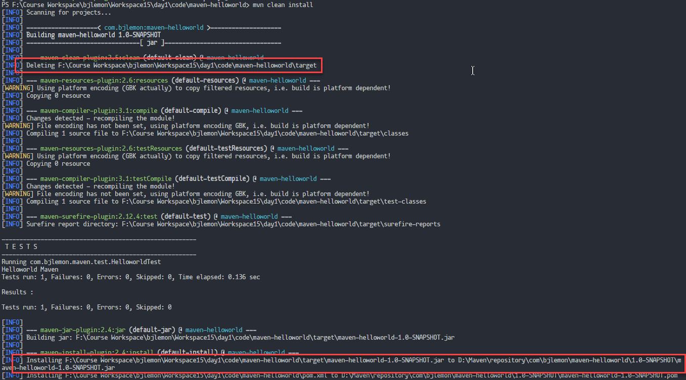

# 四.Maven与开发工具的集成

## 4.1 Maven与Eclipse集成（了解）

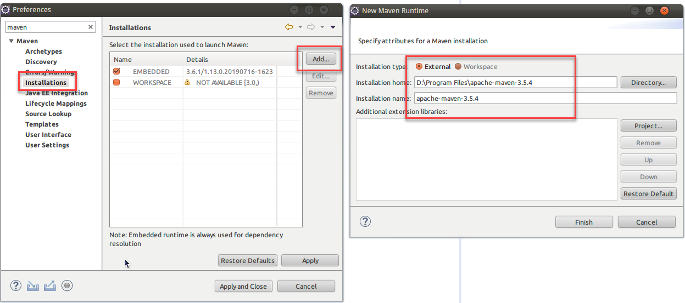

 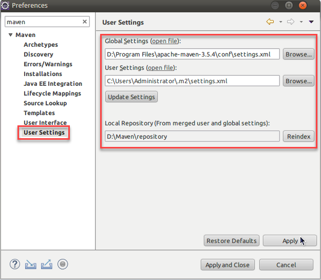

## 4.2 Maven与IDEA集成

### 4.2.1 设置默认配置

 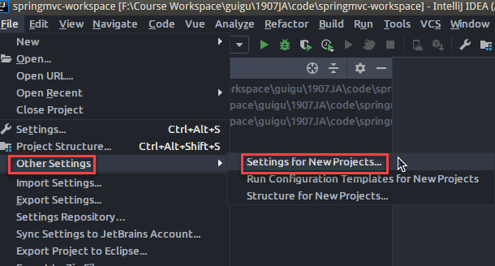

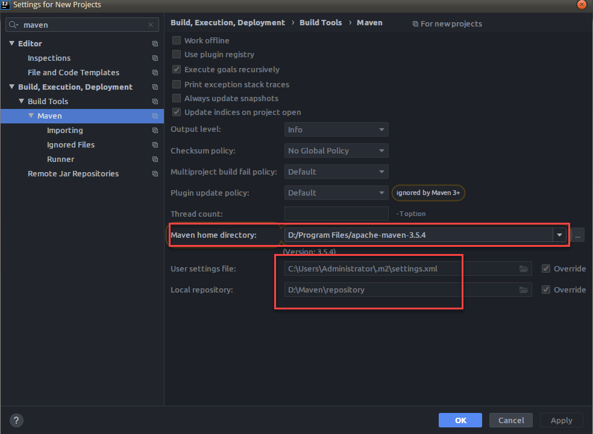

- 设置VM options（-DarchetypeCatalog=internal）

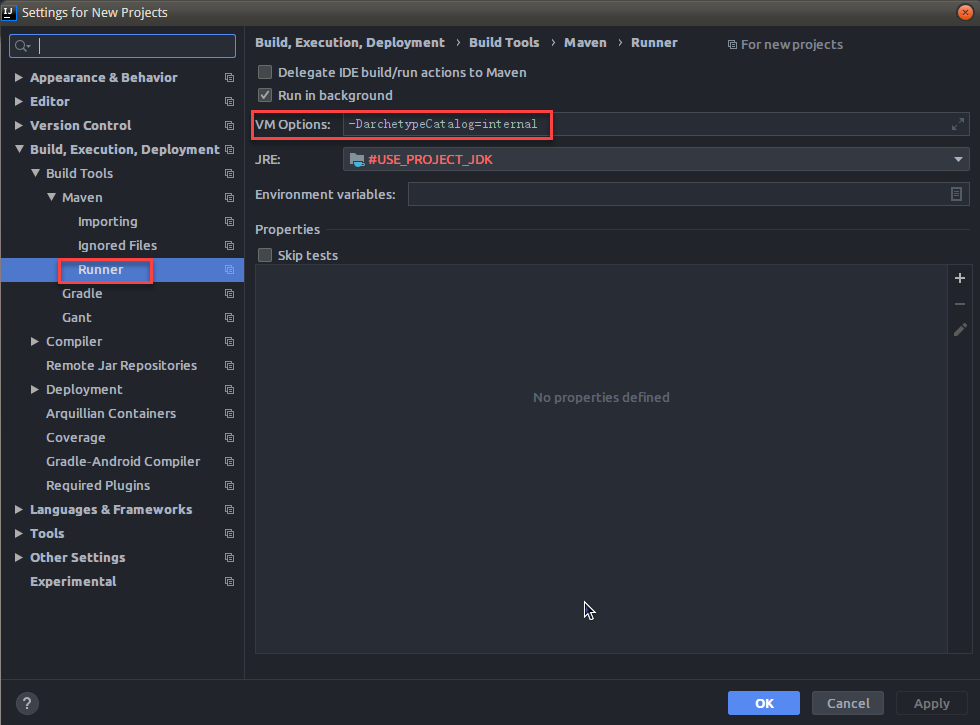

- 装上插件Maven Helper


# 五. 父子工程和聚合工程（重点 SSM）

## 5.1 父子工程

- 项目中包很多，版本很乱，那么开发时很容易出现包的版本冲突问题
- Maven有种机制，能够将包的版本进行统一管理。父子工程就是用来进行包的版本控制。
- **父子工程必须满足打包方式为pom**
- 父子工程将项目中所用到的所有的包进行了统一的版本管理，那么子工程继承父工程，当子工程用到哪个包还是需要将坐标显示写出，但是就不用再写版本。
- 父工程不需要编写任何java代码，因此可以将src文件夹删掉

​      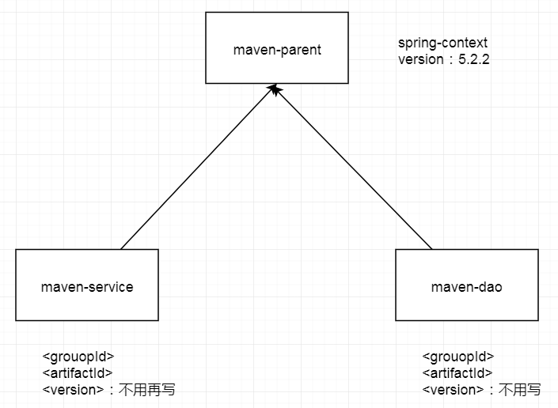


## 5.2 聚合工程

- 项目的拆分，各自完成工程的功能，但是最终需要将各个工程整合在一起才能运行
- mall-dao(jar)，mall-service(jar)，mall-web(war)...
- 项目的整合需要将上述三个工程整合在一起（Maven有这个聚合的能力）
- 每一个工程的配置文件最终进行整合，能够共享
- 聚合工程必须是父子工程，父子工程不一定是聚合工程。


# 六. Maven私服

# 七. 将第三方的jar文件导入到本地库或私服


