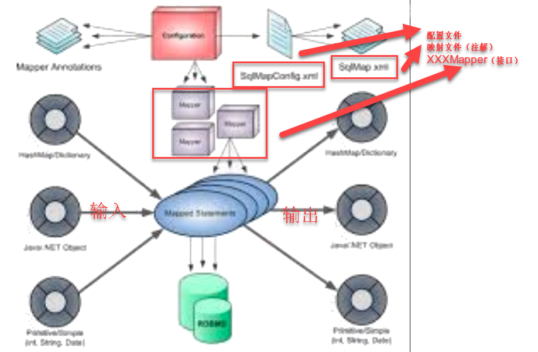
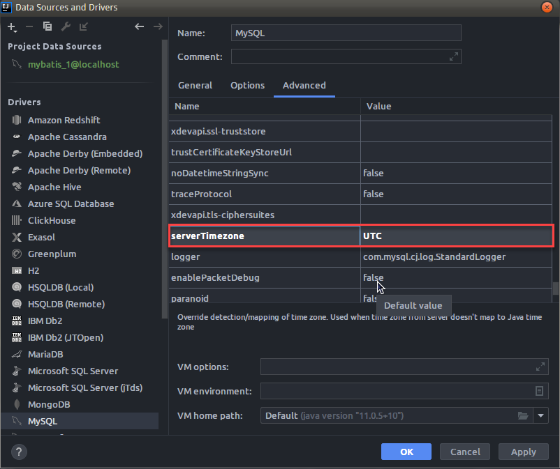
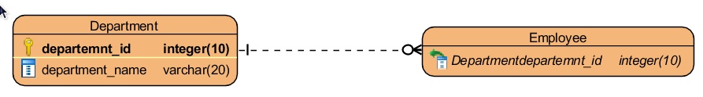
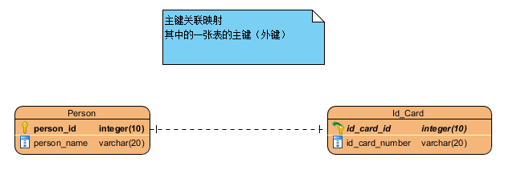
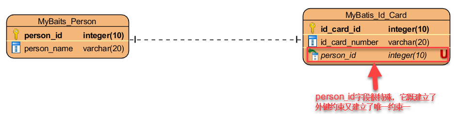
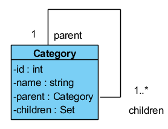
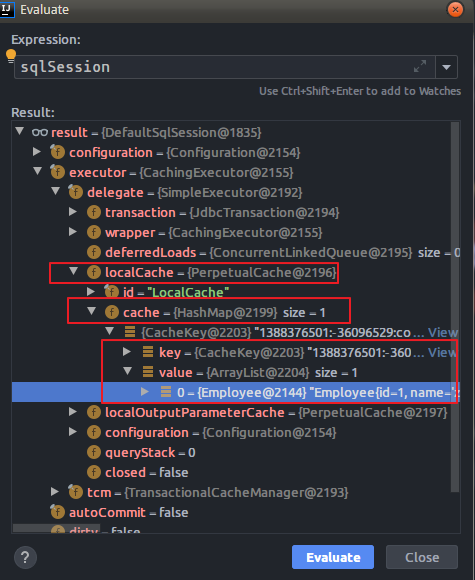

# MyBatis开发笔记

## 学习内容

## 1.MyBatis概述

## 2.MyBatis入门程序

## 3.MyBatis基本配置

## 4.MyBatis动态代理方式的开发

## 5.MyBatis关联映射

## 6.MyBatis继承映射

## 7.MyBatis动态SQL

## 8.MyBatis延迟加载

## 9.MyBatis缓存机制

## 10.MyBatis逆向工程

## 11.MyBatis插件开发

## 12.MyBatis自定义的类型处理器

## 13.MyBatis注解编程

## 14.MyBatis源码分析

## 15.MyBatis-Plus | 通用Mapper 开发


# 一.MyBatis概述

## 1.JDBC编程的问题

- 很多硬编码，冗余
- 数据库连接很耗时，开销很大
- Statement语句对象会产生SQL注入
- ResultSet的映射（ResultSet---->对象）我们自行解决，成本高

## 2.MyBatis是什么

- 优秀的Java实现的一个持久化层的框架，内部封装了JDBC，简化了JDBC开发
- 是一个ORM（对象关系型映射）产品。我认为它是一个ORM半成品，因为MyBatis还有SQL影子
- 使用了XML和注解进行SQL语句的执行，这样简化了代码

## 3.MyBatis的简介

- https://mybatis.org/mybatis-3/
- https://github.com/mybatis/mybatis-3

```markdown
MyBatis is a first class persistence framework with support for custom SQL, stored procedures and advanced mappings. MyBatis eliminates almost all of the JDBC code and manual setting of parameters and retrieval of results. MyBatis can use simple XML or Annotations for configuration and map primitives, Map interfaces and Java POJOs (Plain Old Java Objects) to database records.
```

- 下载
    - https://github.com/mybatis/mybatis-3.git

- MyBatis体系结构




# 二.MyBatis入门（传统做法）

## 2.1 编写pom.xml

```xml
<build>
        <!--
            文件拷贝
            mybatis映射文件默认不会拷贝到类路径
            有两种实现方式可以解决：
                1.编写下面的代码
                2.直接将XxxMapper.xml文件放到src/main/resources下也可以
        -->
        <!--<resources>
            <resource>
                <directory>src/main/java</directory>
                <includes>
                    <include>**/*.properties</include>
                    <include>**/*.xml</include>
                </includes>
                <filtering>false</filtering>
            </resource>

            <resource>
                <directory>src/main/resources</directory>
                <includes>
                    <include>**/*.properties</include>
                 <include>**/*.xml</include>
</includes>
<filtering>false</filtering>
        </resource>
        </resources>-->

        <plugins>
            <plugin>
                <groupId>org.apache.maven.plugins</groupId>
                <artifactId>maven-compiler-plugin</artifactId>
                <version>3.8.1</version>
                <configuration>
                    <source>1.8</source> <!-- 源代码使用的JDK版本 -->
                    <target>1.8</target> <!-- 需要生成的目标class文件的编译版本 -->
                    <encoding>UTF-8</encoding><!-- 字符集编码 -->
                </configuration>
            </plugin>
        </plugins>

    </build>
```


## 2.2 编写mybatis的配置文件（mybatis-config.xml）

```xml
<?xml version="1.0" encoding="UTF-8" ?>
<!DOCTYPE configuration
        PUBLIC "-//mybatis.org//DTD Config 3.0//EN"
        "http://mybatis.org/dtd/mybatis-3-config.dtd">

<configuration>

    <!--指定配置文件的路径-->
    <properties resource="jdbc.properties"/>

    <!--连接数据库的信息-->
    <environments default="development">
        <environment id="development">
            <transactionManager type="JDBC"/>
            <dataSource type="POOLED">
                <property name="driver" value="${jdbc.driverClassName}"/>
                <property name="url" value="${jdbc.url}"/>
                <property name="username" value="${jdbc.username}"/>
                <property name="password" value="${jdbc.password}"/>
            </dataSource>
        </environment>
    </environments>

    <!--映射文件的位置-->
    <mappers>
        <mapper resource="com/bjlemon/mybatis/dao/UserMapper.xml"/>
        <!--
        <mapper resource="mappers/UserMapper.xml"/>
		-->
    </mappers>
</configuration>
```

## 2.2 建库建表

### 2.2.1 注意

- 数据库驱动尽量保持一致（数据库是8.0，驱动也是8.0）

- 当mysql数据库使用了高版本（>5.7）,设置serverTimezone=UTC

​         

## 2.3 建立领域对象

```java
@Data
@ToString
@NoArgsConstructor
@AllArgsConstructor
public class User implements Serializable {

    private static final long serialVersionUID = 8527322364369347165L;

    private Integer id;
    private String name;
    private String password;
    private Float salary;
    private Date birthday;

}
```

## 2.4 编写DAO层

```java
public interface UserDao {

    void save(User user);

    void delete(User user);

    void update(User user);

    User findById(Integer id);

    List<User> findAll();
}
```

```java
package com.bjlemon.mybatis.dao.impl;

import com.bjlemon.mybatis.dao.UserDao;
import com.bjlemon.mybatis.domain.User;
import com.bjlemon.mybatis.util.MyBatisUtils;
import org.apache.ibatis.session.SqlSession;

import java.util.Collections;
import java.util.List;

/**
 * @author jeffzhou
 * @version 1.0.0
 * @ClassName UserDaoImpl.java
 * @Description TODO
 * @createTime 2020年02月29日 22:24:00
 */
public class UserDaoImpl implements UserDao {

    public void save(User user) {
        SqlSession sqlSession = null;
        try {
            sqlSession = MyBatisUtils.getSqlSession();
            sqlSession.insert("com.bjlemon.mybatis.dao.save", user);
            sqlSession.commit();
        } catch (Exception e) {
            e.printStackTrace();
            sqlSession.rollback();
        } finally {
            MyBatisUtils.closeSqlSession(sqlSession);
        }
    }

    public void delete(User user) {
        SqlSession sqlSession = null;
        try {
            sqlSession = MyBatisUtils.getSqlSession();
            sqlSession.delete("com.bjlemon.mybatis.dao.delete", user);
            sqlSession.commit();
        } catch (Exception e) {
            e.printStackTrace();
            sqlSession.rollback();
        } finally {
            MyBatisUtils.closeSqlSession(sqlSession);
        }
    }

    public void update(User user) {
        SqlSession sqlSession = null;
        try {
            sqlSession = MyBatisUtils.getSqlSession();
            sqlSession.update("com.bjlemon.mybatis.dao.update", user);
            sqlSession.commit();
        } catch (Exception e) {
            e.printStackTrace();
            sqlSession.rollback();
        } finally {
            MyBatisUtils.closeSqlSession(sqlSession);
        }
    }

    public User findById(Integer id) {
        User user = null;
        SqlSession sqlSession = null;
        try {
            sqlSession = MyBatisUtils.getSqlSession();
            user = sqlSession.selectOne("com.bjlemon.mybatis.dao.findById", id);
            sqlSession.commit();
        } catch (Exception e) {
            e.printStackTrace();
            sqlSession.rollback();
        } finally {
            MyBatisUtils.closeSqlSession(sqlSession);
        }

        return user;
    }

    public List<User> findAll() {
        List<User> userList = Collections.emptyList();
        SqlSession sqlSession = null;
        try {
            sqlSession = MyBatisUtils.getSqlSession();
            userList = sqlSession.selectList("com.bjlemon.mybatis.dao.findAll");
            sqlSession.commit();
        } catch (Exception e) {
            e.printStackTrace();
            sqlSession.rollback();
        } finally {
            MyBatisUtils.closeSqlSession(sqlSession);
        }

        return userList;
    }
}

```

## 2.5 编写Service层

```java
public interface UserService {

    void addUser(User user);

    void deleteUser(User user);

    void modifyUser(User user);

    User findUserById(Integer id);

    List<User> findAllUserList();
}
```

```java
public class UserServiceImpl implements UserService {

    private UserDao userDao = new UserDaoImpl();

    public void addUser(User user) {
        if (user == null) {
            throw new IllegalArgumentException("");
        }

        this.userDao.save(user);
    }

    public void deleteUser(User user) {
        if (user == null) {
            throw new IllegalArgumentException("");
        }

        this.userDao.delete(user);
    }

    public void modifyUser(User user) {
        if (user == null) {
            throw new IllegalArgumentException("");
        }

        this.userDao.update(user);
    }

    public User findUserById(Integer id) {
        if (id == null || id <= 0) {
            throw new IllegalArgumentException("");
        }

        return this.userDao.findById(id);
    }

    public List<User> findAllUserList() {
        return this.userDao.findAll();
    }
}

```

## 2.6 编写单元测试


# 三. 动态代理方式的开发

## 3.1 概述

- 简化开发，省去了DAO层的实现类。只需建立DAO层的接口，然后有对应的映射文件与之对应即可
- **但是必须满足一些开发规范**

## 3.2 开发步骤

### 3.2.1 改写MyBatisUtils

```java
package com.bjlemon.mybatis.util;

import org.apache.ibatis.session.SqlSession;
import org.apache.ibatis.session.SqlSessionFactory;
import org.apache.ibatis.session.SqlSessionFactoryBuilder;

import java.io.InputStream;

/**
 * @author jeffzhou
 * @version 1.0.0
 * @ClassName MyBatisUtils.java
 * @Description 由于SqlSession线程不安全，那么我们必须将它做成线程局部变量（ThreadLocal(Map) k:绑定当前线程）
 * @createTime 2020年03月03日 20:44:00
 */
public class MyBatisUtils {

    private static SqlSessionFactoryBuilder builder;
    private static SqlSessionFactory factory;

    private static ThreadLocal<SqlSession> sqlSessionThreadLocal = new ThreadLocal<>();

    static {
        builder = new SqlSessionFactoryBuilder();
        InputStream inputStream = MyBatisUtils.class.getClassLoader().getResourceAsStream("mybatis-config.xml");
        factory = builder.build(inputStream);
    }

    public static SqlSession getSqlSession() {
        SqlSession sqlSession = sqlSessionThreadLocal.get();
        if (sqlSession == null) {
            sqlSession = factory.openSession();
            sqlSessionThreadLocal.set(sqlSession);
        }

        return sqlSession;
    }

    public static void closeSqlSession() {
        SqlSession sqlSession = sqlSessionThreadLocal.get();
        if (sqlSession != null) {
            sqlSession.close();
            sqlSessionThreadLocal.remove();
        }
    }
}
```

### 3.2.2 建立Mapper层（DAO层）

```java
public interface UserMapper {

    void save(User user);

    void delete(User user);

    void update(User user);

    User findById(Integer id);

    List<User> findAll();
}
```

### 3.2.3 建立映射文件

```xml
<?xml version="1.0" encoding="UTF-8" ?>
<!DOCTYPE mapper
        PUBLIC "-//mybatis.org//DTD Mapper 3.0//EN"
        "http://mybatis.org/dtd/mybatis-3-mapper.dtd">

<mapper namespace="com.bjlemon.mybatis.mapper.UserMapper">

    <insert id="save">
        INSERT INTO mybatis_user(user_id, user_name, user_password, user_salary, user_birthday)
        VALUES (NULL, #{name}, #{password}, #{salary}, #{birthday})
    </insert>

    <delete id="delete">
        DELETE
        FROM mybatis_user
        WHERE user_id = #{id}
    </delete>

    <select id="findById" resultType="User">
        SELECT user_id       id,
               user_name     name,
               user_password password,
               user_salary   salary,
               user_birthday birthday
        FROM mybatis_user
        WHERE user_id = #{id}
    </select>

    <update id="update">
        UPDATE mybatis_user
        SET user_name     = #{name},
            user_password = #{password},
            user_salary   = #{salary},
            user_birthday = #{birthday}
        WHERE user_id = #{id}
    </update>

    <select id="findAll" resultType="User">
        SELECT user_id       id,
               user_name     name,
               user_password password,
               user_salary   salary,
               user_birthday birthday
        FROM mybatis_user
    </select>
</mapper>
```

### 3.2.4 编写测试代码

```java
package com.bjlemon.mybatis.mapper;

import com.bjlemon.mybatis.domain.User;
import com.bjlemon.mybatis.util.MyBatisUtils;
import org.apache.ibatis.session.SqlSession;
import org.junit.Test;

import java.util.Collections;
import java.util.Date;
import java.util.List;

/**
 * @author jeffzhou
 * @version 1.0.0
 * @ClassName UserMapperTest.java
 * @Description TODO
 * @createTime 2020年03月03日 21:09:00
 */
public class UserMapperTest {

    @Test
    public void save() {
        SqlSession sqlSession = null;
        try {
            sqlSession = MyBatisUtils.getSqlSession();
            UserMapper userMapper = sqlSession.getMapper(UserMapper.class);
            User user = User.builder()
                    .name("lisi")
                    .password("admin")
                    .salary(12.34F)
                    .birthday(new Date())
                    .build();
            userMapper.save(user);

            sqlSession.commit();
        } catch (Exception e) {
            e.printStackTrace();
            sqlSession.rollback();
        } finally {
            MyBatisUtils.closeSqlSession();
        }
    }

    @Test
    public void delete() {
        SqlSession sqlSession = null;
        try {
            sqlSession = MyBatisUtils.getSqlSession();
            UserMapper userMapper = sqlSession.getMapper(UserMapper.class);

            User user = userMapper.findById(6);
            userMapper.delete(user);

            sqlSession.commit();
        } catch (Exception e) {
            e.printStackTrace();
            sqlSession.rollback();
        } finally {
            MyBatisUtils.closeSqlSession();
        }
    }


    @Test
    public void update() {
        SqlSession sqlSession = null;
        try {
            sqlSession = MyBatisUtils.getSqlSession();
            UserMapper userMapper = sqlSession.getMapper(UserMapper.class);

            User user = userMapper.findById(5);
            user.setName("梅西");
            user.setPassword("test");
            userMapper.update(user);

            sqlSession.commit();
        } catch (Exception e) {
            e.printStackTrace();
            sqlSession.rollback();
        } finally {
            MyBatisUtils.closeSqlSession();
        }
    }

    @Test
    public void findById() {
    }

    @Test
    public void findAll() {
        List<User> userList = Collections.emptyList();
        SqlSession sqlSession = null;
        try {
            sqlSession = MyBatisUtils.getSqlSession();
            UserMapper userMapper = sqlSession.getMapper(UserMapper.class);

            userList = userMapper.findAll();
            userList.stream().forEach(System.out::println);
            sqlSession.commit();
        } catch (Exception e) {
            e.printStackTrace();
            sqlSession.rollback();
        } finally {
            MyBatisUtils.closeSqlSession();
        }
    }
}
```


# 四.MyBatis基本配置

## 4.1 配置的内容与顺序

```dtd
<!ELEMENT configuration (properties?, settings?, typeAliases?, typeHandlers?, objectFactory?, objectWrapperFactory?, reflectorFactory?, plugins?, environments?, databaseIdProvider?, mappers?)>
```

- properties

    ```dtd
    <!ELEMENT properties (property*)>
    ```

- settings

    ```dtd
    <!ELEMENT settings (setting+)>
    ```

- typeAliases

    ```dtd
    <!ELEMENT typeAliases (typeAlias*,package*)>
    ```

- plugins

    ```dtd
    <!ELEMENT plugins (plugin+)>
    ```

- environments

    ```dtd
    <!ELEMENT environments (environment+)>
    <!ELEMENT environment (transactionManager,dataSource)>
    <!ELEMENT transactionManager (property*)>
    ```

- mappers

    ```dtd
    <!ELEMENT mappers (mapper*,package*)>
    ```

    

# 五.关联映射（重点）

## 5.1 一对多关系

 

```sql
CREATE TABLE mybatis_department
(
    department_id       INT(4) PRIMARY KEY AUTO_INCREMENT,
    department_name     VARCHAR(20)  NOT NULL,
    department_location VARCHAR(100) NOT NULL
);

CREATE TABLE mybatis_employee
(
    employee_id       INT(4) PRIMARY KEY AUTO_INCREMENT,
    employee_name     VARCHAR(20) NOT NULL,
    employee_password VARCHAR(20) NOT NULL,
    employee_salary   FLOAT(6, 2) NOT NULL,
    employee_birthday DATE        NOT NULL,
    department_id     INT(4)
);

ALTER TABLE mybatis_employee
    ADD CONSTRAINT fk_department_id FOREIGN KEY (department_id)
        REFERENCES mybatis_department (department_id);
```

- 案例：根据部门名查询出该部门的所有的员工
- 第一种做法

```xml
<select id="findEmployeesByDepartmentName" resultType="Employee">
    SELECT
    me.employee_id id,
    me.employee_name name ,
    me.employee_password password,
    me.employee_salary salary,
    me.employee_birthday birthday
    FROM mybatis_employee me
    LEFT JOIN mybatis_department md ON me.department_id = md.department_id
    WHERE md.department_name = #{name}
</select>
```

- 第二种做法

```java
/**
     * @description 根据部门名称查询部门，同时将员工也查询出来
     * @author admin
     * @updateTime 2020/3/3 22:30
     */
Department findByDepartmentName(String name);
```

```xml
<resultMap id="DepartmentResultMap" type="Department">
    <id property="id" column="department_id"/>
    <result property="name" column="department_name"/>
    <result property="location" column="department_location"/>
    <collection property="employees" column="department_id" ofType="Employee">
        <id property="id" column="employee_id"/>
        <result property="name" column="employee_name"/>
        <result property="password" column="employee_password"/>
        <result property="salary" column="employee_salary"/>
        <result property="birthday" column="employee_birthday"/>
    </collection>
</resultMap>

<resultMap id="DepartmentResultMap" type="Department">
    <id property="id" column="department_id"/>
    <result property="name" column="department_name"/>
    <result property="location" column="department_location"/>
    <collection property="employees" column="department_id" ofType="Employee"
                resultMap="com.bjlemon.mybatis.mapper.EmployeeMapper.EmployeeBaseResultMap"/>
</resultMap>

<select id="findByDepartmentName" resultMap="DepartmentResultMap">
    SELECT
    me.employee_id,
    me.employee_name,
    me.employee_password,
    me.employee_salary,
    me.employee_birthday,
    md.department_id,
    md.department_name,
    md.department_location
    FROM mybatis_employee me
    LEFT JOIN mybatis_department md ON me.department_id = md.department_id
    WHERE md.department_name = #{name}
</select>
```

- 第三种做法

```xml
<select id="findByName" resultMap="DepartmentResultMap1">
    SELECT
    department_id,
    department_name,
    department_location
    FROM mybatis_department
    WHERE department_name = #{name}
</select>

<resultMap id="DepartmentResultMap1" type="Department">
    <id property="id" column="department_id"/>
    <result property="name" column="department_name"/>
    <result property="location" column="department_location"/>
    <collection property="employees" column="department_id" ofType="Employee"
                select="com.bjlemon.mybatis.mapper.EmployeeMapper.findEmployeesByDepartmentId"/>
</resultMap>
```

```xml
<resultMap id="EmployeeBaseResultMap" type="Employee">
    <id property="id" column="employee_id"/>
    <result property="name" column="employee_name"/>
    <result property="password" column="employee_password"/>
    <result property="salary" column="employee_salary"/>
    <result property="birthday" column="employee_birthday"/>
</resultMap>
```


## 5.2 一对一关系

### 5.2.1 主键关联映射

 

- 上图将Id_Card表的主键又做成了外键，外键参考Person表的主键

### 5.2.2 外键关联映射（掌握）

 

- 实现方式与1对多关系的实现类似


## 5.3 多对多关系

### 5.3.1 传统做法

```sql
CREATE TABLE mybatis_teacher
(
    teacher_id     INT(4) PRIMARY KEY AUTO_INCREMENT,
    teacher_name   VARCHAR(20) NOT NULL,
    teacher_salary FLOAT(6, 2) NOT NULL
);

CREATE TABLE mybatis_student
(
    student_id    INT(4) PRIMARY KEY AUTO_INCREMENT,
    student_name  VARCHAR(20) NOT NULL,
    student_score FLOAT(4, 2) NOT NULL
);

CREATE TABLE mybatis_teacher_student
(
    teacher_id INT(4),
    student_id INT(4)
);

ALTER TABLE mybatis_teacher_student
    ADD CONSTRAINT pk_teacher_id_student_id PRIMARY KEY (teacher_id, student_id);

ALTER TABLE mybatis_teacher_student
    ADD CONSTRAINT fk_teacher_id FOREIGN KEY (teacher_id)
        REFERENCES mybatis_teacher (teacher_id);

ALTER TABLE mybatis_teacher_student
    ADD CONSTRAINT fk_student_id FOREIGN KEY (student_id)
        REFERENCES mybatis_student (student_id);
```

```java
@Data
@AllArgsConstructor
@NoArgsConstructor
@Builder
public class Teacher implements Serializable {

    private static final long serialVersionUID = -9085299453277590840L;
    private Integer id;
    private String name;
    private Float salary;

    private Set<Student> students = new HashSet<>();

    @Override
    public String toString() {
        return "Teacher{" +
                "id=" + id +
                ", name='" + name + '\'' +
                ", salary=" + salary +
                '}';
    }
}
```

```java
public class Student implements Serializable {

    private static final long serialVersionUID = 5516784836720369956L;
    private Integer id;
    private String name;
    private Float score;

    private Set<Teacher> teachers = new HashSet<>();

    @Override
    public String toString() {
        return "Student{" +
                "id=" + id +
                ", name='" + name + '\'' +
                ", score=" + score +
                '}';
    }
}

```

```xml
<mapper namespace="com.bjlemon.mybatis.mapper.TeacherMapper">


    <select id="findStudentsByName" resultMap="com.bjlemon.mybatis.mapper.StudentMapper.StudentBaseResultMap">
        SELECT
        ms.student_id, ms.student_name, ms.student_score
        FROM mybatis_student ms
        LEFT JOIN mybatis_teacher_student mts ON ms.student_id = mts.student_id
        LEFT JOIN mybatis_teacher mt ON mts.teacher_id = mt.teacher_id
        WHERE mt.teacher_name = #{name}
    </select>

    <resultMap id="TeacherResultMap" type="Teacher">
        <id property="id" column="teacher_id"/>
        <result property="name" column="teacher_name"/>
        <result property="salary" column="teacher_salary"/>
        <collection property="students" column="teacher_id" ofType="Student"
                    resultMap="com.bjlemon.mybatis.mapper.StudentMapper.StudentBaseResultMap"/>
    </resultMap>

    <select id="findByName" resultMap="TeacherResultMap">
        SELECT
        mt.teacher_id,mt.teacher_name,mt.teacher_salary,
        ms.student_id, ms.student_name, ms.student_score
        FROM mybatis_student ms
        LEFT JOIN mybatis_teacher_student mts ON ms.student_id = mts.student_id
        LEFT JOIN mybatis_teacher mt ON mts.teacher_id = mt.teacher_id
        WHERE mt.teacher_name = #{name}
    </select>

</mapper>
```

### 5.3.2 将多对多转换成两个多对一

```java
public class TeacherStudent implements Serializable {

    private static final long serialVersionUID = 1577109694452564587L;
    private Teacher teacher;
    private Student student;
}
```

```java
@Data
@AllArgsConstructor
@NoArgsConstructor
@Builder
public class Teacher implements Serializable {

    private static final long serialVersionUID = -9085299453277590840L;
    private Integer id;
    private String name;
    private Float salary;
}
```

```java
public class Student implements Serializable {

    private static final long serialVersionUID = 5516784836720369956L;
    private Integer id;
    private String name;
    private Float score;

    @Override
    public String toString() {
        return "Student{" +
                "id=" + id +
                ", name='" + name + '\'' +
                ", score=" + score +
                '}';
    }
}
```


## 5.4 无限极分类（自引用）

 

```xml
<mapper namespace="com.bjlemon.mybatis.mapper.CategoryMapper">


    <select id="findParentByName" resultType="Category">
        SELECT
        mcp.category_id id,
        mcp.category_name name
        FROM mybatis_category mcp
        LEFT JOIN mybatis_category mcc ON mcp.category_id = mcc.parent_id
        WHERE mcc.category_name = #{name}
    </select>

    <select id="findChildrenByName" resultType="Category">
        SELECT
        mcc.category_id id,
        mcc.category_name name
        FROM mybatis_category mcp
        LEFT JOIN mybatis_category mcc ON mcp.category_id = mcc.parent_id
        WHERE mcp.category_name = #{name}
    </select>
</mapper>
```

# 六.继承映射

## 6.1 建立一张表

| animal_id | animal_name | eye_color | fur_color | type |
| :-------: | :---------: | :-------: | :-------: | :--: |
|     1     |    小猫     |   blue    |           |  C   |
|     2     |    小狗     |           |   black   |  D   |
|     3     |    猫咪     |  yellow   |           |  C   |

```xml
<?xml version="1.0" encoding="UTF-8" ?>
<!DOCTYPE mapper
        PUBLIC "-//mybatis.org//DTD Mapper 3.0//EN"
        "http://mybatis.org/dtd/mybatis-3-mapper.dtd">

<mapper namespace="com.bjlemon.mybatis.mapper.AnimalMapper">

    <insert id="saveCat">
        INSERT INTO mybatis_animal (animal_id, animal_name, eye_color, fur_color, type)
        VALUES (NULL,#{name},#{eyeColor},null,'C')
    </insert>

    <insert id="saveDog">
        INSERT INTO mybatis_animal (animal_id, animal_name, eye_color, fur_color, type)
        VALUES (NULL,#{name},null,#{furColor},'D')
    </insert>

    <resultMap id="AnimalResultMap" type="Animal">
        <id property="id" column="animal_id"/>
        <result property="name" column="animal_name"/>
        <discriminator javaType="java.lang.String" column="type">
            <case value="C" resultMap="CatResultMap"/>
            <case value="D" resultMap="DogResultMap"/>
        </discriminator>
    </resultMap>

    <resultMap id="CatResultMap" type="Cat" extends="AnimalResultMap">
        <result property="eyeColor" column="eye_color"/>
    </resultMap>

    <resultMap id="DogResultMap" type="Dog" extends="AnimalResultMap">
        <result property="furColor" column="fur_color"/>
    </resultMap>

    <select id="findById" resultMap="AnimalResultMap">
        SELECT
        animal_id, animal_name, eye_color, fur_color, type
        FROM mybatis_animal
        WHERE animal_id = #{id}
    </select>


</mapper>
```

```java
package com.bjlemon.mybatis.mapper;

import com.bjlemon.mybatis.domain.Animal;
import com.bjlemon.mybatis.domain.Cat;
import com.bjlemon.mybatis.domain.Dog;
import com.bjlemon.mybatis.util.MyBatisUtils;
import org.apache.ibatis.session.SqlSession;
import org.junit.Test;

/**
 * @author jeffzhou
 * @version 1.0.0
 * @ClassName AnimalMapperTest.java
 * @Description TODO
 * @createTime 2020年03月05日 21:52:00
 */
public class AnimalMapperTest {

    @Test
    public void saveCat() {
        SqlSession sqlSession = null;
        Cat cat = null;

        try {
            sqlSession = MyBatisUtils.getSqlSession();
            AnimalMapper mapper = sqlSession.getMapper(AnimalMapper.class);
            cat = new Cat();
            cat.setName("小猫");
            cat.setEyeColor("blue");

            mapper.saveCat(cat);
            sqlSession.commit();
        } catch (Exception e) {
            e.printStackTrace();
            sqlSession.rollback();
        } finally {
            MyBatisUtils.closeSqlSession();
        }
    }

    @Test
    public void saveDog() {
        SqlSession sqlSession = null;
        Dog dog = null;

        try {
            sqlSession = MyBatisUtils.getSqlSession();
            AnimalMapper mapper = sqlSession.getMapper(AnimalMapper.class);
            dog = new Dog();
            dog.setName("小猫狗");
            dog.setFurColor("black");

            mapper.saveDog(dog);
            sqlSession.commit();
        } catch (Exception e) {
            e.printStackTrace();
            sqlSession.rollback();
        } finally {
            MyBatisUtils.closeSqlSession();
        }
    }

    @Test
    public void findById() {
        SqlSession sqlSession = null;
        Dog dog = null;
        Cat cat = null;

        try {
            sqlSession = MyBatisUtils.getSqlSession();
            AnimalMapper mapper = sqlSession.getMapper(AnimalMapper.class);

            Animal animal = mapper.findById(2);
            if (animal instanceof Cat) {
                cat = (Cat) animal;
                System.out.println(cat);
            } else if (animal instanceof Dog) {
                dog = (Dog) animal;
                System.out.println(dog);
            }

            sqlSession.commit();
        } catch (Exception e) {
            e.printStackTrace();
            sqlSession.rollback();
        } finally {
            MyBatisUtils.closeSqlSession();
        }
    }
}
```


# 七. 插入一条记录返回其主键

## 7.1 为什么需要使用这个技术

- 对于1对多关系，初始化数据时插入了一方数据，此时多方数据中需要有一方的主键值

| department_id | department_name | department_location |
| :-----------: | :-------------: | :-----------------: |
|       1       |       IBM       |         LOS         |
|       2       |      Apple      |         LOS         |
|               |                 |                     |

| user_id | user_name | department_id |
| :-----: | :-------: | :-----------: |
|    1    | zhangsan  |       1       |
|    2    |   lisi    |       1       |
|    3    |  wangwu   |       2       |

## 7.2 实现方式

### 7.2.1 第一种方式

```xml
<insert id="save" useGeneratedKeys="true" keyProperty="id" keyColumn="department_id">
    INSERT INTO mybatis_department (department_id, department_name, department_location)
    VALUES (NULL,#{name},#{location})
</insert>
```

7.2.2 第二种方式

```xml
<insert id="save">
    <selectKey keyProperty="id" keyColumn="department_id" order="AFTER" resultType="int">
        SELECT last_insert_id() as id
    </selectKey>
    INSERT INTO mybatis_department (department_id, department_name, department_location)
    VALUES (#{id},#{name},#{location})
</insert>

<insert id="save">
    <selectKey keyProperty="id" keyColumn="department_id" order="BEFORE" resultType="int">
        SELECT MAX(department_id) + 1 AS id FROM mybatis_department;
    </selectKey>
    INSERT INTO mybatis_department (department_id, department_name, department_location)
    VALUES (#{id},#{name},#{location})
</insert>
```


# 八.动态SQL

## 8.1 概述

- 在JDBC中会涉及到拼接SQL，这种拼接SQL比较麻烦，而且很容易出错
- 动态SQL简化拼接，利用了类似于JSTL的语法，实际上是使用了OGNL表达式（Struts2）

## 8.2 重要标签

- if
- choose(when,otherwise)
- trim(where,set)
- foreach

# 九. 延迟加载（性能优化）

## 9.1 概念

- 当真正用到某对象时才会与数据库交互
- 延迟加载必须用在关联关系上。当查询用户时，讨论关联对象（部门）需不需要查询出来
- 优点：当查询一方时，如果关联的集合数据非常多，那么此时就需要用到延迟加载

## 9.2 如何实现

- 延迟加载用在关联关系上

- <association>,<collection>

- 步骤

    - 打开总开关

        ```xml
        <settings>
            <setting name="lazyLoadingEnabled" value="true"/>
            <setting name="aggressiveLazyLoading" value="false"/>
        </settings>
        ```

    - 映射文件

        ```xml
        <resultMap id="EmployeeResultMap" type="Employee" extends="EmployeeBaseResultMap">
            <association property="department" column="department_id" javaType="Department"
                         select="com.bjlemon.mybatis.mapper.DepartmentMapper.findById"/>
        </resultMap>
        ```

        

# 十.缓存

## 10.1 缓存的概念

- 减少与数据库的交互
- 第一次查询数据与数据库交互一次，将数据放到缓存中，后续的查询（查询相同的数据）就直接从缓存中获取即可
- 当数据发生变化了（更新），此时缓存必须同步（将缓存清空，然后再做缓存）

## 10.2 MyBatis的缓存

- 一级缓存
- 二级缓存

## 10.3 一级缓存

### 10.3.1 概念

- 基于SqlSession级别
- 只要SqlSession关闭或flush，一级缓存消失
- 程序员可以干预一级缓存（通过程序强制地将对象从缓存中移除）
- 只要执行了增删改操作，一级缓存消失

### 10.3.2 测试

### 10.3.3 一级缓存的内存结构

 

- 从上面的内存图得知：一级缓存实际缓存的是HashMap。这个Map中的Key主要的组成部分是映射文件中namepace属性值与<select>标签中的id值拼接而成。下图所示为key的完整内容：


```markdown
-1877527505:893948537:com.bjlemon.mybatis.mapper.UserMapper.findById:0:2147483647:select
user_id, user_name, user_password, user_salary, user_birthday
from
t_user
where
user_id =?:4:development
```

而value实际上是一个ArrayList，在这个ArrayList存放的就是查询出来的对象

## 10.4 二级缓存

### 10.4.1 概念

- 二级缓存基于mapper映射级别的缓存（namespace）
- 多个SqlSession去操作同一个Mapper映射的SQL语句。多个SqlSession可以共享同一个二级缓存

### 10.4.2 如何实现

- 开启总开关

    ```xml
    <!--开启二级缓存-->
    <setting name="cacheEnabled" value="true"/>
    ```

- 开启二级缓存的支持

    ```xml
    <mapper namespace="com.bjlemon.mybatis.mapper.EmployeeMapper">
    
        <!--开启二级缓存的支持-->
        <cache/>
    </mapper>
    ```

- 使用useCache属性使用二级缓存

    ```xml
    <select id="findAll" resultMap="EmployeeResultMap" useCache="true">
        select
        *
        from
        mybatis_employee
    </select>
    ```

### 10.4.3 使用EhCache来实现二级缓存

- ehcache是一个程序级别的缓存产品

- 开源，基于Java开发的缓存产品

- 官网： https://www.ehcache.org/ 

    ```
    Ehcache is an open source, standards-based cache that boosts performance, offloads your database, and simplifies scalability. It's the most widely-used Java-based cache because it's robust, proven, full-featured, and integrates with other popular libraries and frameworks. Ehcache scales from in-process caching, all the way to mixed in-process/out-of-process deployments with terabyte-sized caches.
    ```

- 使用Ehcache

```xml
<dependency>
    <groupId>org.ehcache</groupId>
    <artifactId>ehcache</artifactId>
    <version>3.8.1</version>
</dependency>

<dependency>
    <groupId>org.mybatis</groupId>
    <artifactId>mybatis-ehcache</artifactId>
    <version>1.0.0</version>
</dependency>
```

- 将ehcache核心库中一个ehcache-xxx.xml文件拷贝一份到类路径下，一般修改为ehcache.xml

- 修改配置（一般使用默认）

- 开启二级缓存

    ```xml
    <!--开启二级缓存-->
    <setting name="cacheEnabled" value="true"/>
    ```

- 开启二级缓存的支持

    ```xml
    <cache type="org.mybatis.caches.ehcache.EhcacheCache"/>
    ```


# 十一.SSM整合

## 11.1 配置方式

- Maven的聚合工程和父子工程
    - ssm-parent(父工程 pom)
        - 打包方式为pom
        - 版本管理
    
    ```xml
    <?xml version="1.0" encoding="UTF-8"?>
    <project xmlns:xsi="http://www.w3.org/2001/XMLSchema-instance"
             xmlns="http://maven.apache.org/POM/4.0.0"
             xsi:schemaLocation="http://maven.apache.org/POM/4.0.0 http://maven.apache.org/xsd/maven-4.0.0.xsd">
        <modelVersion>4.0.0</modelVersion>
    
        <groupId>com.bjlemon</groupId>
        <artifactId>ssm-parent</artifactId>
        <version>1.0-SNAPSHOT</version>
        <modules>
            <module>ssm-common</module>
            <module>ssm-domain</module>
            <module>ssm-dao</module>
            <module>ssm-service</module>
            <module>ssm-web</module>
        </modules>
        <packaging>pom</packaging>
    
        <dependencyManagement>
            <dependencies>
                <dependency>
                    <groupId>org.springframework</groupId>
                    <artifactId>spring-context</artifactId>
                    <version>5.2.4.RELEASE</version>
                </dependency>
    
                <dependency>
                    <groupId>org.springframework</groupId>
                    <artifactId>spring-context-support</artifactId>
                    <version>5.2.4.RELEASE</version>
                </dependency>
    
                <dependency>
                    <groupId>org.springframework</groupId>
                    <artifactId>spring-test</artifactId>
                    <version>5.2.4.RELEASE</version>
                </dependency>
    
                <dependency>
                    <groupId>org.springframework</groupId>
                    <artifactId>spring-jdbc</artifactId>
                    <version>5.2.4.RELEASE</version>
                </dependency>
    
                <dependency>
                    <groupId>org.springframework</groupId>
                    <artifactId>spring-tx</artifactId>
                    <version>5.2.4.RELEASE</version>
                </dependency>
    
                <dependency>
                    <groupId>org.springframework</groupId>
                    <artifactId>spring-webmvc</artifactId>
                    <version>5.2.4.RELEASE</version>
                </dependency>
    
                <dependency>
                    <groupId>org.mybatis</groupId>
                    <artifactId>mybatis</artifactId>
                    <version>3.5.4</version>
                </dependency>
    
                <dependency>
                    <groupId>org.mybatis</groupId>
                    <artifactId>mybatis-spring</artifactId>
                    <version>2.0.3</version>
                </dependency>
    
                <!-- https://mvnrepository.com/artifact/com.github.pagehelper/pagehelper -->
                <dependency>
                    <groupId>com.github.pagehelper</groupId>
                    <artifactId>pagehelper</artifactId>
                    <version>5.1.11</version>
                </dependency>
    
    
                <dependency>
                    <groupId>mysql</groupId>
                    <artifactId>mysql-connector-java</artifactId>
                    <version>8.0.19</version>
                    <scope>runtime</scope>
                </dependency>
    
                <dependency>
                    <groupId>com.alibaba</groupId>
                    <artifactId>druid</artifactId>
                    <version>1.1.21</version>
                </dependency>
    
                <dependency>
                    <groupId>org.projectlombok</groupId>
                    <artifactId>lombok</artifactId>
                    <version>1.18.12</version>
                    <scope>provided</scope>
                </dependency>
    
                <dependency>
                    <groupId>org.apache.commons</groupId>
                    <artifactId>commons-lang3</artifactId>
                    <version>3.9</version>
                </dependency>
    
                <dependency>
                    <groupId>commons-collections</groupId>
                    <artifactId>commons-collections</artifactId>
                    <version>3.2.2</version>
                </dependency>
    
                <dependency>
                    <groupId>junit</groupId>
                    <artifactId>junit</artifactId>
                    <version>4.12</version>
                    <scope>test</scope>
                </dependency>
    
                <dependency>
                    <groupId>org.slf4j</groupId>
                    <artifactId>slf4j-api</artifactId>
                    <version>1.7.30</version>
                </dependency>
    
                <dependency>
                    <groupId>org.slf4j</groupId>
                    <artifactId>slf4j-log4j12</artifactId>
                    <version>1.7.30</version>
                </dependency>
    
                <dependency>
                    <groupId>javax.servlet</groupId>
                    <artifactId>javax.servlet-api</artifactId>
                    <version>4.0.1</version>
                    <scope>provided</scope>
                </dependency>
    
                <!-- https://mvnrepository.com/artifact/javax.servlet.jsp/jsp-api -->
                <dependency>
                    <groupId>javax.servlet.jsp</groupId>
                    <artifactId>jsp-api</artifactId>
                    <version>2.2</version>
                    <scope>provided</scope>
                </dependency>
    
                <dependency>
                    <groupId>javax.servlet</groupId>
                    <artifactId>jstl</artifactId>
                    <version>1.2</version>
                </dependency>
    
                <dependency>
                    <groupId>com.fasterxml.jackson.core</groupId>
                    <artifactId>jackson-databind</artifactId>
                    <version>2.9.9</version>
                </dependency>
    
                <dependency>
                    <groupId>com.fasterxml.jackson.core</groupId>
                    <artifactId>jackson-core</artifactId>
                    <version>2.9.9</version>
                </dependency>
    
                <dependency>
                    <groupId>com.fasterxml.jackson.core</groupId>
                    <artifactId>jackson-annotations</artifactId>
                    <version>2.9.9</version>
                </dependency>
    
            </dependencies>
        </dependencyManagement>
    
    </project>
    ```
    
- ssm-common

- ssm-domain

- ssm-dao

    - applicationContext-dao.xml：配置数据源、Spring与Mybatis的整合

    ```xml
    <?xml version="1.0" encoding="UTF-8"?>
    <beans xmlns:xsi="http://www.w3.org/2001/XMLSchema-instance"
           xmlns:context="http://www.springframework.org/schema/context"
           xmlns="http://www.springframework.org/schema/beans"
           xsi:schemaLocation="http://www.springframework.org/schema/beans http://www.springframework.org/schema/beans/spring-beans.xsd http://www.springframework.org/schema/context https://www.springframework.org/schema/context/spring-context.xsd">
    
        <context:property-placeholder location="classpath*:druidconfig.properties"/>
    
        <bean id="dataSource" class="com.alibaba.druid.pool.DruidDataSource" init-method="init" destroy-method="close">
            <property name="driverClassName" value="${jdbc.driverClassName}"/>
            <property name="url" value="${jdbc.url}"/>
            <property name="username" value="${jdbc.username}"/>
            <property name="password" value="${jdbc.password}"/>
            <property name="initialSize" value="${jdbc.initialSize}"/>
            <property name="maxActive" value="${jdbc.maxActive}"/>
            <property name="minIdle" value="${jdbc.minIdle}"/>
            <property name="maxWait" value="${jdbc.maxWait}"/>
        </bean>
    
        <bean id="sqlSessionFactory" class="org.mybatis.spring.SqlSessionFactoryBean">
            <property name="dataSource" ref="dataSource"/>
            <property name="configLocation" value="classpath:mybatis/mybatis-config.xml"/>
        </bean>
    
        <bean id="mapperScannerConfigurer" class="org.mybatis.spring.mapper.MapperScannerConfigurer">
            <property name="basePackage" value="com.bjlemon.ssm.mapper"/>
        </bean>
    </beans>
    ```

    ```xml
    <?xml version="1.0" encoding="UTF-8" ?>
    <!DOCTYPE configuration
            PUBLIC "-//mybatis.org//DTD Config 3.0//EN"
            "http://mybatis.org/dtd/mybatis-3-config.dtd">
    
    <configuration>
    
        <settings>
            <setting name="lazyLoadingEnabled" value="true"/>
            <setting name="aggressiveLazyLoading" value="false"/>
            <setting name="cacheEnabled" value="true"/>
        </settings>
    
        <typeAliases>
            <package name="com.bjlemon.ssm.domain"/>
        </typeAliases>
    
        <plugins>
            <plugin interceptor="com.github.pagehelper.PageInterceptor"/>
        </plugins>
    
    </configuration>
    ```

    ```properties
    #连接设置
    jdbc.driverClassName=com.mysql.cj.jdbc.Driver
    jdbc.url=jdbc:mysql:///ssm?useUnicode=true&characterEncoding=utf8&serverTimezone=UTC
    jdbc.username=root
    jdbc.password=root
    #<!-- 初始化连接 -->
    jdbc.initialSize=10
    #最大连接数量
    jdbc.maxActive=50
    #<!-- 最大空闲连接 -->
    #jdbc.maxIdle=20
    #<!-- 最小空闲连接 -->
    jdbc.minIdle=5
    #<!-- 超时等待时间以毫秒为单位 6000毫秒/1000等于60秒 -->
    jdbc.maxWait=60000
    #JDBC驱动建立连接时附带的连接属性属性的格式必须为这样：[属性名=property;]
    #注意："user" 与 "password" 两个属性会被明确地传递，因此这里不需要包含他们。
    connectionProperties=useUnicode=true;characterEncoding=utf8
    #指定由连接池所创建的连接的自动提交（auto-commit）状态。
    defaultAutoCommit=true
    #driver default 指定由连接池所创建的连接的只读（read-only）状态。
    #如果没有设置该值，则“setReadOnly”方法将不被调用。（某些驱动并不支持只读模式，如：Informix）
    defaultReadOnly=
    #driver default 指定由连接池所创建的连接的事务级别（TransactionIsolation）。
    #可用值为下列之一：（详情可见javadoc。）NONE,READ_UNCOMMITTED, READ_COMMITTED, REPEATABLE_READ, SERIALIZABLE
    defaultTransactionIsolation=REPEATABLE_READ
    ```

- ssm-service

    - applicationContext-service.xml：声明式事务、扫描service层的组件

    ```xml
    <?xml version="1.0" encoding="UTF-8"?>
    <beans xmlns:xsi="http://www.w3.org/2001/XMLSchema-instance"
           xmlns:context="http://www.springframework.org/schema/context" xmlns:tx="http://www.springframework.org/schema/tx"
           xmlns="http://www.springframework.org/schema/beans"
           xsi:schemaLocation="http://www.springframework.org/schema/beans http://www.springframework.org/schema/beans/spring-beans.xsd http://www.springframework.org/schema/context https://www.springframework.org/schema/context/spring-context.xsd http://www.springframework.org/schema/tx http://www.springframework.org/schema/tx/spring-tx.xsd">
    
    
        <context:component-scan base-package="com.bjlemon.ssm.service"/>
    
        <bean id="transactionManager" class="org.springframework.jdbc.datasource.DataSourceTransactionManager">
            <property name="dataSource" ref="dataSource"/>
        </bean>
    
        <tx:annotation-driven transaction-manager="transactionManager"/>
    
    </beans>
    ```

- ssm-web

    ```xml
    <?xml version="1.0" encoding="UTF-8"?>
    <project xmlns:xsi="http://www.w3.org/2001/XMLSchema-instance"
             xmlns="http://maven.apache.org/POM/4.0.0"
             xsi:schemaLocation="http://maven.apache.org/POM/4.0.0 http://maven.apache.org/xsd/maven-4.0.0.xsd">
        <parent>
            <artifactId>ssm-parent</artifactId>
            <groupId>com.bjlemon</groupId>
            <version>1.0-SNAPSHOT</version>
        </parent>
        <modelVersion>4.0.0</modelVersion>
    
        <artifactId>ssm-web</artifactId>
        <packaging>war</packaging>
    
        <dependencies>
    
            <dependency>
                <groupId>com.bjlemon</groupId>
                <artifactId>ssm-service</artifactId>
                <version>1.0-SNAPSHOT</version>
            </dependency>
    
            <dependency>
                <groupId>org.springframework</groupId>
                <artifactId>spring-webmvc</artifactId>
            </dependency>
    
            <dependency>
                <groupId>javax.servlet</groupId>
                <artifactId>javax.servlet-api</artifactId>
            </dependency>
    
            <!-- https://mvnrepository.com/artifact/javax.servlet.jsp/jsp-api -->
            <dependency>
                <groupId>javax.servlet.jsp</groupId>
                <artifactId>jsp-api</artifactId>
            </dependency>
    
            <dependency>
                <groupId>javax.servlet</groupId>
                <artifactId>jstl</artifactId>
            </dependency>
        </dependencies>
    
        <build>
            <plugins>
                <plugin>
                    <groupId>org.apache.tomcat.maven</groupId>
                    <artifactId>tomcat7-maven-plugin</artifactId>
                    <version>2.2</version>
                    <configuration>
                        <path>/</path>
                        <port>9090</port>
                        <uriEncoding>UTF-8</uriEncoding>
                    </configuration>
                </plugin>
            </plugins>
        </build>
    </project>
    ```

    ```xml
    <?xml version="1.0" encoding="UTF-8"?>
    
    <web-app xmlns:xsi="http://www.w3.org/2001/XMLSchema-instance"
             xmlns="http://xmlns.jcp.org/xml/ns/javaee"
             xsi:schemaLocation="http://xmlns.jcp.org/xml/ns/javaee
                                 http://xmlns.jcp.org/xml/ns/javaee/web-app_3_1.xsd"
             version="3.1">
    
        <welcome-file-list>
            <welcome-file>index.html</welcome-file>
            <welcome-file>index.htm</welcome-file>
            <welcome-file>index.jsp</welcome-file>
        </welcome-file-list>
    
        <listener>
            <listener-class>org.springframework.web.context.ContextLoaderListener</listener-class>
        </listener>
    
        <context-param>
            <param-name>contextConfigLocation</param-name>
            <param-value>classpath*:spring/applicationContext-*.xml</param-value>
        </context-param>
    
        <servlet>
            <servlet-name>ssm</servlet-name>
            <servlet-class>org.springframework.web.servlet.DispatcherServlet</servlet-class>
            <init-param>
                <param-name>contextConfigLocation</param-name>
                <param-value>classpath*:spring/springmvc.xml</param-value>
            </init-param>
        </servlet>
    
        <servlet-mapping>
            <servlet-name>ssm</servlet-name>
            <url-pattern>/</url-pattern>
        </servlet-mapping>
    
        <filter>
            <filter-name>CharacterEncodingFilter</filter-name>
            <filter-class>org.springframework.web.filter.CharacterEncodingFilter</filter-class>
            <init-param>
                <param-name>encoding</param-name>
                <param-value>UTF-8</param-value>
            </init-param>
        </filter>
    
        <filter-mapping>
            <filter-name>CharacterEncodingFilter</filter-name>
            <url-pattern>/*</url-pattern>
        </filter-mapping>
    
    </web-app>
    
    ```

    ```xml
    <?xml version="1.0" encoding="UTF-8"?>
    <beans xmlns:xsi="http://www.w3.org/2001/XMLSchema-instance"
           xmlns:context="http://www.springframework.org/schema/context"
           xmlns:mvc="http://www.springframework.org/schema/mvc" xmlns="http://www.springframework.org/schema/beans"
           xsi:schemaLocation="http://www.springframework.org/schema/beans http://www.springframework.org/schema/beans/spring-beans.xsd http://www.springframework.org/schema/context https://www.springframework.org/schema/context/spring-context.xsd http://www.springframework.org/schema/mvc https://www.springframework.org/schema/mvc/spring-mvc.xsd">
    
    
        <context:component-scan base-package="com.bjlemon.ssm.web.controller"/>
    
        <mvc:annotation-driven/>
    
        <mvc:default-servlet-handler/>
    
        <bean id="viewResolver" class="org.springframework.web.servlet.view.InternalResourceViewResolver">
            <property name="prefix" value="/WEB-INF/pages"/>
            <property name="suffix" value=".jsp"/>
        </bean>
    
    </beans>
    ```

    

- MyBatis逆向工程
  
    - 参考项目：generatorSqlmapCustom
    - 生成domain(实体类)和dao(mapper)
    
- 分页插件

- 插件开发

## 11.2 注解方式

- 利用Servlet3.x新特性（SPI）

```java
package com.bjlemon.ssm.web.initializer;

import com.bjlemon.ssm.config.SsmRootConfig;
import com.bjlemon.ssm.config.SsmWebConfig;
import org.springframework.web.servlet.support.AbstractAnnotationConfigDispatcherServletInitializer;

/**
 * 初始化过程
 *      1. 加载根Spring容器（applicationContext-*.xml）
 *      1. 加载web环境的Spring容器（springmvc.xml）
 *      1. 配置映射（<url-pattern></url-pattern>）
 */
public class SsmServletContainerInitializer extends AbstractAnnotationConfigDispatcherServletInitializer {

    @Override
    protected Class<?>[] getRootConfigClasses() {
        return new Class[] {SsmRootConfig.class};
    }

    @Override
    protected Class<?>[] getServletConfigClasses() {
        return new Class[] {SsmWebConfig.class};
    }

    @Override
    protected String[] getServletMappings() {
        return new String[] {"/"};
    }
}

```

```java
package com.bjlemon.ssm.config;

import com.alibaba.druid.pool.DruidDataSource;
import org.apache.ibatis.session.SqlSessionFactory;
import org.mybatis.spring.SqlSessionFactoryBean;
import org.mybatis.spring.annotation.MapperScan;
import org.mybatis.spring.mapper.MapperScannerConfigurer;
import org.springframework.beans.factory.annotation.Value;
import org.springframework.context.annotation.*;
import org.springframework.core.io.ClassPathResource;
import org.springframework.jdbc.datasource.DataSourceTransactionManager;
import org.springframework.stereotype.Controller;
import org.springframework.test.context.jdbc.Sql;
import org.springframework.transaction.TransactionManager;
import org.springframework.transaction.annotation.EnableTransactionManagement;

import javax.sql.DataSource;

/**
 * Spring根容器的配置类（applicationContext.xml）
 */
@Configuration
@PropertySource(value = "classpath:druidconfig.properties")
@MapperScan("com.bjlemon.ssm.mapper")
@EnableTransactionManagement
@ComponentScan(value = "com.bjlemon.ssm",excludeFilters = {
        @ComponentScan.Filter(type = FilterType.ANNOTATION,classes = Controller.class)
})
public class SsmRootConfig {

    @Value("${jdbc.driverClassName}")
    private String driverClassName;

    @Value("${jdbc.url}")
    private String url;

    @Value("${jdbc.username}")
    private String username;

    @Value("${jdbc.password}")
    private String password;

    @Value("${jdbc.initialSize}")
    private Integer initialSize;

    @Value("${jdbc.maxActive}")
    private Integer maxActive;

    @Value("${jdbc.minIdle}")
    private Integer minIdle;

    @Value("${jdbc.maxWait}")
    private Integer maxWait;


    @Bean
    public DataSource dataSource() {
        DruidDataSource dataSource = new DruidDataSource();
        dataSource.setDriverClassName(this.driverClassName);
        dataSource.setUrl(this.url);
        dataSource.setUsername(this.username);
        dataSource.setPassword(this.password);
        dataSource.setInitialSize(this.initialSize);
        dataSource.setMaxActive(this.maxActive);
        dataSource.setMinIdle(this.minIdle);
        dataSource.setMaxWait(this.maxWait);
        return dataSource;
    }

    @Bean
    public SqlSessionFactoryBean sqlSessionFactoryBean(DataSource dataSource) {
        SqlSessionFactoryBean sqlSessionFactoryBean = new SqlSessionFactoryBean();
        sqlSessionFactoryBean.setDataSource(dataSource);
        ClassPathResource classPathResource = new ClassPathResource("mybatis/mybatis-config.xml");
        sqlSessionFactoryBean.setConfigLocation(classPathResource);
        return sqlSessionFactoryBean;
    }

    /*@Bean
    public MapperScannerConfigurer mapperScannerConfigurer() {
        MapperScannerConfigurer mapperScannerConfigurer = new MapperScannerConfigurer();
        mapperScannerConfigurer.setBasePackage("com.bjlemon.ssm.mapper");
        return mapperScannerConfigurer;
    }*/

    @Bean
    public TransactionManager transactionManager(DataSource dataSource) {
        return new DataSourceTransactionManager(dataSource);
    }
}

```

```java
package com.bjlemon.ssm.config;

import org.springframework.context.annotation.ComponentScan;
import org.springframework.context.annotation.Configuration;
import org.springframework.context.annotation.FilterType;
import org.springframework.stereotype.Controller;
import org.springframework.web.servlet.config.annotation.DefaultServletHandlerConfigurer;
import org.springframework.web.servlet.config.annotation.EnableWebMvc;
import org.springframework.web.servlet.config.annotation.ViewResolverRegistry;
import org.springframework.web.servlet.config.annotation.WebMvcConfigurer;

@Configuration
@ComponentScan(value = "com.bjlemon.ssm",includeFilters = {
        @ComponentScan.Filter(type = FilterType.ANNOTATION,classes = Controller.class)
})
@EnableWebMvc
public class SsmWebConfig implements WebMvcConfigurer {

    /**
     * 视图解析器
     * @param registry
     */
    public void configureViewResolvers(ViewResolverRegistry registry) {
        registry.jsp().prefix("/WEB-INF/pages/").suffix(".jsp");
    }

    /**
     * 放行静态资源
     * @param configurer
     */
    public void configureDefaultServletHandling(DefaultServletHandlerConfigurer configurer) {
        configurer.enable();
    }

}

```


