# Maven开发笔记

## 学习内容

## 1.Maven概述

## 2.Maven基本使用（搭建开发环境）

## 3.Maven基本命令

## 4.Maven与开发工具的集成（Eclipse与IDEA整合）

## 5.聚合工程和父子工程（重点 SSM）

## 6.Maven私服


# 一.Maven概述

## 1.什么是Maven

- Maven是项目管理工具，主要作用是用来做**项目构建**
- 项目构建：
    - 项目有生命周期，可行性研究-->分析-->概要设计-->详细设计-->编码-->测试-->部署-->试运行...
    - 一组标准的集合
- 基于**项目对象模型**（POM：Project Object Model）
    - Maven可以通过一小段描述信息（pom.xml）来管理项目的构建，生成文档...
- 基于**项目依赖管理系统**（Dependency Management System）
    - 自动导入第三方的jar包
- Maven 除了以程序构建能力为特色之外，还提供高级项目管理工具。由于 Maven 的缺省构建规则有较高的可重用性，所以常常用两三行 Maven 构建脚本就可以构建简单的项目。由于 Maven 的面向项目的方法，许多 Apache Jakarta 项目发文时使用 Maven，而且公司项目采用 Maven 的比例在持续增长。
- Maven这个单词来自于意第绪语（犹太语），意为知识的积累，最初在Jakata Turbine项目中用来简化构建过程。当时有一些项目（有各自Ant build文件），仅有细微的差别，而JAR文件都由[CVS](https://baike.baidu.com/item/CVS)来维护。于是希望有一种标准化的方式构建项目，一个清晰的方式定义项目的组成，一个容易的方式发布项目的信息，以及一种简单的方式在多个项目中共享JARs

## 2.Maven概述

### 2.1 官网

- http://maven.apache.org/

### 2.2 官方介绍

```markdown
Maven, a [Yiddish word](https://en.wikipedia.org/wiki/Maven) meaning *accumulator of knowledge*, began as an attempt to simplify the build processes in the Jakarta Turbine project. There were several projects, each with their own Ant build files, that were all slightly different. JARs were checked into CVS. We wanted a standard way to build the projects, a clear definition of what the project consisted of, an easy way to publish project information and a way to share JARs across several projects.
The result is a tool that can now be used for building and managing any Java-based project. We hope that we have created something that will make the day-to-day work of Java developers easier and generally help with the comprehension of any Java-based project.
```

### 2.3 Maven目标(优点)

```markdown
Maven’s primary goal is to allow a developer to comprehend the complete state of a development effort in the shortest period of time. In order to attain this goal, there are several areas of concern that Maven attempts to deal with:

Making the build process easy
Providing a uniform build system
Providing quality project information
Providing guidelines for best practices development
Allowing transparent migration to new features
```

- **自动导入jar包，而且还能够解决版本冲突问题**

- **自动编译，测试，打包以及安装**

- **提供了很多的插件**

- **父子工程和聚合工程符合当今分布式和微服务开发的架构思想**

    

### 2.4 Maven基本工作原理

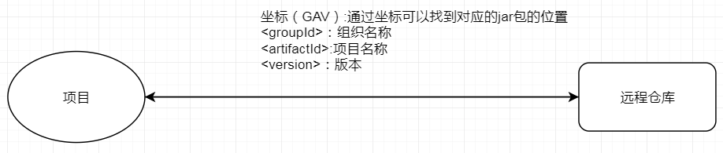


### 2.5 Maven体系结构

​          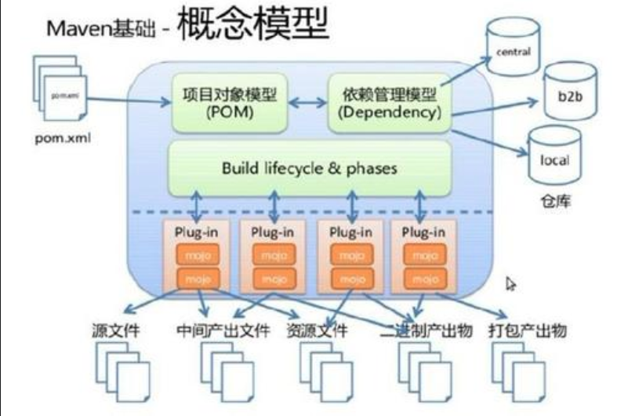

- 只需提供pom.xml以及仓库的位置，那么Maven就会自动从仓库中下载jar包或者插件
- 根据客户端给出的命令构建系统产生一系列文件（源文件、中间产出文件，资源文件....）


# 二.Maven基本使用

## 2.1 Maven的安装

### 2.1.1 Maven的下载

- http://maven.apache.org/download.cgi

### 2.1.2 安装

- 解压下载的文件

​         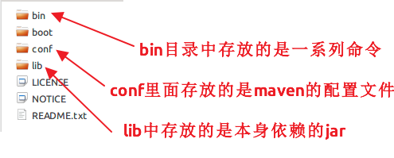

- 配置环境变量

​         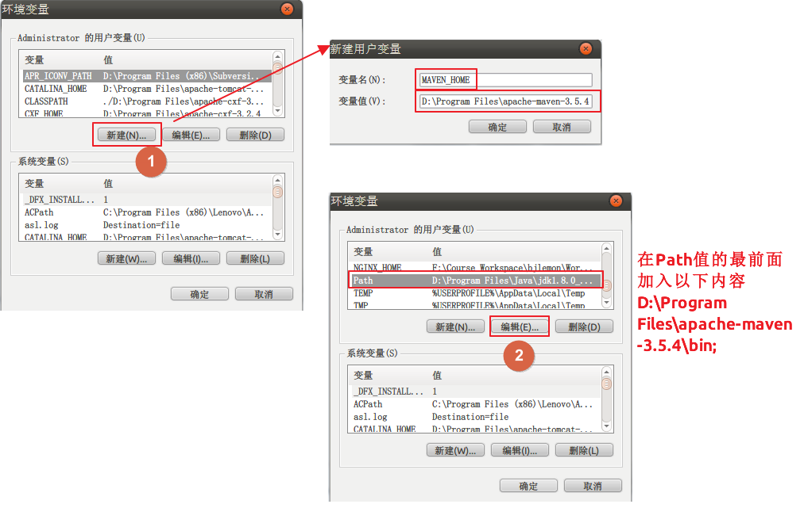

- Maven环境的测试

​         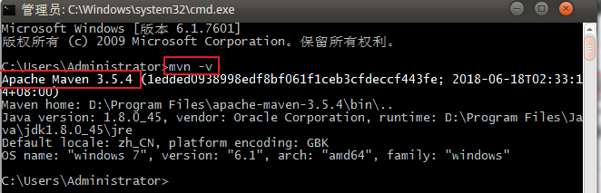

### 2.1.3 Maven仓库

- 本地仓库
    - 用来存储从远程仓库或中央仓库下载的jar包或插件
    - 项目优先查找本地仓库

​        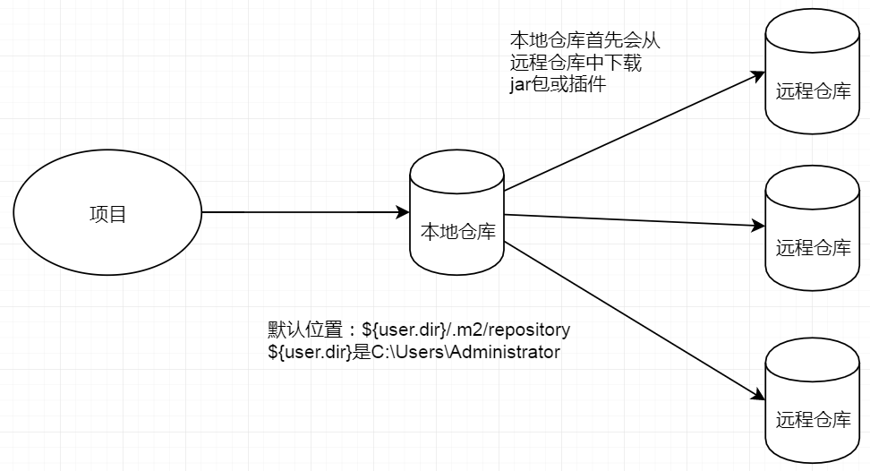


- 远程仓库
    - 如果本地仓库没有这个jar包或没有这个插件，那么就会去远程仓库下载
    - 远程仓库可以是在局域网内也可以是外网

- 中央仓库
    - Maven库
    - 服务整个互联网，由Maven团队来管理
    - http://repo1.maven.org/maven2

- 配置本地库

    - 将repository.rar文件解压

    - D:\Program Files\apache-maven-3.5.4\conf下找到一个settings.xml

    - 修改settings.xml

        - 找到<localRepository>标签，然后放开（起初是注释掉的）
        - 将这个标签中的内容改为你自己本地库的绝对路径

        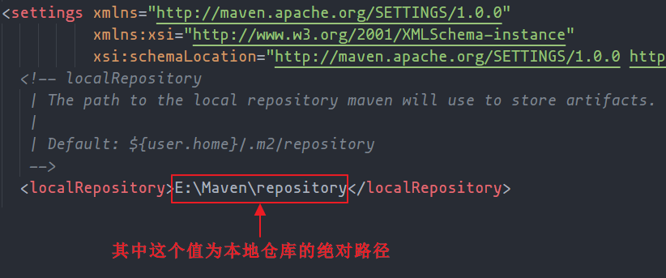

- 全局配置和用户配置

    - 全局配置：所有的项目都用settings.xml文件中指定的本地库
    - 用户配置：只是这个项目使用这个本地库
        - 将D:\Program Files\apache-maven-3.5.4\conf\下的settings.xml文件拷贝到C:\Users\Administrator\.m2下
        - 然后再修改C:\Users\Administrator\.m2目录下的settings.xml。依然修改<localRepository>

    - Maven会首先找用户配置，如果找到用户配置的settings.xml则就使用用户配置，否则就使用全局配置。

- 添加阿里云镜像（加速）

    ```xml
    <mirror>
        <id>alimaven</id>
        <name>aliyun maven</name>
        <url>http://maven.aliyun.com/nexus/content/groups/public/</url>
        <mirrorOf>central</mirrorOf>
    </mirror>
    ```

    

# 三.Maven的基本命令

## 3.1 Maven项目

​            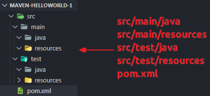

## 3.2 基本命令

```shell
mvn compile
```

 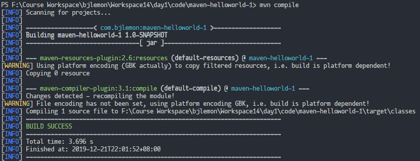

 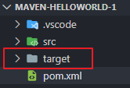


```powershell
mvn clean
```

 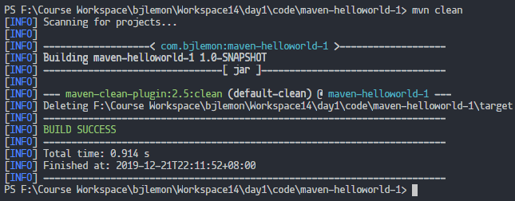


```shell
mvn test
```

 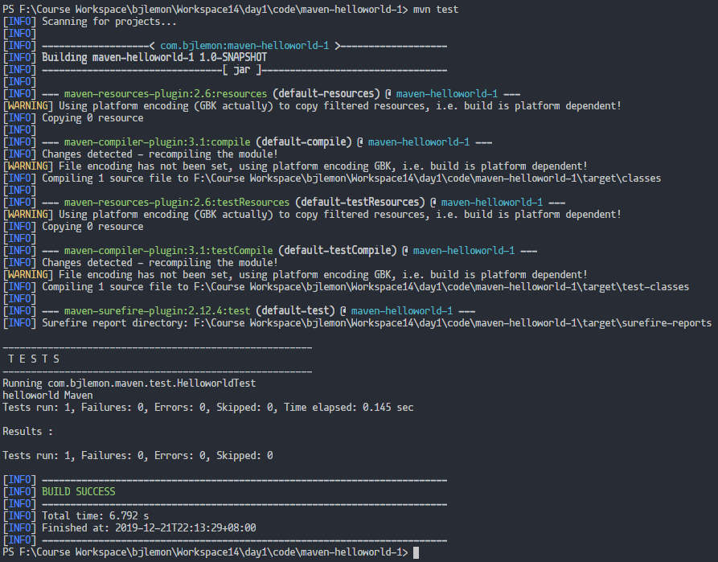


```shell
mvn package
```

 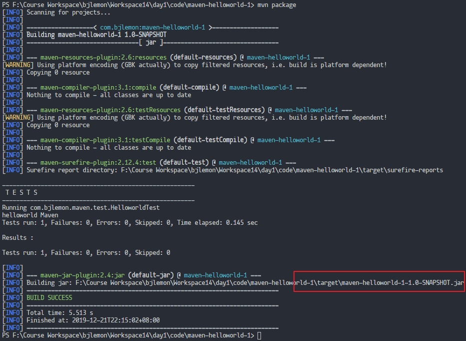

 

```shell
mvn install
```

 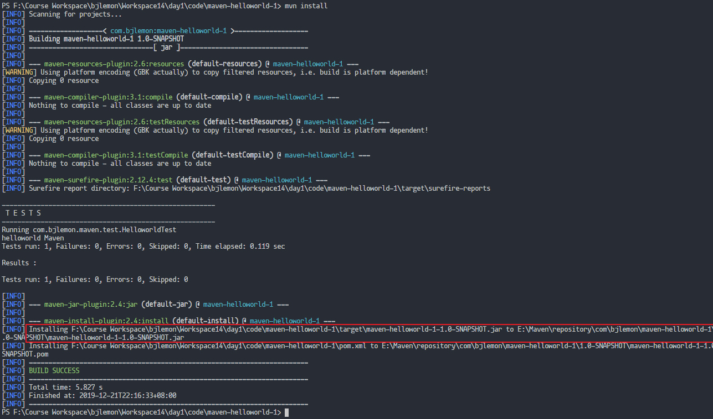


```shell
mvn clean install
```


# 四.Maven与开发工具的整合

## 4.1 Maven与Eclipse整合

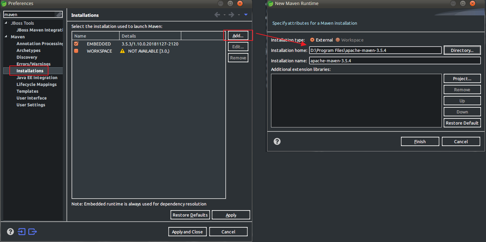

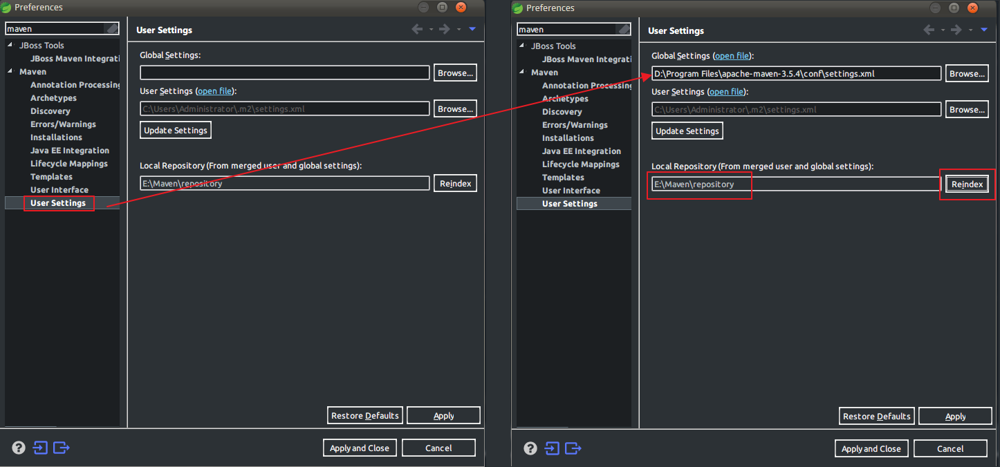


## 4.2 Maven与IDEA整合（重点）

### 4.2.1 默认配置

 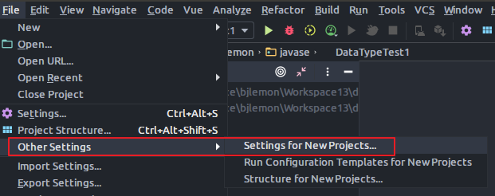

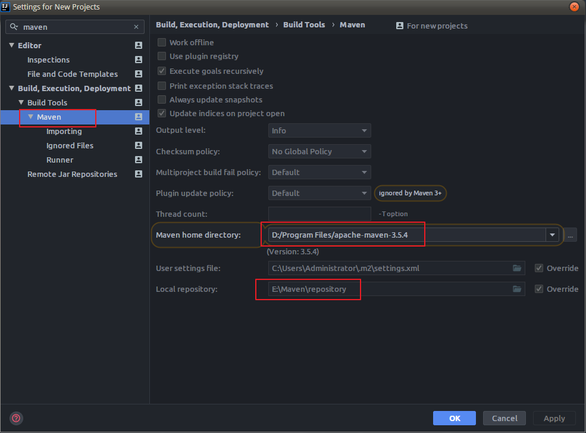

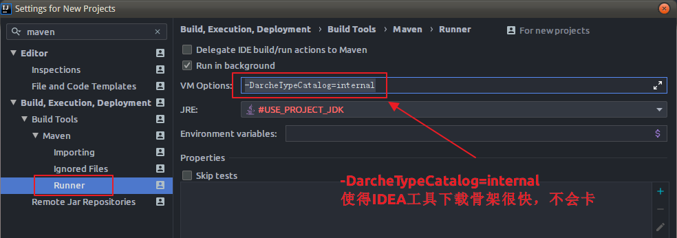


- 如果在编写pom.xml文件时没有提示，那么建议大家打开https://mvnrepository.com/。然后去搜索相应的坐标

### 4.2.2 安装Maven Helper插件（强烈建议）

### 4.2.3 常用Maven自带插件

```xml
<plugin>
    <groupId>org.apache.tomcat.maven</groupId>
    <artifactId>tomcat7-maven-plugin</artifactId>
    <version>2.2</version>
    <configuration>
        <path>/</path>
        <port>9090</port>
        <uriEncoding>UTF-8</uriEncoding>
    </configuration>
</plugin>

<plugin>
    <groupId>org.apache.maven.plugins</groupId>
    <artifactId>maven-compiler-plugin</artifactId>
    <version>3.8.1</version>
    <configuration>
        <target>1.8</target>
        <source>1.8</source>
        <encoding>UTF-8</encoding>
    </configuration>
</plugin>
```

### 4.2.4 对于web项目注意的地方

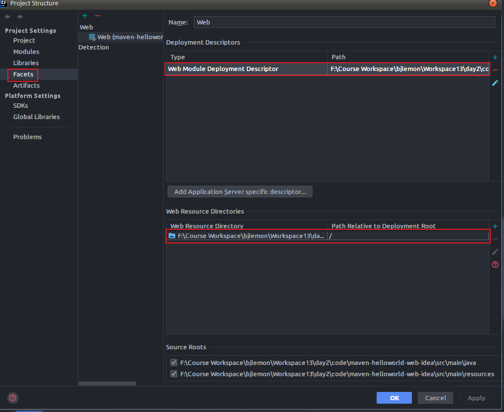


# 五.父子工程和聚合工程（SSM讲解）

## 5.1 父子工程

- 项目的包很多，此时需要将每个包的版本统一起来（包的版本可能会有冲突）。
- **此时就可以使用父工程来统一包的版本**
- 父工程的打包方式<packing>必须是pom
- 父工程一般是将项目中的所有的包进行版本统一，那么子工程继承父工程，当子工程只需要编写<groupId>和<artifactId>，<version>不用再写

​         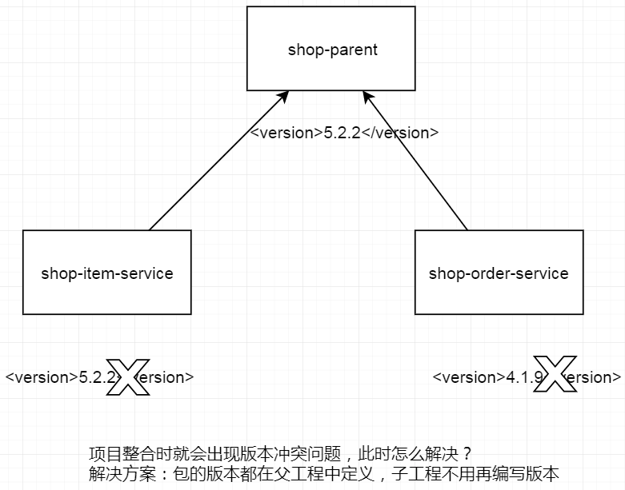

## 5.2 聚合工程

- 项目会拆分，一般可以按照**层次**划分。
- shop-dao（jar），shop-service（jar），shop-web（war）...
- 项目整合是需要将各个maven项目聚合在一起才能运行。
- shop-dao（applicationContext-dao.xml）,shop-service（applicationContext-service.xml）,shop-web（springmvc.xml）中的配置文件是需要整合才能完整进行配置，因此项目必须做聚合工程。
- 聚合工程必须是父子工程，父子工程不一定是聚合工程


