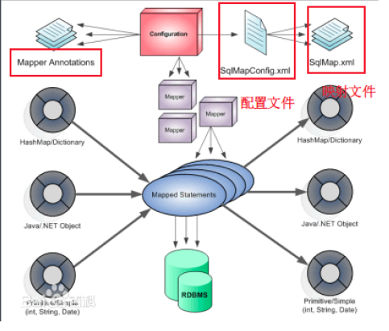
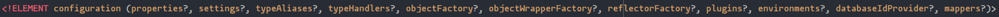
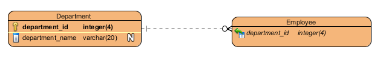
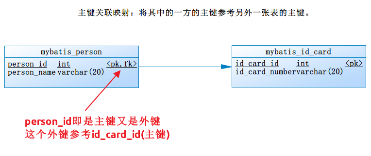
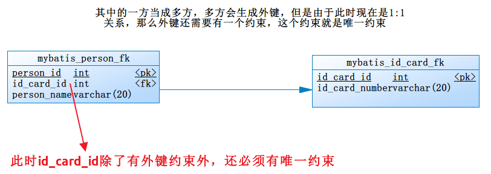
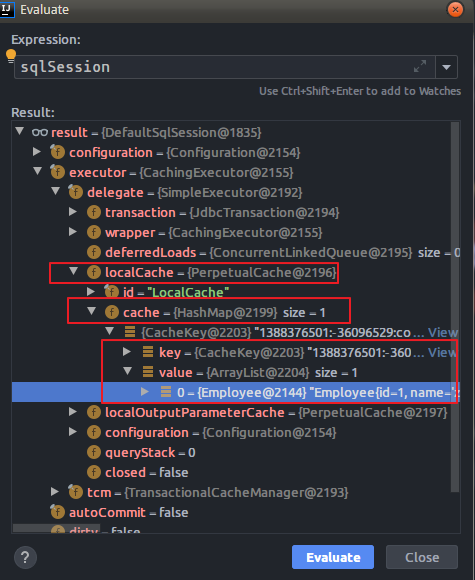
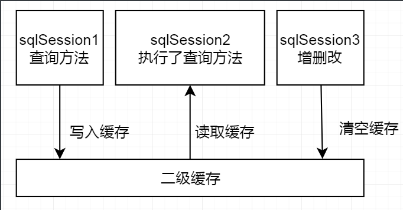

# MyBatis开发笔记

## 学习内容

## 1.MyBatis概述

## 2.MyBatis入门程序

## 3.MyBatis基本配置

## 4.MyBatis动态代理方式开发

## 5.MyBatis关联关系的映射策略

## 6.MyBatis继承映射策略

## 7.MyBatis动态SQL

## 8.MyBatis延迟加载

## 9.MyBatis缓存策略

## 10.MyBatis注解编程

## 11.MyBatis逆向工程

## 12.MyBatis插件开发

## 13.MyBatis自定义类型处理器

## 14.MyBatis源码分析（难点）

## 15.MyBatis-Plus


# 一.MyBatis概述

## 1.JDBC编程的问题

- 代码冗余，不易维护，很多硬编码
- 数据库连接，释放连接开销很大，导致浪费资源
- Statement会产生SQL注入问题，PreparedStatement又不灵活
- 结果集到对象的映射由程序员自行解决，成本很高

## 2.MyBatis是什么

- 优秀的Java实现的一个持久化层的框架（解决方案）。内部封装了JDBC，简化了JDBC
- 是一个非常优秀的ORM（对象关系型映射）产品。我个人认为MyBatis是一个ORM半成品，因为MyBatis有关系的操作
- 使用了XML或注解进行SQL语句的执行，这样减少了硬编码

## 3.MyBatis简介

- https://mybatis.org/mybatis-3/

- https://github.com/mybatis/mybatis-3

    ```markdown
    MyBatis is a first class persistence framework with support for custom SQL, stored procedures and advanced mappings. MyBatis eliminates almost all of the JDBC code and manual setting of parameters and retrieval of results. MyBatis can use simple XML or Annotations for configuration and map primitives, Map interfaces and Java POJOs (Plain Old Java Objects) to database records.
    ```

- 下载

    - https://github.com/mybatis/mybatis-3/releases
    - https://github.com/mybatis/mybatis-3.git

## 4.MyBatis体系结构

​       


# 二.MyBatis入门程序

## 2.1 传统做法

### 2.1.1 编写pom.xml

```xml
<?xml version="1.0" encoding="UTF-8"?>
<project xmlns:xsi="http://www.w3.org/2001/XMLSchema-instance"
         xmlns="http://maven.apache.org/POM/4.0.0"
         xsi:schemaLocation="http://maven.apache.org/POM/4.0.0 http://maven.apache.org/xsd/maven-4.0.0.xsd">
    <modelVersion>4.0.0</modelVersion>

    <groupId>com.bjlemon</groupId>
    <artifactId>mybatis-demo-1</artifactId>
    <version>1.0-SNAPSHOT</version>

    <dependencies>
        <!-- https://mvnrepository.com/artifact/org.mybatis/mybatis -->
        <dependency>
            <groupId>org.mybatis</groupId>
            <artifactId>mybatis</artifactId>
            <version>3.5.3</version>
        </dependency>

        <dependency>
            <groupId>mysql</groupId>
            <artifactId>mysql-connector-java</artifactId>
            <version>5.1.48</version>
            <scope>runtime</scope>
        </dependency>

        <dependency>
            <groupId>junit</groupId>
            <artifactId>junit</artifactId>
            <version>4.12</version>
            <scope>test</scope>
        </dependency>

        <dependency>
            <groupId>org.projectlombok</groupId>
            <artifactId>lombok</artifactId>
            <version>1.18.10</version>
            <scope>provided</scope>
        </dependency>

    </dependencies>

    <build>
        <plugins>
            <plugin>
                <groupId>org.apache.maven.plugins</groupId>
                <artifactId>maven-compiler-plugin</artifactId>
                <version>3.8.1</version>
                <configuration>
                    <target>1.8</target>
                    <source>1.8</source>
                    <encoding>UTF-8</encoding>
                </configuration>
            </plugin>
        </plugins>

        <!--
            资源拷贝
            将src/main/java下的所有的目录以及子孙目录的.properties文件以及.xml文件拷贝到类路径
            将src/main/resources下的所有的目录以及子孙目录的.properties文件以及.xml文件拷贝到类路径
        -->
        <resources>
            <resource>
                <directory>src/main/java</directory>
                <includes>
                    <include>**/*.properties</include>
                    <include>**/*.xml</include>
                </includes>
                <filtering>false</filtering>
            </resource>

            <resource>
                <directory>src/main/resources</directory>
                <includes>
                    <include>**/*.properties</include>
                    <include>**/*.xml</include>
                </includes>
                <filtering>false</filtering>
            </resource>
        </resources>

    </build>
</project>
```


### 2.1.2 建库建表

### 2.1.3 建立领域对象（实体类）

```java
@Data
@AllArgsConstructor
@NoArgsConstructor
@ToString
@EqualsAndHashCode
@Builder
public class User implements Serializable {

    private static final long serialVersionUID = 8527322364369347165L;
    private Integer id;
    private String name;
    private String password;
    private Float salary;
    private Date birthday;

}
```

### 2.1.4 编写DAO层

```java
package com.bjlemon.mybatis.dao.impl;

import com.bjlemon.mybatis.dao.UserDao;
import com.bjlemon.mybatis.domain.User;
import com.bjlemon.mybatis.util.MyBatisUtils;
import org.apache.ibatis.session.SqlSession;

import java.util.Collections;
import java.util.List;

public class UserDaoImpl implements UserDao {

    @Override
    public void save(User user) {
        SqlSession sqlSession = null;

        try {
            sqlSession = MyBatisUtils.getSqlSession();
            sqlSession.insert("com.bjlemon.mybatis.domain.save", user);
            sqlSession.commit();
        } catch (Exception e) {
            e.printStackTrace();
            sqlSession.rollback();
        } finally {
            MyBatisUtils.closeSqlSession();
        }
    }

    @Override
    public void delete(User user) {
        SqlSession sqlSession = null;

        try {
            sqlSession = MyBatisUtils.getSqlSession();
            sqlSession.delete("com.bjlemon.mybatis.domain.delete", user);
            sqlSession.commit();
        } catch (Exception e) {
            e.printStackTrace();
            sqlSession.rollback();
        } finally {
            MyBatisUtils.closeSqlSession();
        }
    }

    @Override
    public void update(User user) {
        SqlSession sqlSession = null;

        try {
            sqlSession = MyBatisUtils.getSqlSession();
            sqlSession.update("com.bjlemon.mybatis.domain.update", user);
            sqlSession.commit();
        } catch (Exception e) {
            e.printStackTrace();
            sqlSession.rollback();
        } finally {
            MyBatisUtils.closeSqlSession();
        }
    }

    @Override
    public User findById(Integer id) {
        SqlSession sqlSession = null;
        User user = null;
        try {
            sqlSession = MyBatisUtils.getSqlSession();
            user = sqlSession.selectOne("com.bjlemon.mybatis.domain.findById", id);
        } catch (Exception e) {
            e.printStackTrace();
        } finally {
            MyBatisUtils.closeSqlSession();
        }

        return user;
    }

    @Override
    public List<User> findAll() {
        SqlSession sqlSession = null;
        List<User> userList = Collections.emptyList();
        try {
            sqlSession = MyBatisUtils.getSqlSession();
            userList = sqlSession.selectList("com.bjlemon.mybatis.domain.findAll");
        } catch (Exception e) {
            e.printStackTrace();
        } finally {
            MyBatisUtils.closeSqlSession();
        }

        return userList;
    }
}

```


### 2.1.5 编写service层

```java
package com.bjlemon.mybatis.service.impl;

import com.bjlemon.mybatis.dao.UserDao;
import com.bjlemon.mybatis.dao.impl.UserDaoImpl;
import com.bjlemon.mybatis.domain.User;
import com.bjlemon.mybatis.service.UserService;

import java.util.List;

public class UserServiceImpl implements UserService {

    private UserDao userDao = new UserDaoImpl();

    @Override
    public void addUser(User user) {
        if (user == null) {
            throw new IllegalArgumentException("");
        }

        this.userDao.save(user);
    }

    @Override
    public void deleteUser(User user) {
        if (user == null) {
            throw new IllegalArgumentException("");
        }

        this.userDao.delete(user);
    }

    @Override
    public void modifyUser(User user) {
        if (user == null) {
            throw new IllegalArgumentException("");
        }

        this.userDao.update(user);
    }

    @Override
    public User findUserById(Integer id) {
        if (id == null || id <= 0) {
            throw new IllegalArgumentException("");
        }

        return this.userDao.findById(id);
    }

    @Override
    public List<User> findAllUserList() {
        return this.userDao.findAll();
    }
}

```

### 2.1.6 编写UserMapper.xml

```xml
<?xml version="1.0" encoding="UTF-8" ?>
<!DOCTYPE mapper
        PUBLIC "-//mybatis.org//DTD Mapper 3.0//EN"
        "http://mybatis.org/dtd/mybatis-3-mapper.dtd">

<mapper namespace="com.bjlemon.mybatis.domain">

    <insert id="save" parameterType="com.bjlemon.mybatis.domain.User">
        insert into
            mybatis_user(user_name, user_password, user_salary, user_birthday)
        values
            (#{name},#{password},#{salary},#{birthday})
    </insert>

    <delete id="delete">
        delete
        from
            mybatis_user
        where
            user_id = #{id}
    </delete>

    <update id="update">
        update
            mybatis_user
        set
            user_name = #{name},
            user_password = #{password},
            user_salary = #{salary},
            user_birthday = #{birthday}
        where
            user_id = #{id}
    </update>

    <select id="findById" resultType="com.bjlemon.mybatis.domain.User">
        select
            user_id id,
            user_name name,
            user_password password,
            user_salary salary,
            user_birthday birthday
        from
            mybatis_user
        where
            user_id = #{id}
    </select>

    <select id="findAll" resultType="com.bjlemon.mybatis.domain.User">
        select
            user_id id,
            user_name name,
            user_password password,
            user_salary salary,
            user_birthday birthday
        from
            mybatis_user
    </select>

</mapper>
```

### 2.1.7 作业：有条件的分页查询如何实现？


# 三.动态代理方式的开发

## 3.1 编写pom.xml

```xml
<dependencies>
    <dependency>
        <groupId>org.mybatis</groupId>
        <artifactId>mybatis</artifactId>
        <version>3.5.3</version>
    </dependency>

    <dependency>
        <groupId>mysql</groupId>
        <artifactId>mysql-connector-java</artifactId>
        <version>5.1.48</version>
        <scope>runtime</scope>
    </dependency>

    <dependency>
        <groupId>junit</groupId>
        <artifactId>junit</artifactId>
        <version>4.12</version>
        <scope>test</scope>
    </dependency>

    <dependency>
        <groupId>org.projectlombok</groupId>
        <artifactId>lombok</artifactId>
        <version>1.18.10</version>
        <scope>provided</scope>
    </dependency>
</dependencies>

<build>
    <plugins>
        <plugin>
            <groupId>org.apache.maven.plugins</groupId>
            <artifactId>maven-compiler-plugin</artifactId>
            <version>3.8.1</version>
            <configuration>
                <target>1.8</target>
                <source>1.8</source>
                <encoding>UTF-8</encoding>
            </configuration>
        </plugin>
    </plugins>

    <resources>
        <resource>
            <directory>src/main/java</directory>
            <includes>
                <include>**/*.properties</include>
                <include>**/*.xml</include>
            </includes>
            <filtering>false</filtering>
        </resource>

        <resource>
            <directory>src/main/resources</directory>
            <includes>
                <include>**/*.properties</include>
                <include>**/*.xml</include>
            </includes>
            <filtering>false</filtering>
        </resource>
    </resources>

</build>
```

## 3.2 编写mybatis-config.xml

```xml
<configuration>
    <properties resource="db.properties"/>

    <typeAliases>
        <!--
            默认去使用com.bjlemon.mybatis.domain包下的所有的类对应的类的简单名作为别名
            com.bjlemon.mybatis.domain.User别名为User
        -->
        <package name="com.bjlemon.mybatis.domain"/>
    </typeAliases>

    <environments default="development">
        <environment id="development">
            <transactionManager type="JDBC"/>
            <dataSource type="POOLED">
                <property name="driver" value="${jdbc.driverClassName}"/>
                <property name="url" value="${jdbc.url}"/>
                <property name="username" value="${jdbc.username}"/>
                <property name="password" value="${jdbc.password}"/>
            </dataSource>
        </environment>
    </environments>

    <mappers>
        <!--
            默认去com.bjlemon.mybatis.mapper包下找到对应的映射文件
            该映射文件的名称与接口的名称保持一致
        -->
        <package name="com.bjlemon.mybatis.mapper"/>
    </mappers>

</configuration>
```

## 3.3 建立UserMapper

```java
/**
 * @author jeffzhou
 * @version 1.0.0
 * @ClassName UserMapper.java
 * @Description TODO
 * @createTime 2019年12月26日 20:17:00
 */
public interface UserMapper {

    void save(User user);

    void delete(User user);

    void update(User user);

    User findById(Integer id);

    List<User> findAll();
}
```

## 3.4 建立UserMapper.xml

```xml
<?xml version="1.0" encoding="UTF-8" ?>
<!DOCTYPE mapper
        PUBLIC "-//mybatis.org//DTD Mapper 3.0//EN"
        "http://mybatis.org/dtd/mybatis-3-mapper.dtd">

<mapper namespace="com.bjlemon.mybatis.mapper.UserMapper">

    <insert id="save" parameterType="com.bjlemon.mybatis.domain.User">
        insert into
            mybatis_user(user_name, user_password, user_salary, user_birthday)
        values
            (#{name},#{password},#{salary},#{birthday})
    </insert>

    <delete id="delete">
        delete
        from
            mybatis_user
        where
            user_id = #{id}
    </delete>

    <update id="update">
        update
            mybatis_user
        set
            user_name = #{name},
            user_password = #{password},
            user_salary = #{salary},
            user_birthday = #{birthday}
        where
            user_id = #{id}
    </update>

    <select id="findById" resultType="com.bjlemon.mybatis.domain.User">
        select
            user_id id,
            user_name name,
            user_password password,
            user_salary salary,
            user_birthday birthday
        from
            mybatis_user
        where
            user_id = #{id}
    </select>

    <select id="findAll" resultType="com.bjlemon.mybatis.domain.User">
        select
            user_id id,
            user_name name,
            user_password password,
            user_salary salary,
            user_birthday birthday
        from
            mybatis_user
    </select>

</mapper>
```

- 其中namespace的值必须写上“com.bjlemon.mybatis.mapper.UserMapper”
- 在这个UserMapper接口中的方法的名称必须与映射文件中的<insert>,<delete>,<update>,<select>的id值保持一致

## 3.5 编写测试

```java
package com.bjlemon.mybatis.mapper;

import com.bjlemon.mybatis.domain.User;
import com.bjlemon.mybatis.util.MyBatisUtils;
import org.apache.ibatis.session.SqlSession;
import org.junit.Test;

import java.util.Collections;
import java.util.Date;
import java.util.List;

/**
 * @author jeffzhou
 * @version 1.0.0
 * @ClassName UserMapperTest.java
 * @Description TODO
 * @createTime 2019年12月26日 20:24:00
 */
public class UserMapperTest {

    @Test
    public void testSave() {
        SqlSession sqlSession = null;

        try {
            sqlSession = MyBatisUtils.getSqlSession();
            UserMapper userMapper = sqlSession.getMapper(UserMapper.class);

            User user = User.builder()
                    .name("wangwu")
                    .password("test")
                    .salary(55.34F)
                    .birthday(new Date())
                    .build();
            userMapper.save(user);

            sqlSession.commit();
        } catch (Exception e) {
            e.printStackTrace();
            sqlSession.rollback();
        } finally {
            MyBatisUtils.closeSqlSession();
        }
    }

    @Test
    public void testDelete() {
        SqlSession sqlSession = null;

        try {
            sqlSession = MyBatisUtils.getSqlSession();
            UserMapper userMapper = sqlSession.getMapper(UserMapper.class);

            User user = userMapper.findById(3);
            userMapper.delete(user);

            sqlSession.commit();
        } catch (Exception e) {
            e.printStackTrace();
            sqlSession.rollback();
        } finally {
            MyBatisUtils.closeSqlSession();
        }
    }

    @Test
    public void testUpdate() {
        SqlSession sqlSession = null;

        try {
            sqlSession = MyBatisUtils.getSqlSession();
            UserMapper userMapper = sqlSession.getMapper(UserMapper.class);

            User user = userMapper.findById(2);
            user.setName("C罗");
            user.setPassword("admin");
            user.setSalary(1000.00F);
            userMapper.update(user);

            sqlSession.commit();
        } catch (Exception e) {
            e.printStackTrace();
            sqlSession.rollback();
        } finally {
            MyBatisUtils.closeSqlSession();
        }
    }

    @Test
    public void testFindAll() {
        SqlSession sqlSession = null;
        List<User> userList = Collections.EMPTY_LIST;
        try {
            sqlSession = MyBatisUtils.getSqlSession();
            UserMapper userMapper = sqlSession.getMapper(UserMapper.class);

            userList = userMapper.findAll();
            userList.stream().forEach(System.out::println);
        } catch (Exception e) {
            e.printStackTrace();
            sqlSession.rollback();
        } finally {
            MyBatisUtils.closeSqlSession();
        }

    }
}
```


# 四.mybatis-config.xml配置文件

## 4.1 配置的内容与顺序



- properties
    - property
- settings
    - setting
- typeAliases
    - package
    - typeAlias
- plugins
- environments
    - environment
        - transactionManager
        - dataSource
- mappers
    - package
    - mapper


# 五.关联关系映射策略（重点）

## 5.1 一对多关系

​           


- 数据库脚本

    ```sql
    CREATE TABLE mybatis_department
    (
        department_id       INT(4) PRIMARY KEY AUTO_INCREMENT,
        department_name     VARCHAR(20) NOT NULL,
        department_location VARCHAR(20) NOT NULL
    );
    
    CREATE TABLE mybatis_employee
    (
        employee_id       INT(4) PRIMARY KEY AUTO_INCREMENT,
        employee_name     VARCHAR(20) NOT NULL,
        employee_password VARCHAR(20) NOT NULL,
        employee_salary   FLOAT(6, 2) NOT NULL,
        employee_birthday DATE        NOT NULL,
        department_id     INT(4)
    );
    
    ALTER TABLE mybatis_employee
        ADD CONSTRAINT fk_department_id FOREIGN KEY (department_id)
            REFERENCES mybatis_department (department_id);
    ```

- 建立领域对象

    ```java
    @Data
    @NoArgsConstructor
    @AllArgsConstructor
    @Builder
    public class Department implements Serializable {
    
        private static final long serialVersionUID = -2060603187050196155L;
        private Integer id;
        private String name;
        private String location;
    
        private Set<Employee> employees;
    
        @Override
        public String toString() {
            return "Department{" +
                    "id=" + id +
                    ", name='" + name + '\'' +
                    ", location='" + location + '\'' +
                    '}';
        }
    }
    ```

    ```java
    @Data
    @NoArgsConstructor
    @AllArgsConstructor
    @Builder
    public class Employee implements Serializable {
    
        private static final long serialVersionUID = -4484286206402095879L;
        private Integer id;
        private String name;
        private String password;
        private Float salary;
        private Date birthday;
    
        private Department department;
    
        @Override
        public String toString() {
            return "Employee{" +
                    "id=" + id +
                    ", name='" + name + '\'' +
                    ", password='" + password + '\'' +
                    ", salary=" + salary +
                    ", birthday=" + birthday +
                    '}';
        }
    
    }
    
    ```

- 建立Mapper接口

    - 建议大家安装IDEA的mybatis插件

    ```java
    /**
     * @author jeffzhou
     * @version 1.0.0
     * @ClassName DepartmentMapper.java
     * @Description TODO
     * @createTime 2019年12月26日 21:16:00
     */
    public interface DepartmentMapper {
    
        void save(Department department);
    
    }
    ```

    ```java
    /**
     * @author jeffzhou
     * @version 1.0.0
     * @ClassName EmployeeMapper.java
     * @Description TODO
     * @createTime 2019年12月26日 21:17:00
     */
    public interface EmployeeMapper {
    
        void save(Employee employee);
    }
    ```

- 建立DepartmentMapper.xml以及EmployeeMapper.xml文件

    ```xml
    <?xml version="1.0" encoding="UTF-8" ?>
    <!DOCTYPE mapper
            PUBLIC "-//mybatis.org//DTD Mapper 3.0//EN"
            "http://mybatis.org/dtd/mybatis-3-mapper.dtd">
    
    <mapper namespace="com.bjlemon.mybatis.mapper.DepartmentMapper">
    
        <resultMap id="DepartmentBaseResultMap" type="Department">
            <id property="id" column="department_id"/>
            <result property="name" column="department_name"/>
            <result property="location" column="department_location"/>
        </resultMap>
    
        <!--<resultMap id="DepartmentResultMap" type="Department" extends="DepartmentBaseResultMap">
            <collection property="employees" column="department_id" ofType="Employee"
                        resultMap="com.bjlemon.mybatis.mapper.EmployeeMapper.EmployeeBaseResultMap"/>
        </resultMap>-->
    
        <resultMap id="DepartmentResultMap" type="Department" extends="DepartmentBaseResultMap">
            <collection property="employees" column="department_id" ofType="Employee"
                        select="com.bjlemon.mybatis.mapper.EmployeeMapper.findEmployeesByDepartmentId"/>
        </resultMap>
    
        <insert id="save">
            INSERT INTO mybatis_department (department_name, department_location) VALUES (#{name},#{location})
        </insert>
    
        <select id="findById" resultType="Department">
            select
                department_id id,
                department_name name,
                department_location location
            from
                mybatis_department
            where
                department_id = #{id}
        </select>
    
        <select id="findEmployeesByDepartmentName" resultType="Employee">
            select
                me.employee_id id,
                me.employee_name name,
                me.employee_password password,
                me.employee_salary salary,
                me.employee_birthday birthday
            from
                mybatis_employee me
            left join
                mybatis_department md on me.department_id = md.department_id
            where
                md.department_name = #{name}
        </select>
    
        <!--<select id="findByName" resultMap="DepartmentResultMap">
            select
                md.department_id,
                md.department_name,
                md.department_location,
                me.employee_id,
                me.employee_name,
                me.employee_password,
                me.employee_salary,
                me.employee_birthday
            from
                mybatis_department md
            left join
                mybatis_employee me on md.department_id = me.department_id
            where
                md.department_name = #{name}
        </select>-->
    
        <select id="findByName" resultMap="DepartmentResultMap">
            select
                department_id,
                department_name,
                department_location
            from
                mybatis_department
            where
                department_name = #{name}
        </select>
    </mapper>
    ```

    ```xml
    <?xml version="1.0" encoding="UTF-8" ?>
    <!DOCTYPE mapper
            PUBLIC "-//mybatis.org//DTD Mapper 3.0//EN"
            "http://mybatis.org/dtd/mybatis-3-mapper.dtd">
    
    <mapper namespace="com.bjlemon.mybatis.mapper.EmployeeMapper">
    
        <resultMap id="EmployeeBaseResultMap" type="Employee">
            <id property="id" column="employee_id"/>
            <result property="name" column="employee_name"/>
            <result property="password" column="employee_password"/>
            <result property="salary" column="employee_salary"/>
            <result property="birthday" column="employee_birthday"/>
        </resultMap>
    
        <!--<resultMap id="EmployeeResultMap" type="Employee" extends="EmployeeBaseResultMap">
            <association property="department" column="department_id" javaType="Department">
                <id property="id" column="department_id"/>
                <result property="name" column="department_name"/>
                <result property="location" column="department_location"/>
            </association>
        </resultMap>-->
    
        <!--<resultMap id="EmployeeResultMap" type="Employee" extends="EmployeeBaseResultMap">
            <association property="department" column="department_id" javaType="Department"
                         resultMap="com.bjlemon.mybatis.mapper.DepartmentMapper.DepartmentBaseResultMap"/>
        </resultMap>-->
    
        <resultMap id="EmployeeResultMap" type="Employee" extends="EmployeeBaseResultMap">
            <association property="department" column="department_id" javaType="Department"
                         select="com.bjlemon.mybatis.mapper.DepartmentMapper.findById"/>
        </resultMap>
    
    
        <insert id="save">
            INSERT INTO
                mybatis_employee(employee_name, employee_password, employee_salary, employee_birthday, department_id)
            VALUES
                (#{name},#{password},#{salary},#{birthday},#{department.id})
        </insert>
    
        <select id="findDepartmentByEmployeeName" resultType="Department">
            select
                md.department_id id,
                md.department_name name,
                md.department_location location
            from
                mybatis_department md
            left join
                mybatis_employee me on md.department_id = me.department_id
            where
                employee_name = #{name}
        </select>
    
        <!--<select id="findByName" resultMap="EmployeeResultMap">
            select
                me.employee_id,
                me.employee_name,
                me.employee_password,
                me.employee_salary,
                me.employee_birthday,
                me.department_id,
                md.department_name,
                md.department_location
            from
                mybatis_employee me
            left join
                mybatis_department md on me.department_id = md.department_id
            where
                me.employee_name = #{name}
        </select>-->
    
        <select id="findByName" resultMap="EmployeeResultMap">
            select
                employee_id,
                employee_name,
                employee_password,
                employee_salary,
                employee_birthday,
                department_id
            from
                mybatis_employee
            where
                employee_name = #{name}
        </select>
    
        <select id="findEmployeesByDepartmentId" resultMap="EmployeeBaseResultMap">
            select
                employee_id,
                employee_name,
                employee_password,
                employee_salary,
                employee_birthday
            from
                mybatis_employee
            where
                department_id = #{id}
        </select>
    </mapper>
    ```
    
    

## 5.2 一对一关联

### 5.2.1 主键关联映射



```sql
CREATE TABLE mybatis_person_pk
(
    person_id   INT(4) PRIMARY KEY AUTO_INCREMENT,
    person_name VARCHAR(20) NOT NULL
);

CREATE TABLE mybatis_id_card_pk
(
    id_card_id     INT(4) PRIMARY KEY AUTO_INCREMENT,
    id_card_number VARCHAR(20) NOT NULL
);

ALTER TABLE mybatis_person_pk
    ADD CONSTRAINT fk_person_id FOREIGN KEY (person_id)
        REFERENCES mybatis_id_card_pk (id_card_id);
```


### 5.2.2 外键关联映射



```sql
CREATE TABLE mybatis_person_fk
(
    person_id   INT(4) PRIMARY KEY AUTO_INCREMENT,
    person_name VARCHAR(20) NOT NULL,
    id_card_id  INT(4)
);

CREATE TABLE mybatis_id_card_fk
(
    id_card_id     INT(4) PRIMARY KEY AUTO_INCREMENT,
    id_card_number VARCHAR(20) NOT NULL
);

ALTER TABLE mybatis_person_fk
    ADD CONSTRAINT fk_id_card_id FOREIGN KEY (id_card_id)
        REFERENCES mybatis_id_card_fk (id_card_id);

ALTER TABLE mybatis_person_fk
    ADD CONSTRAINT uk_id_card_id UNIQUE (id_card_id);
```

## 5.3 多对多关系

```sql
CREATE TABLE mybatis_teacher
(
    teacher_id   INT(4) PRIMARY KEY AUTO_INCREMENT,
    teacher_name VARCHAR(20) NOT NULL
);

CREATE TABLE mybatis_student
(
    student_id   INT(4) PRIMARY KEY AUTO_INCREMENT,
    student_name VARCHAR(20) NOT NULL
);

CREATE TABLE mybatis_teacher_student
(
    teacher_id INT(4),
    student_id INT(4)
);

ALTER TABLE mybatis_teacher_student
    ADD CONSTRAINT pk_teacher_id_student_id PRIMARY KEY (teacher_id, student_id);

ALTER TABLE mybatis_teacher_student
    ADD CONSTRAINT fk_teacher_id FOREIGN KEY (teacher_id)
        REFERENCES mybatis_teacher (teacher_id);

ALTER TABLE mybatis_teacher_student
    ADD CONSTRAINT fk_student_id FOREIGN KEY (student_id)
        REFERENCES mybatis_student (student_id);
```


## 5.4 无限极分类

```sql
CREATE TABLE mybatis_category
(
    category_id   INT(4) PRIMARY KEY AUTO_INCREMENT,
    category_name VARCHAR(20) NOT NULL,
    parent_id     INT(4)
);

ALTER TABLE mybatis_category
    ADD CONSTRAINT fk_parent_id FOREIGN KEY (parent_id)
        REFERENCES mybatis_category (category_id);
```

```xml
<select id="findParentByName" resultType="Category">
    select
    mcp.category_id id,
    mcp.category_name name
    from
    mybatis_category mcp
    left join mybatis_category mc on mc.parent_id = mcp.category_id
    where
    mc.category_name = #{name}
</select>
```


# 六.继承映射

## 6.1 建表

| animal_id | animal_name | eye_color | fur_color | type |
| :-------: | :---------: | :-------: | :-------: | :--: |
|     1     |    小猫     |   blue    |           |  C   |
|   小狗    |             |           |           |      |
|     2     |    小狗     |           |   black   |  D   |

## 6.2 映射文件

```xml
<resultMap id="AnimalResultMap" type="Animal">
    <id property="id" column="animal_id"/>
    <result property="name" column="animal_name"/>
    <discriminator javaType="java.lang.String" column="type">
        <case value="C" resultMap="CatResultMap"/>
        <case value="D" resultMap="DogResultMap"/>
    </discriminator>
</resultMap>

<resultMap id="CatResultMap" type="Cat" extends="AnimalResultMap">
    <result property="eyeColor" column="eye_color"/>
</resultMap>

<resultMap id="DogResultMap" type="Dog" extends="AnimalResultMap">
    <result property="furColor" column="fur_color"/>
</resultMap>
```


# 七.动态SQL

## 7.1 概述

- 在之前的JDBC编程中可能会涉及到拼接SQL，这种拼接SQL的实现方式可能会有错误
- 动态SQL类似于JSTL。内部使用了OGNL表达式

## 7.2 重要的标签

- if
- choose（when，otherwise）
- trim（where，set）
- foreach


# 八.插入一条记录返回其主键

## 8.1 第一种实现方式

```xml
<insert id="save" useGeneratedKeys="true" keyProperty="id" keyColumn="user_id">
    insert into mybatis_user (user_name, user_password, user_salary, user_birthday) VALUES
    (#{name},#{password},#{salary},#{birthday})
</insert>
```

## 8.2 第二种实现方式

```xml
<insert id="persist">
    <selectKey keyProperty="id" keyColumn="user_id" order="AFTER" resultType="int">
        select last_insert_id() as id
    </selectKey>
    insert into mybatis_user (user_id,user_name, user_password, user_salary, user_birthday) VALUES
    (#{id},#{name},#{password},#{salary},#{birthday})
</insert>
```


# 九.延迟加载

## 9.1 概念

- 我们真正用到数据时才与数据库交互
- 延迟加载一定用在关联关系上
- 优点：
    - 当查询一方时，如果关联的对象的数据很多，那么此时用到延迟加载可以提供性能

## 9.2 如何实现

- 延迟加载发生在对象关系上
- <association>或<collection>

## 9.3 案例

### 9.3.1 打开总开关

```xml
<settings>
    <setting name="lazyLoadingEnabled" value="true"/>
    <setting name="aggressiveLazyLoading" value="false"/>
</settings>
```

### 9.3.2 建立领域对象

```java
package com.bjlemon.mybatis.domain;

import lombok.AllArgsConstructor;
import lombok.Data;
import lombok.NoArgsConstructor;

import java.io.Serializable;
import java.util.Date;
import java.util.Objects;

/**
 * @author jeffzhou
 * @version 1.0.0
 * @ClassName Employee.java
 * @Description TODO
 * @createTime 2019年12月26日 21:14:00
 */
@Data
@NoArgsConstructor
@AllArgsConstructor
public class Employee implements Serializable {

    private static final long serialVersionUID = 8527322364369347165L;
    private Integer id;
    private String name;
    private String password;
    private Float salary;
    private Date birthday;
    private Department department;

    @Override
    public boolean equals(Object o) {
        if (this == o) return true;
        if (o == null || getClass() != o.getClass()) return false;
        Employee employee = (Employee) o;
        return Objects.equals(id, employee.id) &&
                Objects.equals(name, employee.name) &&
                Objects.equals(password, employee.password) &&
                Objects.equals(salary, employee.salary) &&
                Objects.equals(birthday, employee.birthday);
    }

    @Override
    public int hashCode() {
        return Objects.hash(id, name, password, salary, birthday);
    }

    @Override
    public String toString() {
        return "Employee{" +
                "id=" + id +
                ", name='" + name + '\'' +
                ", password='" + password + '\'' +
                ", salary=" + salary +
                ", birthday=" + birthday +
                '}';
    }
}

```

```java
package com.bjlemon.mybatis.domain;

import lombok.AllArgsConstructor;
import lombok.Data;
import lombok.NoArgsConstructor;

import java.io.Serializable;
import java.util.HashSet;
import java.util.Objects;
import java.util.Set;

@Data
@AllArgsConstructor
@NoArgsConstructor
public class Department implements Serializable {

    private static final long serialVersionUID = -2060603187050196155L;
    private Integer id;
    private String name;
    private String location;
    private Set<Employee> employees = new HashSet<>();

    @Override
    public boolean equals(Object o) {
        if (this == o) return true;
        if (o == null || getClass() != o.getClass()) return false;
        Department that = (Department) o;
        return Objects.equals(id, that.id) &&
                Objects.equals(name, that.name) &&
                Objects.equals(location, that.location);
    }

    @Override
    public int hashCode() {
        return Objects.hash(id, name, location);
    }

    @Override
    public String toString() {
        return "Department{" +
                "id=" + id +
                ", name='" + name + '\'' +
                ", location='" + location + '\'' +
                '}';
    }
}

```

```xml
<resultMap id="EmployeeResultMap" type="Employee">
        <id property="id" column="employee_id"/>
        <result property="name" column="employee_name"/>
        <result property="password" column="employee_password"/>
        <result property="salary" column="employee_salary"/>
        <result property="birthday" column="employee_birthday"/>
        <association property="department" column="department_id" javaType="Department"
                     select="com.bjlemon.mybatis.mapper.DepartmentMapper.findById"/>
    </resultMap>
```

# 十.缓存

## 10.1 缓存的概念

- 用来减少对数据库查询操作的次数。性能会有提升
- MyBatis缓存
    - 一级缓存
    - 二级缓存

## 10.2 一级缓存

### 10.2.1 一级缓存的概念

- 一级缓存基于SqlSession级别
- 只有SqlSession关闭或flush，一级缓存消失
- 干预一级缓存（强制将对象从一级缓存中移除）
- 只要执行了增删改操作，一级缓存消失

### 10.2.2 测试

### 10.2.3 一级缓存内存结构

 

- 从上面的内存图得知：一级缓存实际缓存的是HashMap。这个Map中的Key主要的组成部分是映射文件中namepace属性值与<select>标签中的id值拼接而成。下图所示为key的完整内容：


```markdown
-1877527505:893948537:com.bjlemon.mybatis.mapper.UserMapper.findById:0:2147483647:select
user_id, user_name, user_password, user_salary, user_birthday
from
t_user
where
user_id =?:4:development
```

而value实际上是一个ArrayList，在这个ArrayList存放的就是查询出来的对象

## 10.3 二级缓存

- 二级缓存是mapper映射级别的缓s存，多个SqlSession去操作同一个Mapper映射的sql语句，多个SqlSession可以共享二级缓存，二级缓存是跨SqlSession的

​      

### 10.3.1 如何实现

- 开启总开关

    ```xml
    <!--开启二级缓存-->
    <setting name="cacheEnabled" value="true"/>
    ```

- 开启二级缓存的支持

    ```xml
    <mapper namespace="com.bjlemon.mybatis.mapper.EmployeeMapper">
    
        <!--开启二级缓存的支持-->
        <cache/>
    </mapper>
    ```

- 使用useCache属性使用二级缓存

    ```xml
    <select id="findAll" resultMap="EmployeeResultMap" useCache="true">
        select
        *
        from
        mybatis_employee
    </select>
    ```

### 10.3.2 mybatis与ehcache整合

- ehcache是一个程序级别的缓存产品

- 开源，基于Java开发的缓存产品

- 官网： https://www.ehcache.org/ 

    ```
    Ehcache is an open source, standards-based cache that boosts performance, offloads your database, and simplifies scalability. It's the most widely-used Java-based cache because it's robust, proven, full-featured, and integrates with other popular libraries and frameworks. Ehcache scales from in-process caching, all the way to mixed in-process/out-of-process deployments with terabyte-sized caches.
    ```

- 使用Ehcache

```xml
<dependency>
    <groupId>org.ehcache</groupId>
    <artifactId>ehcache</artifactId>
    <version>3.8.1</version>
</dependency>

<dependency>
    <groupId>org.mybatis</groupId>
    <artifactId>mybatis-ehcache</artifactId>
    <version>1.0.0</version>
</dependency>
```

- 将ehcache核心库中一个ehcache-xxx.xml文件拷贝一份到类路径下，一般修改为ehcache.xml

- 修改配置（一般使用默认）

- 开启二级缓存

    ```xml
    <!--开启二级缓存-->
    <setting name="cacheEnabled" value="true"/>
    ```

- 开启二级缓存的支持

    ```xml
    <cache type="org.mybatis.caches.ehcache.EhcacheCache"/>
    ```

# 十一.SSM整合

## 11.1 配置方式

```xml
<?xml version="1.0" encoding="UTF-8"?>
<project xmlns:xsi="http://www.w3.org/2001/XMLSchema-instance"
         xmlns="http://maven.apache.org/POM/4.0.0"
         xsi:schemaLocation="http://maven.apache.org/POM/4.0.0 http://maven.apache.org/xsd/maven-4.0.0.xsd">
    <modelVersion>4.0.0</modelVersion>

    <groupId>com.bjlemon</groupId>
    <artifactId>ssm-parent</artifactId>
    <version>1.0-SNAPSHOT</version>
    <modules>
        <module>ssm-common</module>
        <module>ssm-domain</module>
        <module>ssm-dao</module>
        <module>ssm-service</module>
        <module>ssm-web</module>
    </modules>
    <packaging>pom</packaging>

    <dependencyManagement>
        <dependencies>
            <dependency>
                <groupId>org.springframework</groupId>
                <artifactId>spring-context</artifactId>
                <version>5.2.2.RELEASE</version>
            </dependency>

            <dependency>
                <groupId>org.springframework</groupId>
                <artifactId>spring-context-support</artifactId>
                <version>5.2.2.RELEASE</version>
            </dependency>

            <dependency>
                <groupId>org.springframework</groupId>
                <artifactId>spring-jdbc</artifactId>
                <version>5.2.2.RELEASE</version>
            </dependency>

            <dependency>
                <groupId>org.springframework</groupId>
                <artifactId>spring-tx</artifactId>
                <version>5.2.2.RELEASE</version>
            </dependency>

            <dependency>
                <groupId>org.springframework</groupId>
                <artifactId>spring-test</artifactId>
                <version>5.2.2.RELEASE</version>
            </dependency>

            <dependency>
                <groupId>org.springframework</groupId>
                <artifactId>spring-webmvc</artifactId>
                <version>5.2.2.RELEASE</version>
            </dependency>


            <!--mybatis相关-->
            <!-- https://mvnrepository.com/artifact/org.mybatis/mybatis -->
            <dependency>
                <groupId>org.mybatis</groupId>
                <artifactId>mybatis</artifactId>
                <version>3.5.3</version>
            </dependency>

            <!-- https://mvnrepository.com/artifact/org.mybatis/mybatis-spring -->
            <dependency>
                <groupId>org.mybatis</groupId>
                <artifactId>mybatis-spring</artifactId>
                <version>2.0.3</version>
            </dependency>

            <!--分页插件-->
            <!-- https://mvnrepository.com/artifact/com.github.pagehelper/pagehelper -->
            <dependency>
                <groupId>com.github.pagehelper</groupId>
                <artifactId>pagehelper</artifactId>
                <version>5.1.10</version>
            </dependency>

            <!--数据源-->
            <!-- https://mvnrepository.com/artifact/com.alibaba/druid -->
            <dependency>
                <groupId>com.alibaba</groupId>
                <artifactId>druid</artifactId>
                <version>1.1.21</version>
            </dependency>

            <!-- https://mvnrepository.com/artifact/mysql/mysql-connector-java -->
            <dependency>
                <groupId>mysql</groupId>
                <artifactId>mysql-connector-java</artifactId>
                <version>5.1.48</version>
            </dependency>

            <!-- https://mvnrepository.com/artifact/javax.servlet/javax.servlet-api -->
            <dependency>
                <groupId>javax.servlet</groupId>
                <artifactId>javax.servlet-api</artifactId>
                <version>4.0.1</version>
                <scope>provided</scope>
            </dependency>

            <!-- https://mvnrepository.com/artifact/javax.servlet.jsp/javax.servlet.jsp-api -->
            <dependency>
                <groupId>javax.servlet.jsp</groupId>
                <artifactId>javax.servlet.jsp-api</artifactId>
                <version>2.3.3</version>
                <scope>provided</scope>
            </dependency>

            <!-- https://mvnrepository.com/artifact/javax.servlet/jstl -->
            <dependency>
                <groupId>javax.servlet</groupId>
                <artifactId>jstl</artifactId>
                <version>1.2</version>
            </dependency>

            <!-- https://mvnrepository.com/artifact/org.apache.commons/commons-lang3 -->
            <dependency>
                <groupId>org.apache.commons</groupId>
                <artifactId>commons-lang3</artifactId>
                <version>3.9</version>
            </dependency>


            <!-- https://mvnrepository.com/artifact/commons-collections/commons-collections -->
            <dependency>
                <groupId>commons-collections</groupId>
                <artifactId>commons-collections</artifactId>
                <version>3.2.2</version>
            </dependency>

            <!-- https://mvnrepository.com/artifact/commons-fileupload/commons-fileupload -->
            <dependency>
                <groupId>commons-fileupload</groupId>
                <artifactId>commons-fileupload</artifactId>
                <version>1.4</version>
            </dependency>

            <!-- https://mvnrepository.com/artifact/commons-io/commons-io -->
            <dependency>
                <groupId>commons-io</groupId>
                <artifactId>commons-io</artifactId>
                <version>2.6</version>
            </dependency>

            <!-- https://mvnrepository.com/artifact/org.projectlombok/lombok -->
            <dependency>
                <groupId>org.projectlombok</groupId>
                <artifactId>lombok</artifactId>
                <version>1.18.10</version>
                <scope>provided</scope>
            </dependency>

            <!-- https://mvnrepository.com/artifact/com.fasterxml.jackson.core/jackson-databind -->
            <dependency>
                <groupId>com.fasterxml.jackson.core</groupId>
                <artifactId>jackson-databind</artifactId>
                <version>2.9.9</version>
            </dependency>

            <!-- https://mvnrepository.com/artifact/com.fasterxml.jackson.core/jackson-core -->
            <dependency>
                <groupId>com.fasterxml.jackson.core</groupId>
                <artifactId>jackson-core</artifactId>
                <version>2.9.9</version>
            </dependency>

            <!-- https://mvnrepository.com/artifact/com.fasterxml.jackson.core/jackson-annotations -->
            <dependency>
                <groupId>com.fasterxml.jackson.core</groupId>
                <artifactId>jackson-annotations</artifactId>
                <version>2.9.9</version>
            </dependency>
        </dependencies>
    </dependencyManagement>
</project>
```

- 逆向工程
- 编写applicationContext-dao.xml

```xml
<context:property-placeholder location="classpath:druidconfig.properties"/>

<bean id="dataSource" class="com.alibaba.druid.pool.DruidDataSource" init-method="init" destroy-method="close">
    <property name="driverClassName" value="${jdbc.driverClassName}"/>
    <property name="url" value="${jdbc.url}"/>
    <property name="username" value="${jdbc.username}"/>
    <property name="password" value="${jdbc.password}"/>
    <property name="initialSize" value="${jdbc.initialSize}"/>
    <property name="maxActive" value="${jdbc.maxActive}"/>
    <property name="minIdle" value="${jdbc.minIdle}"/>
    <property name="maxWait" value="${jdbc.maxWait}"/>
</bean>

<bean id="sqlSessionFactory" class="org.mybatis.spring.SqlSessionFactoryBean">
    <property name="dataSource" ref="dataSource"/>
    <property name="configLocation" value="classpath:mybatis/mybatis-config.xml"/>
</bean>

<bean id="mapperScannerConfigurer" class="org.mybatis.spring.mapper.MapperScannerConfigurer">
    <property name="basePackage" value="com.bjlemon.ssm.mapper"/>
</bean>
```

- 编写applicationContext-service.xml

```xml
<context:component-scan base-package="com.bjlemon.ssm.service"/>

<bean id="transactionManager" class="org.springframework.jdbc.datasource.DataSourceTransactionManager">
    <property name="dataSource" ref="dataSource"/>
</bean>

<tx:annotation-driven transaction-manager="transactionManager"/>
```

- 编写web.xml

```xml
<?xml version="1.0" encoding="UTF-8"?>

<web-app xmlns:xsi="http://www.w3.org/2001/XMLSchema-instance"
         xmlns="http://xmlns.jcp.org/xml/ns/javaee"
         xsi:schemaLocation="http://xmlns.jcp.org/xml/ns/javaee
                             http://xmlns.jcp.org/xml/ns/javaee/web-app_3_1.xsd"
         version="3.1">

    <listener>
        <listener-class>org.springframework.web.context.ContextLoaderListener</listener-class>
    </listener>

    <context-param>
        <param-name>contextConfigLocation</param-name>
        <param-value>classpath*:spring/applicationContext-*.xml</param-value>
    </context-param>

    <servlet>
        <servlet-name>ssm</servlet-name>
        <servlet-class>org.springframework.web.servlet.DispatcherServlet</servlet-class>
        <init-param>
            <param-name>contextConfigLocation</param-name>
            <param-value>classpath*:spring/springmvc.xml</param-value>
        </init-param>
    </servlet>

    <servlet-mapping>
        <servlet-name>ssm</servlet-name>
        <url-pattern>/</url-pattern>
    </servlet-mapping>

    <filter>
        <filter-name>CharacterEncodingFilter</filter-name>
        <filter-class>org.springframework.web.filter.CharacterEncodingFilter</filter-class>
        <init-param>
            <param-name>encoding</param-name>
            <param-value>UTF-8</param-value>
        </init-param>
    </filter>

    <filter-mapping>
        <filter-name>CharacterEncodingFilter</filter-name>
        <url-pattern>/*</url-pattern>
    </filter-mapping>


    <welcome-file-list>
        <welcome-file>index.html</welcome-file>
        <welcome-file>index.htm</welcome-file>
        <welcome-file>index.jsp</welcome-file>
    </welcome-file-list>

</web-app>

```

- springmvc.xml

```xml
<?xml version="1.0" encoding="UTF-8"?>
<beans xmlns:xsi="http://www.w3.org/2001/XMLSchema-instance"
       xmlns:context="http://www.springframework.org/schema/context"
       xmlns:mvc="http://www.springframework.org/schema/mvc" xmlns="http://www.springframework.org/schema/beans"
       xsi:schemaLocation="http://www.springframework.org/schema/beans http://www.springframework.org/schema/beans/spring-beans.xsd http://www.springframework.org/schema/context https://www.springframework.org/schema/context/spring-context.xsd http://www.springframework.org/schema/mvc https://www.springframework.org/schema/mvc/spring-mvc.xsd">


    <context:component-scan base-package="com.bjlemon.ssm.web"/>

    <!--静态资源的放行-->
    <mvc:default-servlet-handler/>

    <!--不用去写HandlerMapping和HandlerAdapter-->
    <mvc:annotation-driven/>

    <bean id="viewResolver" class="org.springframework.web.servlet.view.InternalResourceViewResolver">
        <property name="prefix" value="/WEB-INF/pages/"/>
        <property name="suffix" value=".jsp"/>
    </bean>

</beans>
```

- 分页查询（参看代码）

## 11.2 全注解方式（Java配置方式的开发）

- 利用Servlet3.x新特性的启动方式（SPI）

```java
package com.bjlemon.ssm.web.initializer;

import com.bjlemon.ssm.config.SsmRootConfig;
import com.bjlemon.ssm.config.SsmWebConfig;
import org.springframework.web.servlet.support.AbstractAnnotationConfigDispatcherServletInitializer;

/**
 * @author jeffzhou
 * @version 1.0.0
 * @ClassName SsmServletContainerInitializer.java
 * @Description TODO
 * @createTime 2020年01月02日 20:44:00
 */
public class SsmServletContainerInitializer extends AbstractAnnotationConfigDispatcherServletInitializer {

    /**
     * @description 加载Spring的Root容器（applicationContext.xml）
     * @author admin
     * @updateTime 2020/1/2 20:45
     */
    @Override
    protected Class<?>[] getRootConfigClasses() {
        return new Class[]{SsmRootConfig.class};
    }

    /**
     * @description 加载Spring的小容器（springmvc.xml）
     * @author admin
     * @updateTime 2020/1/2 20:47
     */
    @Override
    protected Class<?>[] getServletConfigClasses() {
        return new Class[]{SsmWebConfig.class};
    }

    @Override
    protected String[] getServletMappings() {
        return new String[]{"/"};
    }
}

```

```java
package com.bjlemon.ssm.config;

import com.alibaba.druid.pool.DruidDataSource;
import org.mybatis.spring.SqlSessionFactoryBean;
import org.mybatis.spring.annotation.MapperScan;
import org.springframework.beans.factory.annotation.Value;
import org.springframework.context.annotation.*;
import org.springframework.core.io.ClassPathResource;
import org.springframework.core.io.Resource;
import org.springframework.jdbc.datasource.DataSourceTransactionManager;
import org.springframework.stereotype.Controller;
import org.springframework.transaction.TransactionManager;
import org.springframework.transaction.annotation.EnableTransactionManagement;

import javax.sql.DataSource;

/**
 * @author jeffzhou
 * @version 1.0.0
 * @ClassName SsmRootConfig.java
 * @Description TODO 数据源 SqlSessionFactory 包扫描
 * @createTime 2020年01月02日 20:46:00
 */
@Configuration
@ComponentScan(value = "com.bjlemon.ssm", excludeFilters = {
    @ComponentScan.Filter(type = FilterType.ANNOTATION, classes = Controller.class)
})
@PropertySource(value = "classpath:druidconfig.properties")
@MapperScan(basePackages = "com.bjlemon.ssm.mapper")
@EnableTransactionManagement
public class SsmRootConfig {

    @Value("${jdbc.driverClassName}")
    private String driverClassName;

    @Value("${jdbc.url}")
    private String url;

    @Value("${jdbc.username}")
    private String username;

    @Value("${jdbc.password}")
    private String password;

    @Value("${jdbc.initialSize}")
    private Integer initialSize;

    @Value("${jdbc.maxActive}")
    private Integer maxActive;

    @Value("${jdbc.minIdle}")
    private Integer minIdle;

    @Value("${jdbc.maxWait}")
    private Integer maxWait;

    @Bean
    public DataSource dataSource() {
        DruidDataSource dataSource = new DruidDataSource();
        dataSource.setDriverClassName(this.driverClassName);
        dataSource.setUrl(this.url);
        dataSource.setUsername(this.username);
        dataSource.setPassword(this.password);
        dataSource.setInitialSize(this.initialSize);
        dataSource.setMaxActive(this.maxActive);
        dataSource.setMinIdle(this.minIdle);
        dataSource.setMaxWait(this.maxWait);
        return dataSource;
    }

    @Bean
    public SqlSessionFactoryBean sqlSessionFactoryBean(DataSource dataSource) {
        SqlSessionFactoryBean sqlSessionFactoryBean = new SqlSessionFactoryBean();
        sqlSessionFactoryBean.setDataSource(dataSource);
        Resource resource = new ClassPathResource("mybatis/mybatis-config.xml");
        sqlSessionFactoryBean.setConfigLocation(resource);
        return sqlSessionFactoryBean;
    }

    @Bean
    public TransactionManager transactionManager(DataSource dataSource) {
        return new DataSourceTransactionManager(dataSource);
    }

}

```

```java
package com.bjlemon.ssm.config;

import com.bjlemon.ssm.web.converter.CustomDateConverter;
import com.bjlemon.ssm.web.resolver.SsmExceptionHandlerResolver;
import org.springframework.beans.factory.annotation.Value;
import org.springframework.context.annotation.ComponentScan;
import org.springframework.context.annotation.Configuration;
import org.springframework.context.annotation.FilterType;
import org.springframework.context.annotation.PropertySource;
import org.springframework.format.FormatterRegistry;
import org.springframework.stereotype.Controller;
import org.springframework.web.servlet.HandlerExceptionResolver;
import org.springframework.web.servlet.config.annotation.DefaultServletHandlerConfigurer;
import org.springframework.web.servlet.config.annotation.EnableWebMvc;
import org.springframework.web.servlet.config.annotation.ViewResolverRegistry;
import org.springframework.web.servlet.config.annotation.WebMvcConfigurer;
import org.springframework.web.servlet.view.JstlView;

import java.util.List;

/**
 * @author jeffzhou
 * @version 1.0.0
 * @ClassName SsmWebConfig.java
 * @Description TODO
 * @createTime 2020年01月02日 20:46:00
 */
@Configuration
@ComponentScan(value = "com.bjlemon.ssm", includeFilters = {
        @ComponentScan.Filter(type = FilterType.ANNOTATION, classes = Controller.class)
})
@PropertySource(value = "classpath:conf.properties")
@EnableWebMvc
public class SsmWebConfig implements WebMvcConfigurer {

    @Value("${date.patterns}")
    private String patterns;

    /**
     * @description 配置视图解析器
     * @author admin
     * @updateTime 2020/1/2 21:13
     */
    public void configureViewResolvers(ViewResolverRegistry registry) {
        registry.jsp().prefix("/WEB-INF/pages/").suffix(".jsp").viewClass(JstlView.class);
    }

    /**
     * @description 静态资源放行
     * @author admin
     * @updateTime 2020/1/2 21:14
     */
    public void configureDefaultServletHandling(DefaultServletHandlerConfigurer configurer) {
        configurer.enable();
    }

    public void configureHandlerExceptionResolvers(List<HandlerExceptionResolver> resolvers) {
        resolvers.add(new SsmExceptionHandlerResolver());
    }

    /**
     * @description 添加自定义转换器
     * @author admin
     * @updateTime 2020/1/2 21:17
     */
    public void addFormatters(FormatterRegistry registry) {
        CustomDateConverter customDateConverter = new CustomDateConverter();
        customDateConverter.setPatterns(this.patterns);
        registry.addConverter(customDateConverter);
    }
}

```


