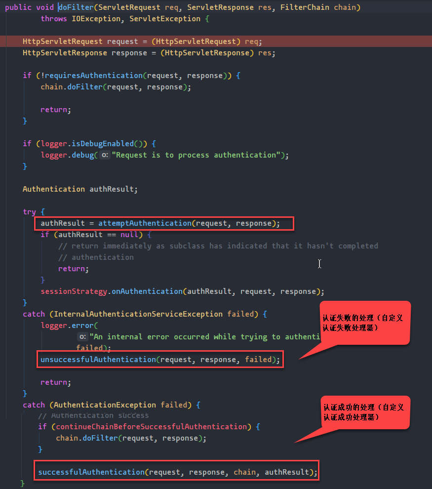
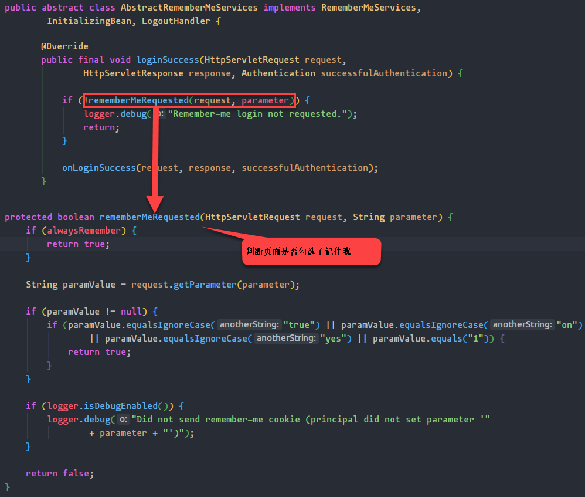

# Spring Boot开发笔记

## 学习内容

## 1.Spring Boot概述

## 2.Spring Boot入门程序

## 3.Spring Boot配置详解

## 4.Spring Boot日志系统详解

## 5.Spring Boot与Web整合

## 6.Spring Boot与模板引擎的整合

## 7.Spring Boot与MyBatis整合

## 8.Spring Boot与JPA整合

## 9.Spring Boot与缓存的整合

## 10.Spring Boot与安全框架（Shiro、Spring Security）

## 11.Spring Boot与消息队列整合（ActiveMQ,RabbitMQ,RocketMQ,Kafka）

## 12.Spring Boot与Elasticsearch（Elastic Stack）

## 13.Spring Boot与Mongodb整合

## 14.Spring Boot与任务调度（quartz,xxl-job）

## 15.Spring Boot与Dubbo(Zookeeper)

## 16.Spring Boot源码分析，配置原理


# 一.Spring Boot概述

## 1. Spring Boot是什么

- Spring Boot基于Spring框架之上的一个微服务架构开发的一个框架

- 大大简化了Spring的开发。因为Spring Boot提供了大量的自动配置。而且它是基于Java配置方式的开发（全注解）

- Spring Boot与其他第三方的框架集成，实现了自动配置

- Spring Boot和Spring Cloud关系：Spring Cloud的开发需要用Spring Boot，反之不一定

- 官方介绍

    ```markdown
    Spring Boot makes it easy to create stand-alone, production-grade Spring based Applications that you can "just run".
    We take an opinionated view of the Spring platform and third-party libraries so you can get started with minimum fuss. Most Spring Boot applications need very little Spring configuration.
    ```

## 2.Spring Boot特点

```markdown
Create stand-alone Spring applications
Embed Tomcat, Jetty or Undertow directly (no need to deploy WAR files)
Provide opinionated 'starter' dependencies to simplify your build configuration
Automatically configure Spring and 3rd party libraries whenever possible
Provide production-ready features such as metrics, health checks and externalized configuration
Absolutely no code generation and no requirement for XML configuration
```

# 二.Spring Boot入门案例

## 2.1 手动开发

### 2.1.1 编写pom.xml

```xml
<?xml version="1.0" encoding="UTF-8"?>
<project xmlns:xsi="http://www.w3.org/2001/XMLSchema-instance"
         xmlns="http://maven.apache.org/POM/4.0.0"
         xsi:schemaLocation="http://maven.apache.org/POM/4.0.0 http://maven.apache.org/xsd/maven-4.0.0.xsd">
    <modelVersion>4.0.0</modelVersion>

    <parent>
        <groupId>org.springframework.boot</groupId>
        <artifactId>spring-boot-starter-parent</artifactId>
        <version>2.2.2.RELEASE</version>
    </parent>

    <groupId>com.bjlemon</groupId>
    <artifactId>springboot-demo-1</artifactId>
    <version>1.0-SNAPSHOT</version>

    <dependencies>
        <dependency>
            <groupId>org.springframework.boot</groupId>
            <artifactId>spring-boot-starter-web</artifactId>
        </dependency>

        <dependency>
            <groupId>org.springframework.boot</groupId>
            <artifactId>spring-boot-starter-test</artifactId>
        </dependency>
    </dependencies>

</project>
```

### 2.1.2 编写springboot配置文件（application.properties或application.yml）

```yaml
server:
  port: 9999
spring:
  application:
    name: springboot-demo-1
  mvc:
    servlet:
      path: /demo
    date-format: yyyy/MM/dd
  jackson:
    date-format: yyyy/MM/dd
```

### 2.1.3编写启动类

```java
@SpringBootApplication
public class SpringBootDemoApplication {

    public static void main(String[] args) {
        SpringApplication.run(SpringBootDemoApplication.class, args);
    }
}
```

### 2.1.4 业务方法

```java
@Controller
public class HelloworldController {

    @GetMapping("/sayHello")
    @ResponseBody
    public String sayHello() {
        return "Helloworld SpringBoot";
    }
}

@Controller
@RequestMapping("/user")
public class UserController {

    @PostMapping("/add")
    @ResponseBody
    public User add(@RequestBody User user) {
        System.out.println(user);
        return user;
    }
}
```

## 2.2 向导开发


# 三.分析启动类

## 3.1 分析@SpringBootApplication注解


### 3.1.1 @SpringBootConfiguration

 

- 实际上就是一个配置类

### 3.1.2 @EnableAutoConfiguration


# 四.配置

## 4.1 配置方式

### 4.1.1 application.properties

### 4.1.2 application.yml

- yaml概述

    - yaml全称：YAML ain't markup language
    - YAML以数据为中心

    ```markdown
    YAML（/ˈjæməl/，尾音类似camel骆驼）是一个可读性高，用来表达数据序列化的格式。YAML参考了其他多种语言，包括：C语言、Python、Perl，并从XML、电子邮件的数据格式（RFC 2822）中获得灵感。Clark Evans在2001年首次发表了这种语言，另外Ingy döt Net与Oren Ben-Kiki也是这语言的共同设计者。当前已经有数种编程语言或脚本语言支持（或者说解析）这种语言。
    YAML是"YAML Ain't a Markup Language"（YAML不是一种标记语言）的递归缩写。在开发的这种语言时，YAML 的意思其实是："Yet Another Markup Language"（仍是一种标记语言），但为了强调这种语言以数据做为中心，而不是以标记语言为重点，而用反向缩略语重命名。
    ```

- 语法（重点）

    - 键值，键与值之间必须有空格

        ```yaml
        k:(空格)v
        ```

    - 以两个空格的缩进控制层次，左对齐的键属于同一级

    - 值的相关问题

        - 字面量。如果值中有转义字符，那么应该怎么写？此时需要用到引号来解决。单引号（不会转义）和双引号（会转义）

        ​       

​                    

- 对象						

    ```yaml
    ###第一种写法
    user:
      name: zhangsan
      age: 23
    
    ###第二种写法
    user: {userName: "zhangsan",age: 23}
    ```

- 集合

    ```yaml
    #user:
    #  name: zhangsan
    #  age: 23
    #  inters:
    #    - football
    #    - basketball
    #    - volleyball
    
    user:
      name: zhangsan
      age: 23
      inters: ["a","b","c"]
    ```

## 4.2 profile

### 4.2.1 多profile文件

- 配置文件可以在不同的环境（dev，test，prod...）下有多个存在
- 配置文件对应着有多个，配置文件的命名规范：application-{profile}.xml

### 4.2.2 yaml支持多文档化

```yaml
server:
  port: 8888
spring:
  profiles: dev

---

server:
  port: 9999
spring:
  profiles: prod
```

### 4.2.3 如何激活profile

- 第一种激活方式

```yaml
spring:
  profiles:
    active: prod
```

- 第二种激活方式

 

- 第三种运行方式

```shell
java -jar springboot-demo-3-0.0.1-SNAPSHOT.jar --spring.profiles.active=prod
```


## 4.3 配置文件的加载问题

### 4.3.1 加载顺序问题

```markdown
./config/
./
classpath:/config/
classpath:/
```

- 优先级由高到低
- 原则：配置互补配置，将所有的配置全部加载，相同配置高优先级会覆盖低优先级

### 4.3.2 可以通过制定加载哪一个配置文件

```shell
java -jar springboot-demo-3-0.0.1-SNAPSHOT.jar --spring.config.location=classpath:/config/
```

# 五.日志系统

## 5.1 slf4j

- 全称：simple logging facade for java
- http://www.slf4j.org/

```markdown
The Simple Logging Facade for Java (SLF4J) serves as a simple facade or abstraction for various logging frameworks (e.g. java.util.logging, logback, log4j) allowing the end user to plug in the desired logging framework at deployment time.
```

- springboot可以跟很多的第三个框架进行集成，而这些第三方的框架所使用的日志产品各不相同，如何统一？

## 5.2 slf4j工作原理

 

## 5.3 slf4j如何统一其他产品


## 5.3 SpringBoot如何实现日志


### 5.3.1 logback

- http://logback.qos.ch/

```markdown
Logback is intended as a successor to the popular log4j project, picking up where log4j leaves off.

Logback's architecture is sufficiently generic so as to apply under different circumstances. At present time, logback is divided into three modules, logback-core, logback-classic and logback-access.

The logback-core module lays the groundwork for the other two modules. The logback-classic module can be assimilated to a significantly improved version of log4j. Moreover, logback-classic natively implements the SLF4J API so that you can readily switch back and forth between logback and other logging frameworks such as log4j or java.util.logging (JUL).

The logback-access module integrates with Servlet containers, such as Tomcat and Jetty, to provide HTTP-access log functionality. Note that you could easily build your own module on top of logback-core.
```

- Appender

​      

- Layout

​      

### 5.3.2 默认实现

```yaml
logging:
  level:
    root: debug
#  file: c:/springboot.log
```

5.3.3 指定配置

- 类路径下放置一个自定义的日志配置文件
- logback-xxx.xml或logback.xml

```xml
<?xml version="1.0" encoding="UTF-8"?>
<configuration debug="true" scan="true" scanPeriod="1 seconds">

    <contextName>logback</contextName>
    <!--定义参数,后面可以通过${app.name}使用-->
    <property name="app.name" value="logback_test"/>
    <!--ConsoleAppender 用于在屏幕上输出日志-->
    <appender name="stdout" class="ch.qos.logback.core.ConsoleAppender">
        <!--定义了一个过滤器,在LEVEL之下的日志输出不会被打印出来-->
        <!--这里定义了DEBUG，也就是控制台不会输出比ERROR级别小的日志-->
        <filter class="ch.qos.logback.classic.filter.ThresholdFilter">
            <level>DEBUG</level>
        </filter>
        <!-- encoder 默认配置为PatternLayoutEncoder -->
        <!--定义控制台输出格式-->
        <encoder>
            <pattern>%d [%thread] %-5level %logger{36} [%file : %line] - %msg%n</pattern>
        </encoder>
    </appender>

    <appender name="file" class="ch.qos.logback.core.rolling.RollingFileAppender">
        <!--定义日志输出的路径-->
        <!--这里的scheduler.manager.server.home 没有在上面的配置中设定，所以会使用java启动时配置的值-->
        <!--比如通过 java -Dscheduler.manager.server.home=/path/to XXXX 配置该属性-->
        <file>${scheduler.manager.server.home}/logs/${app.name}.log</file>
        <!--定义日志滚动的策略-->
        <rollingPolicy class="ch.qos.logback.core.rolling.TimeBasedRollingPolicy">
            <!--定义文件滚动时的文件名的格式-->
            <fileNamePattern>${scheduler.manager.server.home}/logs/${app.name}.%d{yyyy-MM-dd.HH}.log.gz
            </fileNamePattern>
            <!--60天的时间周期，日志量最大20GB-->
            <maxHistory>60</maxHistory>
            <!-- 该属性在 1.1.6版本后 才开始支持-->
            <totalSizeCap>20GB</totalSizeCap>
        </rollingPolicy>
        <triggeringPolicy class="ch.qos.logback.core.rolling.SizeBasedTriggeringPolicy">
            <!--每个日志文件最大100MB-->
            <maxFileSize>100MB</maxFileSize>
        </triggeringPolicy>
        <!--定义输出格式-->
        <encoder>
            <pattern>%d [%thread] %-5level %logger{36} [%file : %line] - %msg%n</pattern>
        </encoder>
    </appender>

    <!--root是默认的logger 这里设定输出级别是debug-->
    <root level="trace">
        <!--定义了两个appender，日志会通过往这两个appender里面写-->
        <appender-ref ref="stdout"/>
        <appender-ref ref="file"/>
    </root>

    <!--对于类路径以 com.example.logback 开头的Logger,输出级别设置为warn,并且只输出到控制台-->
    <!--这个logger没有指定appender，它会继承root节点中定义的那些appender-->
    <logger name="com.example.logback" level="warn"/>

    <!--通过 LoggerFactory.getLogger("mytest") 可以获取到这个logger-->
    <!--由于这个logger自动继承了root的appender，root中已经有stdout的appender了，自己这边又引入了stdout的appender-->
    <!--如果没有设置 additivity="false" ,就会导致一条日志在控制台输出两次的情况-->
    <!--additivity表示要不要使用rootLogger配置的appender进行输出-->
    <logger name="mytest" level="info" additivity="false">
        <appender-ref ref="stdout"/>
    </logger>
    
    <!--由于设置了 additivity="false" ，所以输出时不会使用rootLogger的appender-->
    <!--但是这个logger本身又没有配置appender，所以使用这个logger输出日志的话就不会输出到任何地方-->
    <logger name="mytest2" level="info" additivity="false"/>
</configuration>
```

# 六.SpringBoot与Web集成

## 6.0 SpringBoot如何集成

- XXXWebXXXAutoConfiguration
- WebMvcProperties，ResourceProperties

## 6.1 静态资源映射规则

- 定义静态资源的路径

```properties
spring.resources.static-locations=classpath:/demo/
```

- 如果按照上述配置了静态资源的路径，那么默认的静态资源的路径就失效。因此建议：如果真的配置该项，那么建议将默认的四个路径也加上去。

```yaml
server:
  port: 8888
spring:
  application:
    name: springboot-web-demo
  resources:
    static-locations:
      - classpath:/META-INF/resources/
      - classpath:/resources/
      - classpath:/static/
      - classpath:/public/
      - classpath:/demo/
```

- 分析ResourceProperties源码


- 分析WebMvcAutoConfiguration


- 所有的/webjars/**都会在classpath:/META-INF/resources/webjars/下去找到对应的静态资源


## 6.2 SpringBoot与JSP集成（非重点）

### 6.2.1 简介

- JSP性能较差，占用带宽比较大。我们后续的项目开发建议不要使用JSP。
- SpringBoot官方团队建议使用模板技术（Freemarker,**Thymeleaf**）

### 6.2.2 如何实现

- 编写pom.xml

```xml
<dependency>
    <groupId>org.apache.tomcat.embed</groupId>
    <artifactId>tomcat-embed-jasper</artifactId>
</dependency>
```

- 编写配置文件

```yaml
server:
  port: 8888
spring:
  application:
    name: springboot-jsp-dmeo
  mvc:
    view:
      prefix: /WEB-INF/views/
      suffix: .jsp
```

- 编写Controller

```java
@Controller
@RequestMapping("/jsp")
public class JspController {

    @GetMapping("/helloworld")
    public String helloworld(Model model) {
        model.addAttribute("info", "SpringBoot整合JSP");
        return "helloworld";
    }
}
```

- 编写jsp

```jsp
<%@ page contentType="text/html;charset=UTF-8" language="java" %>
<html>
<head>
    <title>Title</title>
</head>
<body>
${info}
</body>
</html>
```

## 6.3 SpringBoot与Servlet、Filter以及Listener集成

### 6.3.1 第一种集成方式

```java
@SpringBootApplication
@ServletComponentScan
public class SpringbootServletDemoApplication {

    public static void main(String[] args) {
        SpringApplication.run(SpringbootServletDemoApplication.class, args);
    }
}
```

### 6.3.2 第二种集成方式

```java
@Configuration
public class WebServletConfiguration implements ServletContextInitializer {

    @Override
    public void onStartup(ServletContext servletContext) throws ServletException {
        ServletRegistration.Dynamic helloworldServlet = servletContext.addServlet("HelloworldServlet", HelloworldServlet.class);
        helloworldServlet.addMapping("/helloworld", "/demo");
        helloworldServlet.setLoadOnStartup(3);
        helloworldServlet.setInitParameter("username", "zhangsan");
        helloworldServlet.setInitParameter("password", "admin");

        FilterRegistration.Dynamic helloworldFilter = servletContext.addFilter("HelloworldFilter", HelloworldFilter.class);
        helloworldFilter.addMappingForUrlPatterns(EnumSet.of(DispatcherType.REQUEST), true, "/*");

        servletContext.addListener(HelloworldListener.class);
    }
}
```

### 6.3.3 第三种集成方式

```java
@Configuration
public class WebServletConfiguration1 {

    @Bean
    public ServletRegistrationBean<HelloworldServlet> servletServletRegistrationBean() {
        ServletRegistrationBean<HelloworldServlet> servletRegistrationBean = new ServletRegistrationBean<>();
        servletRegistrationBean.setServlet(new HelloworldServlet());
        servletRegistrationBean.addUrlMappings("/helloworld", "/demo");
        return servletRegistrationBean;
    }

    @Bean
    public FilterRegistrationBean<HelloworldFilter> filterFilterRegistrationBean() {
        FilterRegistrationBean<HelloworldFilter> filterRegistrationBean = new FilterRegistrationBean<>();
        filterRegistrationBean.setFilter(new HelloworldFilter());
        filterRegistrationBean.setUrlPatterns(Arrays.asList("/*"));
        return filterRegistrationBean;
    }

    @Bean
    public ServletListenerRegistrationBean<HelloworldListener> servletListenerRegistrationBean() {
        ServletListenerRegistrationBean<HelloworldListener> servletListenerRegistrationBean = new ServletListenerRegistrationBean<>();
        servletListenerRegistrationBean.setListener(new HelloworldListener());
        return servletListenerRegistrationBean;
    }
}
```


## 6.4 SpringBoot与模板的集成

### 6.4.0 模板技术概述

- 模板引擎：为了使用户界面与业务数据分离。最终生成特定格式的文档，用于网站生成一个静态页面（HTML文档）
- 模板就是用户界面+业务数据=结果（静态页面方式输出）
- 模板比JSP更轻量级，而且性能更好，渲染效率高，不占网络带宽
- 优秀的模板框架
    - Freemarker
    - Velocity
    - Thymeleaf

### 6.4.1 Freemarker

- https://freemarker.apache.org/

​      

- 简介

    ```markdown
    Apache FreeMarker™ is a template engine: a Java library to generate text output (HTML web pages, e-mails, configuration files, source code, etc.) based on templates and changing data. Templates are written in the FreeMarker Template Language (FTL), which is a simple, specialized language (not a full-blown programming language like PHP). Usually, a general-purpose programming language (like Java) is used to prepare the data (issue database queries, do business calculations). Then, Apache FreeMarker displays that prepared data using templates. In the template you are focusing on how to present the data, and outside the template you are focusing on what data to present.
    ```

### 6.4.2 SpringBoot与Freemarker

- 编写pom.xml

```xml
<dependency>
    <groupId>org.springframework.boot</groupId>
    <artifactId>spring-boot-starter-freemarker</artifactId>
</dependency>
```

- 编写application.yml配置文件

```yaml
server:
  port: 8888
spring:
  application:
    name: springboot-freemarker-demo
  freemarker:
    suffix: .ftl
    enabled: true
    cache: false
    template-loader-path: classpath:/templates/
```

### 6.4.2 Thymeleaf（重点）

- 概述

```markdown
Thymeleaf is a modern server-side Java template engine for both web and standalone environments.

Thymeleaf's main goal is to bring elegant natural templates to your development workflow — HTML that can be correctly displayed in browsers and also work as static prototypes, allowing for stronger collaboration in development teams.

With modules for Spring Framework, a host of integrations with your favourite tools, and the ability to plug in your own functionality, Thymeleaf is ideal for modern-day HTML5 JVM web development — although there is much more it can do
```

- 适用于Web环境和独立JVM环境
- Java服务器端模板引擎
- 如果服务器端没有提供数据，那么就以静态页面显示，但是如果提供了数据那么就用服务器端数据来替换掉静态数据
- Thymeleaf与前端框架（Vue）区别
    - vue**异步**请求数据，后端给前端发送数据（json）。然后前端vue的指令进行解析和渲染。页面的展现可能会产生延迟，而且数据爬虫，搜索引擎抓取不到异步加载的数据
    - thymeleaf是一种后端页面的渲染，然后在浏览器上显示。以静态页面展现基本不会产生延迟，而且索引引擎能抓取数据

- 标签

| 标签名称  |        功能         |
| :-------: | :-----------------: |
|  th:text  |    文本内容显示     |
| th:utext  |    支持html文本     |
|   th:id   |       替换id        |
|  th:each  |        循环         |
|   th:if   |      条件分支       |
| th:switch |      条件分支       |
|  th:case  | 与th:switch搭配使用 |
| th:value  |      属性赋值       |

- springboot与thymeleaf集成

```xml
<dependency>
    <groupId>org.springframework.boot</groupId>
    <artifactId>spring-boot-starter-thymeleaf</artifactId>
</dependency>
```

```yaml
server:
  port: 8888
spring:
  application:
    name: springboot-thymeleaf-demo
  thymeleaf:
    enabled: true
    encoding: UTF-8
    cache: false
```

```html
<!DOCTYPE html>
<html lang="en" xmlns:th="http://www.thymeleaf.org">
<head>
    <meta charset="UTF-8">
    <title>$Title$</title>
</head>
<body>
<table border="1" cellpadding="0" cellspacing="0">
    <thead>
    <tr>
        <th>用户编号</th>
        <th>用户名称</th>
        <th>用户密码</th>
        <th>用户薪资</th>
        <th>用户生日</th>
    </tr>
    </thead>

    <tbody>
    <tr th:each="person : ${personList}">
        <td th:text="${person.id}"></td>
        <td th:text="${person.name}"></td>
        <td th:text="${person.password}"></td>
        <td th:text="${person.salary}"></td>
        <td th:text="${#dates.format(person.birthday,'yyyy-MM-dd')}"></td>
    </tr>
    </tbody>
</table>
</body>
</html>
```

- 分析Thymeleaf源码

 

- Thymeleaf语法
- 表达式

```markdown
Variable Expressions: ${...}
Selection Variable Expressions: *{...}
Message Expressions: #{...}
Link URL Expressions: @{...}
Fragment Expressions: ~{...}
```

- Expression Basic Objects		


```markdown
#ctx : the context object.
#vars: the context variables.
#locale : the context locale.
#request : (only in Web Contexts) the HttpServletRequest object.
#response : (only in Web Contexts) the HttpServletResponse object.
#session : (only in Web Contexts) the HttpSession object.
#servletContext : (only in Web Contexts) the ServletContext object.
```

- Expression Utility Objects

```markdown
#execInfo : information about the template being processed.
#messages : methods for obtaining externalized messages inside variables expressions, in the same way as they would be obtained using #{…} syntax.
#uris : methods for escaping parts of URLs/URIs
#conversions : methods for executing the configured conversion service (if any).
#dates : methods for java.util.Date objects: formatting, component extraction, etc.
#calendars : analogous to #dates , but for java.util.Calendar objects.
#numbers : methods for formatting numeric objects.
#strings : methods for String objects: contains, startsWith, prepending/appending, etc.
#objects : methods for objects in general.
#bools : methods for boolean evaluation.
#arrays : methods for arrays.
#lists : methods for lists.
#sets : methods for sets.
#maps : methods for maps.
#aggregates : methods for creating aggregates on arrays or collections.
#ids : methods for dealing with id attributes that might be repeated (for example, as a result of an iteration).
```

## 6.5 SpringBoot与SpringMVC集成原理（自动配置原理）

### 6.5.1 自动配置如何实现

- https://docs.spring.io/spring-boot/docs/2.2.2.RELEASE/reference/html/spring-boot-features.html#boot-features-developing-web-applications

```markdown
Inclusion of ContentNegotiatingViewResolver and BeanNameViewResolver beans.
Support for serving static resources, including support for WebJars (covered later in this document)).
Automatic registration of Converter, GenericConverter, and Formatter beans.
Support for HttpMessageConverters (covered later in this document).
Automatic registration of MessageCodesResolver (covered later in this document).
Static index.html support.
Custom Favicon support (covered later in this document).
Automatic use of a ConfigurableWebBindingInitializer bean (covered later in this document).
```

- WebMvcAutoConfiguration。这个类中实现了一些默认配置，比如视图解析器，转换器、格式化器，静态资源的映射...
- 问题：我们需要定制一些配置，那么应该怎么办？
    - 编写配置类，继承WebMvcConfigurerAdapter或实现WebMvcConfigurer，此时不能在这个配置类上加上@EnableWebMvc
    - 如果想完全掌管SpringMVC（不想使用SpringBoot与SpringMVC的一些默认配置），此时就需要加上@Configuration和@EnableWebMvc注解

```markdown
If you want to keep Spring Boot MVC features and you want to add additional MVC configuration (interceptors, formatters, view controllers, and other features), you can add your own @Configuration class of type WebMvcConfigurer but without @EnableWebMvc. If you wish to provide custom instances of RequestMappingHandlerMapping, RequestMappingHandlerAdapter, or ExceptionHandlerExceptionResolver, you can declare a WebMvcRegistrationsAdapter instance to provide such components.
```

- 为什么加上了@EnableWebMvc，自动配置就失效？


# 七. SpringBoot与持久化层集成

## 7.1 SpringBoot与MyBatis

### 7.1.1 逆向工程

- 导入项目（generatorSqlmapCustom），删除掉src下的所有的包以及类（GeneratorSqlmap类不能删）
- 修改generatorConfig.xml文件

```xml
<?xml version="1.0" encoding="UTF-8"?>
<!DOCTYPE generatorConfiguration
		PUBLIC "-//mybatis.org//DTD MyBatis Generator Configuration 1.0//EN"
		"http://mybatis.org/dtd/mybatis-generator-config_1_0.dtd">

<generatorConfiguration>
	<context id="testTables" targetRuntime="MyBatis3">
		<commentGenerator>
			<!-- 是否去除自动生成的注释 true：是 ： false:否 -->
			<property name="suppressAllComments" value="true"/>
		</commentGenerator>
		<!--数据库连接的信息：驱动类、连接地址、用户名、密码 -->
		<jdbcConnection driverClass="com.mysql.jdbc.Driver"
						connectionURL="jdbc:mysql://localhost:3306/springboot-mybatis"
						userId="root"
						password="root">
		</jdbcConnection>
		<!-- 默认false，把JDBC DECIMAL 和 NUMERIC 类型解析为 Integer，
			 为true时把JDBC DECIMAL和NUMERIC类型解析为java.math.BigDecimal -->
		<javaTypeResolver>
			<property name="forceBigDecimals" value="false"/>
		</javaTypeResolver>

		<!-- targetProject:生成PO类的位置 -->
		<javaModelGenerator targetPackage="com.bjlemon.springboot.domain"
							targetProject=".\src">
			<!-- enableSubPackages:是否让schema作为包的后缀 -->
			<property name="enableSubPackages" value="false"/>
			<!-- 从数据库返回的值被清理前后的空格 -->
			<property name="trimStrings" value="true"/>
		</javaModelGenerator>
		<!-- targetProject:mapper映射文件生成的位置 -->
		<sqlMapGenerator targetPackage="com.bjlemon.springboot.mapper"
						 targetProject=".\src">
			<!-- enableSubPackages:是否让schema作为包的后缀 -->
			<property name="enableSubPackages" value="false"/>
		</sqlMapGenerator>
		<!-- targetPackage：mapper接口生成的位置 -->
		<javaClientGenerator type="XMLMAPPER"
							 targetPackage="com.bjlemon.springboot.mapper" targetProject=".\src">
			<!-- enableSubPackages:是否让schema作为包的后缀 -->
			<property name="enableSubPackages" value="false"/>
		</javaClientGenerator>
		<!-- 指定数据库表 -->
		<table schema="" tableName="springboot_mybatis_user" domainObjectName="User"/>
		<table schema="" tableName="springboot_mybatis_department" domainObjectName="Department"/>
	</context>
</generatorConfiguration>
```

- 运行GeneratorSqlmap类中的main()方法

### 7.1.2 编写pom.xml

```xml
<?xml version="1.0" encoding="UTF-8"?>
<project xmlns:xsi="http://www.w3.org/2001/XMLSchema-instance" xmlns="http://maven.apache.org/POM/4.0.0"
         xsi:schemaLocation="http://maven.apache.org/POM/4.0.0 https://maven.apache.org/xsd/maven-4.0.0.xsd">
    <modelVersion>4.0.0</modelVersion>
    <parent>
        <groupId>org.springframework.boot</groupId>
        <artifactId>spring-boot-starter-parent</artifactId>
        <version>2.2.1.RELEASE</version>
        <relativePath/> <!-- lookup parent from repository -->
    </parent>
    <groupId>com.bjlemon</groupId>
    <artifactId>springboot-mybatis-demo</artifactId>
    <version>0.0.1-SNAPSHOT</version>
    <name>springboot-mybatis-demo</name>

    <properties>
        <java.version>1.8</java.version>
    </properties>

    <dependencies>
        <dependency>
            <groupId>org.springframework.boot</groupId>
            <artifactId>spring-boot-starter-thymeleaf</artifactId>
        </dependency>

        <dependency>
            <groupId>org.springframework.boot</groupId>
            <artifactId>spring-boot-starter-web</artifactId>
        </dependency>

        <dependency>
            <groupId>org.mybatis.spring.boot</groupId>
            <artifactId>mybatis-spring-boot-starter</artifactId>
            <version>2.1.1</version>
        </dependency>

        <dependency>
            <groupId>org.springframework.boot</groupId>
            <artifactId>spring-boot-devtools</artifactId>
            <scope>runtime</scope>
            <optional>true</optional>
        </dependency>

        <dependency>
            <groupId>mysql</groupId>
            <artifactId>mysql-connector-java</artifactId>
            <scope>runtime</scope>
        </dependency>

        <dependency>
            <groupId>org.springframework.boot</groupId>
            <artifactId>spring-boot-configuration-processor</artifactId>
            <optional>true</optional>
        </dependency>

        <dependency>
            <groupId>org.projectlombok</groupId>
            <artifactId>lombok</artifactId>
            <optional>true</optional>
        </dependency>

        <dependency>
            <groupId>org.springframework.boot</groupId>
            <artifactId>spring-boot-starter-test</artifactId>
            <scope>test</scope>
            <exclusions>
                <exclusion>
                    <groupId>org.junit.vintage</groupId>
                    <artifactId>junit-vintage-engine</artifactId>
                </exclusion>
            </exclusions>
        </dependency>

        <!-- https://mvnrepository.com/artifact/com.alibaba/druid-spring-boot-starter -->
        <dependency>
            <groupId>com.alibaba</groupId>
            <artifactId>druid-spring-boot-starter</artifactId>
            <version>1.1.21</version>
        </dependency>

        <!-- https://mvnrepository.com/artifact/com.github.pagehelper/pagehelper-spring-boot-starter -->
        <dependency>
            <groupId>com.github.pagehelper</groupId>
            <artifactId>pagehelper-spring-boot-starter</artifactId>
            <version>1.2.13</version>
        </dependency>

        <dependency>
            <groupId>junit</groupId>
            <artifactId>junit</artifactId>
            <scope>test</scope>
        </dependency>

    </dependencies>

    <build>
        <plugins>
            <plugin>
                <groupId>org.springframework.boot</groupId>
                <artifactId>spring-boot-maven-plugin</artifactId>
            </plugin>
        </plugins>
    </build>
</project>
```

### 7.1.3 编写application.yml文件

```yaml
server:
  port: 8888
spring:
  application:
    name: springboot-mybatis-demo
  thymeleaf:
    cache: false
    enabled: true
    encoding: UTF-8
  datasource:
    driver-class-name: com.mysql.cj.jdbc.Driver
    url: jdbc:mysql:///springboot-mybatis?useUnicode=true&characterEncoding=utf8&serverTimezone=UTC
    username: root
    password: root
    type: com.alibaba.druid.pool.DruidDataSource
    druid:
      initial-size: 5
      max-active: 20
      min-idle: 5
      max-wait: 60000
mybatis:
  mapper-locations: classpath:mappers/*.xml
  type-aliases-package: com.bjlemon.springboot.domain
  configuration:
    cache-enabled: true
    lazy-loading-enabled: true
    aggressive-lazy-loading: false
```

### 7.1.4 编写启动类

```java
@SpringBootApplication
@MapperScan(basePackages = {"com.bjlemon.springboot.mapper"})
public class SpringbootMybatisDemoApplication {

    public static void main(String[] args) {
        SpringApplication.run(SpringbootMybatisDemoApplication.class, args);
    }

}
```

### 7.1.5 编写业务逻辑层（DepartmentService）

```java
package com.bjlemon.springboot.service.impl;

import com.bjlemon.springboot.domain.Department;
import com.bjlemon.springboot.domain.DepartmentExample;
import com.bjlemon.springboot.domain.User;
import com.bjlemon.springboot.mapper.DepartmentMapper;
import com.bjlemon.springboot.mapper.UserMapper;
import com.bjlemon.springboot.service.DepartmentService;
import com.bjlemon.springboot.vo.DepartmentQueryVO;
import com.github.pagehelper.PageHelper;
import com.github.pagehelper.PageInfo;
import org.apache.commons.collections.CollectionUtils;
import org.apache.commons.lang3.StringUtils;
import org.springframework.beans.factory.annotation.Autowired;
import org.springframework.stereotype.Service;
import org.springframework.transaction.annotation.Transactional;

import java.util.List;

/**
 * @author jeffzhou
 * @version 1.0.0
 * @ClassName DepartmentServiceImpl.java
 * @Description TODO
 * @createTime 2020年01月12日 20:08:00
 */
@Service
@Transactional
public class DepartmentServiceImpl implements DepartmentService {

    @Autowired
    private DepartmentMapper departmentMapper;

    @Autowired
    private UserMapper userMapper;

    @Override
    public void addDepartment(Department department) {
        if (department == null) {
            throw new IllegalArgumentException("");
        }

        this.departmentMapper.insertSelective(department);
    }

    @Override
    public void deleteDepartment(Department department) {
        if (department == null) {
            throw new IllegalArgumentException("");
        }

        Integer departmentId = department.getDepartmentId();
        List<User> userList = this.userMapper.findUsersByDepartmentId(departmentId);
        if (CollectionUtils.isNotEmpty(userList)) {
            throw new RuntimeException("部门下有员工，不能删除!");
        }

        this.departmentMapper.deleteByPrimaryKey(departmentId);
    }

    @Override
    public void modifyDepartment(Department department) {
        if (department == null) {
            throw new IllegalArgumentException("");
        }

        this.departmentMapper.updateByPrimaryKeySelective(department);
    }

    @Override
    public Department findDepartmentById(Integer id) {
        return this.departmentMapper.selectByPrimaryKey(id);
    }

    @Override
    public List<Department> findAllDepartmentList() {
        DepartmentExample departmentExample = new DepartmentExample();
        return this.departmentMapper.selectByExample(departmentExample);
    }

    @Override
    public List<Department> findDepartmentListByQueryVO(DepartmentQueryVO departmentQueryVO) {
        DepartmentExample departmentExample = new DepartmentExample();

        if (departmentQueryVO == null) {
            return this.findAllDepartmentList();
        }

        String departmentName = departmentQueryVO.getDepartmentName();
        String departmentLocation = departmentQueryVO.getDepartmentLocation();

        DepartmentExample.Criteria criteria = departmentExample.createCriteria();

        if (StringUtils.isNotBlank(departmentName)) {
            criteria.andDepartmentNameLike("%" + departmentName + "%");
        }

        if (StringUtils.isNotBlank(departmentLocation)) {
            criteria.andDepartmentLocationLike("%" + departmentLocation + "%");
        }

        return this.departmentMapper.selectByExample(departmentExample);
    }

    @Override
    public PageInfo<Department> findDepartmentPaginationList(Integer pageNum, Integer pageSize) {
        if (pageNum == null || pageNum <= 0) {
            throw new IllegalArgumentException("");
        }

        if (pageSize == null || pageSize <= 0) {
            throw new IllegalArgumentException("");
        }

        PageHelper.startPage(pageNum, pageSize);
        DepartmentExample departmentExample = new DepartmentExample();
        List<Department> departmentList = this.departmentMapper.selectByExample(departmentExample);

        return new PageInfo<>(departmentList);
    }
}
```

## 7.2 SpringBoot与MP（MyBatis-Plus）集成

### 7.2.1 MP概述

- MP是MyBatis-plus的缩写。实际上就是MyBatis的插件，或者是MyBatis的加强版
- MP是baomidou团队开发
- 官网：https://github.com/baomidou/mybatis-plus
- 简介

```markdown
MyBatis-Plus is an powerful enhanced toolkit of MyBatis for simplify development. This toolkit provides some efficient, useful, out-of-the-box features for MyBatis, use it can effectively save your development time.
```

- 特点

```markdown
Fully compatible with MyBatis
Auto configuration on startup
Out-of-the-box interfaces for operate database
Powerful and flexible where condition wrapper
Multiple strategy to generate primary key
Lambda-style API
Almighty and highly customizable code generator
Automatic paging operation
SQL Inject defense
Support active record
Support pluggable custom interface
Build-in many useful extensions
```

### 7.2.2 SpringBoot与MP集成

```xml
<dependency>
    <groupId>com.baomidou</groupId>
    <artifactId>mybatis-plus-boot-starter</artifactId>
    <version>3.2.0</version>
</dependency>

<dependency>
    <groupId>mysql</groupId>
    <artifactId>mysql-connector-java</artifactId>
    <scope>runtime</scope>
</dependency>

<!-- https://mvnrepository.com/artifact/com.alibaba/druid-spring-boot-starter -->
<dependency>
    <groupId>com.alibaba</groupId>
    <artifactId>druid-spring-boot-starter</artifactId>
    <version>1.1.21</version>
</dependency>
```

```yml
server:
  port: 8888
spring:
  application:
    name: springboot-mybatis-plus-demo
  thymeleaf:
    cache: false
    enabled: true
    encoding: UTF-8
  datasource:
    driver-class-name: com.mysql.cj.jdbc.Driver
    url: jdbc:mysql:///springboot-mybatis?useUnicode=true&characterEncoding=utf8&serverTimezone=UTC
    username: root
    password: root
    type: com.alibaba.druid.pool.DruidDataSource
    druid:
      initial-size: 5
      max-active: 20
      min-idle: 5
      max-wait: 60000
mybatis-plus:
  configuration:
    ### domain-----userId
    ### table------user_id
    map-underscore-to-camel-case: true
    use-generated-keys: true
  global-config:
    db-config:
      table-prefix: springboot_mybatis_
```

```java
@Data
@NoArgsConstructor
@AllArgsConstructor
//@TableName(value = "springboot_mybatis_department")
public class Department implements Serializable {

    private static final long serialVersionUID = 626719896969191791L;
    @TableId(value = "department_id", type = IdType.AUTO)
    private Integer id;

    @TableField(value = "department_name")
    private String name;

    @TableField(value = "department_location")
    private String location;

    @Override
    public boolean equals(Object o) {
        if (this == o) return true;
        if (o == null || getClass() != o.getClass()) return false;

        Department that = (Department) o;

        if (id != null ? !id.equals(that.id) : that.id != null) return false;
        if (name != null ? !name.equals(that.name) : that.name != null) return false;
        return location != null ? location.equals(that.location) : that.location == null;
    }

    @Override
    public int hashCode() {
        int result = id != null ? id.hashCode() : 0;
        result = 31 * result + (name != null ? name.hashCode() : 0);
        result = 31 * result + (location != null ? location.hashCode() : 0);
        return result;
    }

    @Override
    public String toString() {
        return "Department{" +
                "id=" + id +
                ", name='" + name + '\'' +
                ", location='" + location + '\'' +
                '}';
    }
}

```

```java
@Data
@NoArgsConstructor
@AllArgsConstructor
@TableName(value = "springboot_mybatis_user")
public class User implements Serializable {

    private static final long serialVersionUID = -6048472400496098620L;
    @TableId(value = "user_id", type = IdType.AUTO)
    private Integer id;

    @TableField(value = "user_name")
    private String name;

    @TableField(value = "user_password")
    private String password;

    @TableField(value = "user_salary")
    private Float salary;

    @TableField(value = "user_birthday")
    private Date birthday;

    private Department department;

    @Override
    public boolean equals(Object o) {
        if (this == o) return true;
        if (o == null || getClass() != o.getClass()) return false;

        User user = (User) o;

        if (id != null ? !id.equals(user.id) : user.id != null) return false;
        if (name != null ? !name.equals(user.name) : user.name != null) return false;
        if (password != null ? !password.equals(user.password) : user.password != null) return false;
        if (salary != null ? !salary.equals(user.salary) : user.salary != null) return false;
        return birthday != null ? birthday.equals(user.birthday) : user.birthday == null;
    }

    @Override
    public int hashCode() {
        int result = id != null ? id.hashCode() : 0;
        result = 31 * result + (name != null ? name.hashCode() : 0);
        result = 31 * result + (password != null ? password.hashCode() : 0);
        result = 31 * result + (salary != null ? salary.hashCode() : 0);
        result = 31 * result + (birthday != null ? birthday.hashCode() : 0);
        return result;
    }

    @Override
    public String toString() {
        return "User{" +
                "id=" + id +
                ", name='" + name + '\'' +
                ", password='" + password + '\'' +
                ", salary=" + salary +
                ", birthday=" + birthday +
                '}';
    }
}

```

```java
package com.bjlemon.springboot.mapper;

import com.baomidou.mybatisplus.core.mapper.BaseMapper;
import com.bjlemon.springboot.domain.User;
import org.apache.ibatis.annotations.*;

import java.util.List;

/**
 * @author jeffzhou
 * @version 1.0.0
 * @ClassName DepartmentMapper.java
 * @Description TODO
 * @createTime 2020年01月12日 21:43:00
 */
public interface UserMapper extends BaseMapper<User> {

    /*@Select(value = "SELECT user_id id, user_name name, user_password password, user_salary salary, user_birthday birthday " +
            "FROM springboot_mybatis_user " +
            "WHERE department_id = #{id}")
    List<User> findUsersByDepartmentId(@Param(value = "id") Integer departmentId);*/

    /*@Select(value = "SELECT user_id, user_name, user_password, user_salary, user_birthday " +
            "FROM springboot_mybatis_user " +
            "WHERE department_id = #{id}")
    @Results(id = "UserBaseResultMap", value = {
            @Result(property = "id", column = "user_id", id = true),
            @Result(property = "name", column = "user_name"),
            @Result(property = "password", column = "user_password"),
            @Result(property = "salary", column = "user_salary"),
            @Result(property = "birthday", column = "user_birthday")
    })
    List<User> findUsersByDepartmentId(@Param(value = "id") Integer departmentId);*/

    @Select(value = "SELECT " +
            "smu.user_id,\n" +
            "       smu.user_name,\n" +
            "       smu.user_password,\n" +
            "       smu.user_salary,\n" +
            "       smu.user_birthday,\n" +
            "       smd.department_id,\n" +
            "       smd.department_name,\n" +
            "       smd.department_location\n" +
            "FROM springboot_mybatis_user smu\n" +
            "         " +
            "LEFT JOIN springboot_mybatis_department smd ON smu.department_id = smd.department_id\n" +
            "WHERE smd.department_id = #{id}")
    @Results(id = "UserResultMap", value = {
            @Result(property = "id", column = "user_id", id = true),
            @Result(property = "name", column = "user_name"),
            @Result(property = "password", column = "user_password"),
            @Result(property = "salary", column = "user_salary"),
            @Result(property = "birthday", column = "user_birthday"),
            @Result(property = "department", column = "department_id", one = @One(select = "com.bjlemon.springboot.mapper.DepartmentMapper.findById"))
    })
    List<User> findUsersByDepartmentId(@Param(value = "id") Integer departmentId);

}

```

```java
public interface DepartmentMapper extends BaseMapper<Department> {

    @Select("SELECT * FROM springboot_mybatis_department WHERE department_id = #{id}")
    @Results(id = "DepartmentResultMap", value = {
            @Result(id = true, property = "id", column = "department_id"),
            @Result(property = "name", column = "department_name"),
            @Result(property = "location", column = "department_location")
    })
    Department findById(Integer id);
}
```

```java
@SpringBootApplication
@MapperScan(basePackages = {"com.bjlemon.springboot.mapper"})
public class SpringbootMybatisPlusDmoApplication {

    public static void main(String[] args) {
        SpringApplication.run(SpringbootMybatisPlusDmoApplication.class, args);
    }

}
```


## 7.3 SpringBoot与JPA集成

### 7.3.1 JPA概述

- Java Persistence API。Java持久化API
- JPA是SUN公司提出的ORM（Object Relationship Mapping）规范
- JPA通过注解描述对象与关系的映射。以前Hibernate是通过XML文件来进行映射

### 7.3.2 JPA优势

- 标准：由JCP组织制定
- 各种容器支持度很高
- 使用成本较低：当时JPA之前有一个EJB（EntityBean 成本非常高）
- 查询语言（JPQL 纯面向对象的查询语言）

### 7.3.3 JPA实现

- Hibernate
- Toplink（Oracle）
- Spring Data JPA

  

### 7.3.4 JPA开发

```xml
<!-- https://mvnrepository.com/artifact/org.hibernate/hibernate-entitymanager -->
<dependency>
    <groupId>org.hibernate</groupId>
    <artifactId>hibernate-entitymanager</artifactId>
    <version>5.4.10.Final</version>
</dependency>

<!-- https://mvnrepository.com/artifact/org.hibernate/hibernate-c3p0 -->
<dependency>
    <groupId>org.hibernate</groupId>
    <artifactId>hibernate-c3p0</artifactId>
    <version>5.4.10.Final</version>
</dependency>

<dependency>
    <groupId>mysql</groupId>
    <artifactId>mysql-connector-java</artifactId>
    <version>5.1.48</version>
    <scope>runtime</scope>
</dependency>
```

```xml
<?xml version="1.0" encoding="UTF-8" ?>
<persistence xmlns:xsi="http://www.w3.org/2001/XMLSchema-instance" xmlns="http://java.sun.com/xml/ns/persistence"
             xsi:schemaLocation="http://java.sun.com/xml/ns/persistence http://java.sun.com/xml/ns/persistence/persistence_2_0.xsd"
             version="2.0">

    <persistence-unit name="jpa-demo" transaction-type="RESOURCE_LOCAL">
        <provider>org.hibernate.jpa.HibernatePersistenceProvider</provider>

        <properties>
            <property name="hibernate.connection.driver_class" value="com.mysql.jdbc.Driver"/>
            <property name="hibernate.connection.url" value="jdbc:mysql://127.0.0.1:3306/jpa_demo"/>
            <property name="hibernate.connection.username" value="root"/>
            <property name="hibernate.connection.password" value="root"/>
            <!--说明:数据库的方言，用于存放不同数据库之间的SQL语句差异。-->
            <property name="hibernate.dialect" value="org.hibernate.dialect.MySQL57Dialect"/>

            <!--
                create:每次启动服务器重新建表
                update:更新表结构
            -->
            <property name="hibernate.hbm2ddl.auto" value="update"/>
            <!--每次执行操作会发SQL语句-->
            <property name="hibernate.show_sql" value="true"/>
            <!--格式化SQL语句-->
            <property name="hibernate.format_sql" value="true"/>
        </properties>
    </persistence-unit>
</persistence>
```

```java
package com.bjlemon.jpa.domain;

import lombok.Data;

import javax.persistence.*;
import java.io.Serializable;
import java.util.Date;

/**
 * @author jeffzhou
 * @version 1.0.0
 * @ClassName User.java
 * @Description TODO
 * @createTime 2020年01月14日 20:59:00
 */
@Data
@Entity
@Table(name = "jpa_user")
public class User implements Serializable {

    private static final long serialVersionUID = 1888819090828579238L;

    @Id
    // 主键生成策略。其中strategy注解的属性，该属性如果不指定值那么就会使用默认值（AUTO）
    // 根据底层数据库自动选择主键生成策略
    // 当前数据库是mysql数据库，又由于id是整型，因此建表时会将其字段做成自动增长
    @GeneratedValue(strategy = GenerationType.IDENTITY)
    @Column(name = "user_id", length = 4)
    private Integer id;

    @Column(name = "user_name", length = 20, nullable = false)
    private String name;

    @Column(name = "user_password", length = 20, nullable = false)
    private String password;

    @Column(name = "user_salary", length = 6, precision = 2, nullable = false)
    private Float salary;

    @Column(name = "user_birthday", nullable = false)
    @Temporal(TemporalType.DATE)
    private Date birthday;
}

```

```java
package com.bjlemon.jpa.test;

import com.bjlemon.jpa.domain.User;
import com.bjlemon.jpa.util.JpaUtils;
import org.junit.Test;

import javax.persistence.EntityManager;
import javax.persistence.EntityTransaction;
import java.util.Collections;
import java.util.Date;
import java.util.List;

/**
 * @author jeffzhou
 * @version 1.0.0
 * @ClassName UserTest.java
 * @Description TODO
 * @createTime 2020年01月14日 21:25:00
 */
public class UserTest {

    @Test
    public void testAdd() {
        EntityManager entityManager = null;
        EntityTransaction transaction = null;
        User user = null;
        try {
            entityManager = JpaUtils.getEntityManager();
            transaction = entityManager.getTransaction();
            transaction.begin();

            user = new User();
            user.setName("zhangsan");
            user.setPassword("admin");
            user.setSalary(12.34F);
            user.setBirthday(new Date());

            entityManager.persist(user);

            transaction.commit();
        } catch (Exception e) {
            e.printStackTrace();
            transaction.rollback();
        } finally {
            JpaUtils.closeEntityManager(entityManager);
        }
    }

    @Test
    public void testDelete() {
        EntityManager entityManager = null;
        EntityTransaction transaction = null;
        User user = null;
        try {
            entityManager = JpaUtils.getEntityManager();
            transaction = entityManager.getTransaction();
            transaction.begin();

            // 查询的是一个代理对象（User）,使用到了延迟加载技术
            // 问题:不要过早关闭EntityManager，如果关了那么代理对象不能初始化，导致出问题
            // 怎么解决问题：web项目配置一个过滤器（OpenEntityManagerInViewFilter）
            user = entityManager.getReference(User.class, 3);
//            Hibernate.initialize(user);

            // 真正查询User类型的对象
//            user = entityManager.find(User.class, 1);
            entityManager.remove(user);

            transaction.commit();
        } catch (Exception e) {
            e.printStackTrace();
            transaction.rollback();
        } finally {
            JpaUtils.closeEntityManager(entityManager);
        }
    }


    @Test
    public void testUpdate() {
        EntityManager entityManager = null;
        EntityTransaction transaction = null;
        User user = null;
        try {
            entityManager = JpaUtils.getEntityManager();
            transaction = entityManager.getTransaction();
            transaction.begin();

            // 真正查询User类型的对象
            user = entityManager.find(User.class, 1);
            user.setName("C罗");
            user.setSalary(99.00F);

            entityManager.merge(user);

            transaction.commit();
        } catch (Exception e) {
            e.printStackTrace();
            transaction.rollback();
        } finally {
            JpaUtils.closeEntityManager(entityManager);
        }
    }

    @Test
    public void testFindAll() {
        EntityManager entityManager = null;
        EntityTransaction transaction = null;
        User user = null;
        try {
            entityManager = JpaUtils.getEntityManager();
            transaction = entityManager.getTransaction();
            transaction.begin();


            List userList = entityManager.createQuery("from User u").getResultList();
            userList.stream().forEach(System.out::println);

            transaction.commit();
        } catch (Exception e) {
            e.printStackTrace();
            transaction.rollback();
        } finally {
            JpaUtils.closeEntityManager(entityManager);
        }
    }

    @Test
    public void testFind() {
        EntityManager entityManager = null;
        EntityTransaction transaction = null;
        User user = null;
        try {
            entityManager = JpaUtils.getEntityManager();
            transaction = entityManager.getTransaction();
            transaction.begin();

            user = (User) entityManager.createQuery("from User u where u.name = ?1 and u.password = ?2")
                    .setParameter(1, "zhangsan")
                    .setParameter(2, "admin")
                    .getSingleResult();
            System.out.println(user);

            transaction.commit();
        } catch (Exception e) {
            e.printStackTrace();
            transaction.rollback();
        } finally {
            JpaUtils.closeEntityManager(entityManager);
        }
    }

    @Test
    public void testFind1() {
        EntityManager entityManager = null;
        EntityTransaction transaction = null;
        User user = null;
        try {
            entityManager = JpaUtils.getEntityManager();
            transaction = entityManager.getTransaction();
            transaction.begin();

            user = (User) entityManager.createQuery("from User u where u.name = :uname and u.password = :pwd")
                    .setParameter("uname", "zhangsan")
                    .setParameter("pwd", "admin")
                    .getSingleResult();
            System.out.println(user);

            transaction.commit();
        } catch (Exception e) {
            e.printStackTrace();
            transaction.rollback();
        } finally {
            JpaUtils.closeEntityManager(entityManager);
        }
    }

    @Test
    public void testFind2() {
        EntityManager entityManager = null;
        EntityTransaction transaction = null;
        List<User> userList = Collections.EMPTY_LIST;
        try {
            entityManager = JpaUtils.getEntityManager();
            transaction = entityManager.getTransaction();
            transaction.begin();

            Integer pageNum = 2;
            Integer pageSize = 3;
            userList = entityManager.createQuery("from User u")
                    .setFirstResult((pageNum - 1) * pageSize)
                    .setMaxResults(3)
                    .getResultList();

            userList.stream().forEach(System.out::println);

            transaction.commit();
        } catch (Exception e) {
            e.printStackTrace();
            transaction.rollback();
        } finally {
            JpaUtils.closeEntityManager(entityManager);
        }
    }
}
```

### 7.3.5 Spring Data JPA

- Spring Data概述

```markdown
Spring Data’s mission is to provide a familiar and consistent, Spring-based programming model for data access while still retaining the special traits of the underlying data store.

It makes it easy to use data access technologies, relational and non-relational databases, map-reduce frameworks, and cloud-based data services. This is an umbrella project which contains many subprojects that are specific to a given database. The projects are developed by working together with many of the companies and developers that are behind these exciting technologies.
```

- Spring Data特点

```markdown
Powerful repository and custom object-mapping abstractions

Dynamic query derivation from repository method names

Implementation domain base classes providing basic properties

Support for transparent auditing (created, last changed)

Possibility to integrate custom repository code

Easy Spring integration via JavaConfig and custom XML namespaces

Advanced integration with Spring MVC controllers

Experimental support for cross-store persistence
```

- Spring Data JPA概述

```markdown
Spring Data JPA, part of the larger Spring Data family, makes it easy to easily implement JPA based repositories. This module deals with enhanced support for JPA based data access layers. It makes it easier to build Spring-powered applications that use data access technologies.

Implementing a data access layer of an application has been cumbersome for quite a while. Too much boilerplate code has to be written to execute simple queries as well as perform pagination, and auditing. Spring Data JPA aims to significantly improve the implementation of data access layers by reducing the effort to the amount that’s actually needed. As a developer you write your repository interfaces, including custom finder methods, and Spring will provide the implementation automatically.
```

- Spring Data JPA特点

```markdown
Sophisticated support to build repositories based on Spring and JPA

Support for Querydsl predicates and thus type-safe JPA queries

Transparent auditing of domain class

Pagination support, dynamic query execution, ability to integrate custom data access code

Validation of @Query annotated queries at bootstrap time

Support for XML based entity mapping

JavaConfig based repository configuration by introducing @EnableJpaRepositories.
```

- Spring Data JPA开发
    - Repository接口

    ​       

    - 开发中一般使用JpaRepository接口

    - 开发步骤

        ```xml
        <dependencies>
            <dependency>
                <groupId>org.springframework</groupId>
                <artifactId>spring-context</artifactId>
                <version>5.2.2.RELEASE</version>
            </dependency>
        
            <dependency>
                <groupId>org.springframework</groupId>
                <artifactId>spring-context-support</artifactId>
                <version>5.2.2.RELEASE</version>
            </dependency>
        
            <dependency>
                <groupId>org.springframework</groupId>
                <artifactId>spring-tx</artifactId>
                <version>5.2.2.RELEASE</version>
            </dependency>
        
            <dependency>
                <groupId>org.springframework</groupId>
                <artifactId>spring-test</artifactId>
                <version>5.2.2.RELEASE</version>
            </dependency>
        
            <dependency>
                <groupId>junit</groupId>
                <artifactId>junit</artifactId>
                <version>4.12</version>
                <scope>test</scope>
            </dependency>
        
            <dependency>
                <groupId>mysql</groupId>
                <artifactId>mysql-connector-java</artifactId>
                <version>5.1.48</version>
                <scope>runtime</scope>
            </dependency>
        
            <!-- https://mvnrepository.com/artifact/com.alibaba/druid -->
            <dependency>
                <groupId>com.alibaba</groupId>
                <artifactId>druid</artifactId>
                <version>1.1.21</version>
            </dependency>
        
            <dependency>
                <groupId>org.springframework.data</groupId>
                <artifactId>spring-data-jpa</artifactId>
                <version>2.2.3.RELEASE</version>
            </dependency>
        
            <!-- https://mvnrepository.com/artifact/org.hibernate/hibernate-entitymanager -->
            <dependency>
                <groupId>org.hibernate</groupId>
                <artifactId>hibernate-entitymanager</artifactId>
                <version>5.4.10.Final</version>
            </dependency>
        
            <dependency>
                <groupId>org.projectlombok</groupId>
                <artifactId>lombok</artifactId>
                <version>1.18.10</version>
                <scope>provided</scope>
            </dependency>
        </dependencies>
        ```

        ```xml
        <?xml version="1.0" encoding="UTF-8"?>
        <beans xmlns:xsi="http://www.w3.org/2001/XMLSchema-instance"
               xmlns:context="http://www.springframework.org/schema/context" xmlns:tx="http://www.springframework.org/schema/tx"
               xmlns:jpa="http://www.springframework.org/schema/data/jpa" xmlns="http://www.springframework.org/schema/beans"
               xsi:schemaLocation="http://www.springframework.org/schema/beans http://www.springframework.org/schema/beans/spring-beans.xsd http://www.springframework.org/schema/context https://www.springframework.org/schema/context/spring-context.xsd http://www.springframework.org/schema/tx http://www.springframework.org/schema/tx/spring-tx.xsd http://www.springframework.org/schema/data/jpa https://www.springframework.org/schema/data/jpa/spring-jpa.xsd">
        
            <context:component-scan base-package="com.bjlemon.jpa"/>
        
            <context:property-placeholder location="classpath*:druidconfig.properties"/>
        
        
            <bean id="dataSource" class="com.alibaba.druid.pool.DruidDataSource" init-method="init"
                  destroy-method="close">
                <property name="driverClassName" value="${jdbc.driverClassName}"/>
                <property name="url" value="${jdbc.url}"/>
                <property name="username" value="${jdbc.username}"/>
                <property name="password" value="${jdbc.password}"/>
                <property name="maxActive" value="${jdbc.maxActive}"/>
                <!--        <property name="maxIdle" value="${jdbc.maxIdle}"/>-->
                <property name="initialSize" value="${jdbc.initialSize}"/>
                <property name="minIdle" value="${jdbc.minIdle}"/>
                <property name="maxWait" value="${jdbc.maxWait}"/>
            </bean>
        
            <bean id="entityManagerFactory" class="org.springframework.orm.jpa.LocalContainerEntityManagerFactoryBean">
                <property name="dataSource" ref="dataSource"/>
                <property name="jpaVendorAdapter">
                    <bean class="org.springframework.orm.jpa.vendor.HibernateJpaVendorAdapter">
                        <property name="showSql" value="true"/>
                        <property name="generateDdl" value="true"/>
                    </bean>
                </property>
        
                <property name="jpaDialect">
                    <bean class="org.springframework.orm.jpa.vendor.HibernateJpaDialect"/>
                </property>
        
                <property name="packagesToScan" value="com.bjlemon.jpa.domain"/>
            </bean>
        
            <bean id="transactionManager" class="org.springframework.orm.jpa.JpaTransactionManager">
                <property name="entityManagerFactory" ref="entityManagerFactory"/>
            </bean>
        
            <tx:annotation-driven transaction-manager="transactionManager"/>
        
            <jpa:repositories base-package="com.bjlemon.jpa.repository"
                              transaction-manager-ref="transactionManager"
                              entity-manager-factory-ref="entityManagerFactory"/>
        
        </beans>
        ```

        ```java
        package com.bjlemon.jpa.domain;
        
        import lombok.AllArgsConstructor;
        import lombok.Data;
        import lombok.NoArgsConstructor;
        
        import javax.persistence.*;
        import java.io.Serializable;
        import java.util.HashSet;
        import java.util.Set;
        
        /**
         * @author jeffzhou
         * @version 1.0.0
         * @ClassName Department.java
         * @Description TODO
         * @createTime 2020年01月14日 22:40:00
         */
        @Data
        @NoArgsConstructor
        @AllArgsConstructor
        @Entity
        @Table(name = "jpa_department")
        public class Department implements Serializable {
        
            private static final long serialVersionUID = -428052927254415765L;
            @Id
            @GeneratedValue(strategy = GenerationType.IDENTITY)
            @Column(name = "department_id", length = 4)
            private Integer id;
        
            @Column(name = "department_name", length = 20, nullable = false)
            private String name;
        
            @Column(name = "department_location", length = 50, nullable = false)
            private String location;
        
            @OneToMany(mappedBy = "department")
            private Set<User> users = new HashSet<>();
        }
        
        ```

        ```java
        package com.bjlemon.jpa.domain;
        
        import lombok.AllArgsConstructor;
        import lombok.Data;
        import lombok.NoArgsConstructor;
        
        import javax.persistence.*;
        import java.io.Serializable;
        import java.util.Date;
        
        /**
         * @author jeffzhou
         * @version 1.0.0
         * @ClassName User.java
         * @Description TODO
         * @createTime 2020年01月14日 22:41:00
         */
        @Data
        @NoArgsConstructor
        @AllArgsConstructor
        @Entity
        @Table(name = "jpa_user")
        public class User implements Serializable {
        
            private static final long serialVersionUID = 1888819090828579238L;
            @Id
            @GeneratedValue(strategy = GenerationType.IDENTITY)
            @Column(name = "user_id", length = 4)
            private Integer id;
        
            @Column(name = "user_name", length = 20, nullable = false)
            private String name;
        
            @Column(name = "user_password", length = 20, nullable = false)
            private String password;
        
            @Column(name = "user_salary", length = 6, precision = 2, nullable = false)
            private Float salary;
        
            @Column(name = "user_birthday", nullable = false)
            @Temporal(TemporalType.DATE)
            private Date birthday;
        
            @ManyToOne
            @JoinColumn(name = "department_id", nullable = true)
            private Department department;
        }
        
        ```

        ```java
        public interface DepartmentRepository extends JpaRepository<Department, Integer> {
        
        }
        ```

        ```java
        public interface UserRepository extends JpaRepository<User, Integer> {
            @Query("select u from User u where u.name like ?1")
            List<User> findUsersByName(String name);
        
            @Query("select u from User u where u.name like ?1 and u.salary = ?2")
            List<User> findUsersByNameAndSalary(String name, Float salary);
        
            @Query(value = "select * from jpa_user where user_name like ? and user_salary = ?", nativeQuery = true)
            List<User> findUsersByNameAndSalary1(String name, Float salary);
        }
        ```

        ```java
        @Service
        public class StudentService implements IStudentService {
        
            @Autowired
            private IStudentRepository repository;
        
            //无关代码略
        
            @Override
            public List<Student> getStudent(String studentNumber,String name ,String nickName,
                    Date birthday,String courseName,float chineseScore,float mathScore,
                    float englishScore,float performancePoints) {
                Specification<Student> specification = new Specification<Student>(){
        
                    @Override
                    public Predicate toPredicate(Root<Student> root, CriteriaQuery<?> query, CriteriaBuilder cb) {
                        //用于暂时存放查询条件的集合
                        List<Predicate> predicatesList = new ArrayList<>();
                        //--------------------------------------------
                        //查询条件示例
                        //equal示例
                        if (!StringUtils.isEmpty(name)){
                            Predicate namePredicate = cb.equal(root.get("name"), name);
                            predicatesList.add(namePredicate);
                        }
                        //like示例
                        if (!StringUtils.isEmpty(nickName)){
                            Predicate nickNamePredicate = cb.like(root.get("nickName"), '%'+nickName+'%');
                            predicatesList.add(nickNamePredicate);
                        }
                        //between示例
                        if (birthday != null) {
                            Predicate birthdayPredicate = cb.between(root.get("birthday"), birthday, new Date());
                            predicatesList.add(birthdayPredicate);
                        }
                        
                        //关联表查询示例
                        if (!StringUtils.isEmpty(courseName)) {
                            Join<Student,Teacher> joinTeacher = root.join("teachers",JoinType.LEFT);
                            Predicate coursePredicate = cb.equal(joinTeacher.get("courseName"), courseName);
                            predicatesList.add(coursePredicate);
                        }
                        
                        //复杂条件组合示例
                        if (chineseScore!=0 && mathScore!=0 && englishScore!=0 && performancePoints!=0) {
                            Join<Student,Examination> joinExam = root.join("exams",JoinType.LEFT);
                            Predicate predicateExamChinese = cb.ge(joinExam.get("chineseScore"),chineseScore);
                            Predicate predicateExamMath = cb.ge(joinExam.get("mathScore"),mathScore);
                            Predicate predicateExamEnglish = cb.ge(joinExam.get("englishScore"),englishScore);
                            Predicate predicateExamPerformance = cb.ge(joinExam.get("performancePoints"),performancePoints);
                            //组合
                            Predicate predicateExam = cb.or(predicateExamChinese,predicateExamEnglish,predicateExamMath);
                            Predicate predicateExamAll = cb.and(predicateExamPerformance,predicateExam);
                            predicatesList.add(predicateExamAll);
                        }
                        //--------------------------------------------
                        //排序示例(先根据学号排序，后根据姓名排序)
                        query.orderBy(cb.asc(root.get("studentNumber")),cb.asc(root.get("name")));
                        //--------------------------------------------
                        //最终将查询条件拼好然后return
                        Predicate[] predicates = new Predicate[predicatesList.size()];
                        return cb.and(predicatesList.toArray(predicates));
                    }
        
                
                };
                return repository.findAll(specification);
            }
        
        }
        
        ```

## 7.4 SpringBoot与Spring Data JPA整合

### 7.4.1 编写pom.xml

```xml
<dependency>
    <groupId>org.springframework.boot</groupId>
    <artifactId>spring-boot-starter-data-jpa</artifactId>
</dependency>
<dependency>
    <groupId>org.springframework.boot</groupId>
    <artifactId>spring-boot-starter-thymeleaf</artifactId>
</dependency>
<dependency>
    <groupId>org.springframework.boot</groupId>
    <artifactId>spring-boot-starter-web</artifactId>
</dependency>

<dependency>
    <groupId>org.springframework.boot</groupId>
    <artifactId>spring-boot-devtools</artifactId>
    <scope>runtime</scope>
    <optional>true</optional>
</dependency>
<dependency>
    <groupId>mysql</groupId>
    <artifactId>mysql-connector-java</artifactId>
    <scope>runtime</scope>
</dependency>
<dependency>
    <groupId>org.springframework.boot</groupId>
    <artifactId>spring-boot-configuration-processor</artifactId>
    <optional>true</optional>
</dependency>
<dependency>
    <groupId>org.projectlombok</groupId>
    <artifactId>lombok</artifactId>
    <optional>true</optional>
</dependency>
<dependency>
    <groupId>org.springframework.boot</groupId>
    <artifactId>spring-boot-starter-test</artifactId>
    <scope>test</scope>
    <exclusions>
        <exclusion>
            <groupId>org.junit.vintage</groupId>
            <artifactId>junit-vintage-engine</artifactId>
        </exclusion>
    </exclusions>
</dependency>
```

### 7.4.2 编写application.yml

```yaml
server:
  port: 8888
spring:
  application:
    name: springboot-data-jpa-demo
  thymeleaf:
    cache: false
    enabled: true
    encoding: UTF-8
  datasource:
    driver-class-name: com.mysql.cj.jdbc.Driver
    url: jdbc:mysql:///springboot-data-jpa?useUnicode=true&characterEncoding=utf8&serverTimezone=UTC
    username: root
    password: root
    type: com.alibaba.druid.pool.DruidDataSource
    druid:
      initial-size: 5
      max-active: 20
      min-idle: 5
      max-wait: 60000
  jpa:
    show-sql: true
    generate-ddl: true
    open-in-view: true
```

### 7.4.3 编写领域对象

...


# 八.SprinvBoot与权限管理系统整合（Spring Security）

## 8.1 什么是权限管理系统

### 8.1.1 认证

- 登录验证。用户登录到系统，必须首先登录。系统会首先根据用户的身份（用户名称）查询数据库，如果查询到该用户再拿数据库中的密码与输入的凭证（密码）进行匹配，如果匹配成功则认为认证成功
- 用户有身份（用户名称）和凭证（密码）

### 8.1.2 授权

- 用户的权限的访问控制。该用户认证成功后，然后系统会对这个用户进行访问控制。判断该用户对某个资源（菜单或链接）能不能访问。
- 判断用户对这个资源有没有访问权限的问题
- 基于角色的访问控制（粗粒度）
- 基于资源的访问控制（细粒度）

## 8.2 相关术语

- 主体（subject）：用户或第三方系统
- 资源：模块，菜单
- 权限：操作
- 角色：先给角色分配权限，然后将角色分配给用户
- 身份：用户名称
- 凭证：用户密码

## 8.3权限管理系统模型

- 用户
- 角色
- 权限：菜单和操作都属于权限的概念，因此这个实体的概念是一个无限极分类（Tree）

  

  


## 8.4 权限管理系统实现方式

- RBAC（基于角色的访问控制 Role-Based Access Control）
- 基于资源的访问控制（Resouece-Based Access Control）
- 基于URL请求访问控制


## 8.5 Spring Security

### 8.5.1 概述

- Spring Security是Spring框架的子项目。主要用来实现权限管理。是采用AOP思想来实现权限管理
- Spring Security与Shiro（Apache）是业界主要的两个权限管理框架
- Spring Security提供了完善的认证机制以及方法级别的授权。

### 8.5.2 官方介绍

- https://spring.io/projects/spring-security

```markdown
Spring Security is a powerful and highly customizable authentication and access-control framework. It is the de-facto standard for securing Spring-based applications.

Spring Security is a framework that focuses on providing both authentication and authorization to Java applications. Like all Spring projects, the real power of Spring Security is found in how easily it can be extended to meet custom requirements
```

- 特点

```markdown
Comprehensive and extensible support for both Authentication and Authorization

Protection against attacks like session fixation, clickjacking, cross site request forgery, etc

Servlet API integration

Optional integration with Spring Web MVC

Much more…
```

### 8.5.3 入门案例

- 编写pom.xml

```xml
<dependency>
    <groupId>org.springframework.security</groupId>
    <artifactId>spring-security-config</artifactId>
    <version>5.1.5.RELEASE</version>
</dependency>

<!-- https://mvnrepository.com/artifact/org.springframework.security/spring-security-taglibs -->
<dependency>
    <groupId>org.springframework.security</groupId>
    <artifactId>spring-security-taglibs</artifactId>
    <version>5.1.5.RELEASE</version>
</dependency>
```

- 编写web.xml（核心）

```xml
<filter>
    <filter-name>springSecurityFilterChain</filter-name>
    <filter-class>org.springframework.web.filter.DelegatingFilterProxy</filter-class>
</filter>

<filter-mapping>
    <filter-name>springSecurityFilterChain</filter-name>
    <url-pattern>/*</url-pattern>
</filter-mapping>
```

- 编写applicationContext-security.xml

```xml
<?xml version="1.0" encoding="UTF-8"?>
<beans xmlns:xsi="http://www.w3.org/2001/XMLSchema-instance"
       xmlns:security="http://www.springframework.org/schema/security"
       xmlns="http://www.springframework.org/schema/beans"
       xsi:schemaLocation="http://www.springframework.org/schema/beans http://www.springframework.org/schema/beans/spring-beans.xsd http://www.springframework.org/schema/security http://www.springframework.org/schema/security/spring-security.xsd">


    <!--
        auto-config="true"：自动配置Spring Security组件
        use-expressions:true表示使用Spring EL表达式配置Spring Security
    -->
    <security:http auto-config="true" use-expressions="true">
        <!--需要有ROLE_USER或ROLE_ADMIN角色就可以访问系统资源-->
        <security:intercept-url pattern="/**" access="hasAnyRole('ROLE_USER','ROLE_ADMIN')"/>
    </security:http>

    <!--配置用户信息-->
    <security:authentication-manager>
        <security:authentication-provider>
            <security:user-service>
                <security:user name="zhangsan" authorities="ROLE_ADMIN" password="{noop}admin"/>
                <security:user name="lisi" authorities="ROLE_USER" password="{noop}admin"/>
            </security:user-service>
        </security:authentication-provider>
    </security:authentication-manager>
</beans>
```

### 8.5.4 Spring Security过滤器

- SecurityContextPersistenceFilter：在Session中保存SecurityContext(认证信息)。实际上使用的是SecurityContextRepository来实现。
- UsernamePasswordAuthenticationFilter
- LogoutFilter
- CsrfFilter：跨域请求伪造。SpringSecurity会对所有的post请求验证是否包含系统生成的csrf的token值，如果不包含会报错，可以防止csrf攻击
- ...

### 8.5.5 使用自定义的认证页面

```xml
<!--静态资源的放行-->
<security:http pattern="/js/**" security="none"/>
<security:http pattern="/css/**" security="none"/>
<security:http pattern="/images/**" security="none"/>

<!--
        auto-config="true"：自动配置Spring Security组件
        use-expressions:true表示使用Spring EL表达式配置Spring Security
    -->
<security:http auto-config="true" use-expressions="true">

    <!--进入登录页面是可以匿名访问，登录的处理不用认证-->
    <security:intercept-url pattern="/user/login" access="permitAll()"/>

    <!--需要有ROLE_USER或ROLE_ADMIN角色就可以访问系统资源-->
    <security:intercept-url pattern="/**" access="hasAnyRole('ROLE_USER','ROLE_ADMIN')"/>

    <!--指定自定义的认证页面-->
    <!--
            login-page：如何进入登录页面
            login-processing-url：该值为"/login"
            default-target-url：认证成功后的跳转"/index"
            authentication-failure-forward-url：认证失败后交给哪一个URL来处理"/user/loginFailure"
        -->
    <security:form-login login-page="/user/login"
                             login-processing-url="/login"
                             authentication-success-handler-ref="customAuthenticationSuccessHandler"
                             authentication-failure-handler-ref="customAuthenticationFailureHandler"/>

    <!--禁止csrf防护 跨站请求伪造-->
    <security:csrf disabled="true"/>

</security:http>

<!--配置用户信息-->
<security:authentication-manager>
    <security:authentication-provider>
        <security:user-service>
            <security:user name="zhangsan" authorities="ROLE_ADMIN" password="{noop}admin"/>
            <security:user name="lisi" authorities="ROLE_USER" password="{noop}admin"/>
        </security:user-service>
    </security:authentication-provider>
</security:authentication-manager>

<bean id="customAuthenticationSuccessHandler"
      class="com.bjlemon.security.web.handler.CustomAuthenticationSuccessHandler"/>

<bean id="customAuthenticationFailureHandler"
      class="com.bjlemon.security.web.handler.CustomAuthenticationFailureHandler"/>
```


```java
/**
 * @author jeffzhou
 * @version 1.0.0
 * @ClassName CustomAuthenticationSuccessHandler.java
 * @Description TODO
 * @createTime 2020年02月11日 20:36:00
 */
public class CustomAuthenticationSuccessHandler implements AuthenticationSuccessHandler {

    public void onAuthenticationSuccess(HttpServletRequest request,
                                        HttpServletResponse response,
                                        Authentication authentication) throws IOException, ServletException {
        User user = (User) authentication.getPrincipal();
        HttpSession session = request.getSession(true);
        session.setAttribute("user", user);

        response.sendRedirect(request.getContextPath() + "/index");
    }
}
```

```java
/**
 * @author jeffzhou
 * @version 1.0.0
 * @ClassName CustomAuthenticationFailureHandler.java
 * @Description TODO
 * @createTime 2020年02月11日 20:42:00
 */
public class CustomAuthenticationFailureHandler implements AuthenticationFailureHandler {

    public void onAuthenticationFailure(HttpServletRequest request,
                                        HttpServletResponse response,
                                        AuthenticationException exception) throws IOException, ServletException {
        response.sendRedirect(request.getContextPath() + "/error");
    }
}
```


### 8.5.6 认证流程

- 分析UsernamePasswordAuthenticationFilter源码
- 实际上调用了AbstractAuthenticationProcessingFilter的doFilter()




- 真正的认证实现其实是在s中的authenticate()


- 上面的方法最终返回的是UsernamePasswordAuthenticationToken对象


### 8.5.7 使用数据库完成认证（没有真正访问数据库）

```java
public interface UserService extends UserDetailsService {

}
```

```java
@Service
@Transactional
public class UserServiceImpl implements UserService {

    @Autowired
    private UserDao userDao;

    public UserDetails loadUserByUsername(String username) throws UsernameNotFoundException {
        List<SimpleGrantedAuthority> authorities = new ArrayList<SimpleGrantedAuthority>();
        User user = this.userDao.findByName(username);

        if (user == null) {
            return null;
        }

        Set<Role> roles = user.getRoles();
        if (!CollectionUtils.isEmpty(roles)) {
            for (Role role : roles) {
                authorities.add(new SimpleGrantedAuthority(role.getName()));
            }
        }

        // 没有加密需要加上"{noop}"
//        return new org.springframework.security.core.userdetails.User(user.getName(), "{noop}" + user.getPassword(), authorities);
        return new org.springframework.security.core.userdetails.User(user.getName(), user.getPassword(), authorities);

    }
}
```

```java
public interface UserDao {

    User findByName(String name);
}
```

```java
@Repository
public class UserDaoImpl implements UserDao {

    @Autowired
    private BCryptPasswordEncoder bCryptPasswordEncoder;

    public User findByName(String name) {
        User user = null;
        if ("zhangsan".equals(name)) {
            user = new User();
            user.setId(1);
            user.setName(name);
            String password = bCryptPasswordEncoder.encode("admin");
            user.setPassword(password);
            user.setSalary(12.34F);
            user.setBirthday(new Date());

            Set<Role> roles = new HashSet<Role>();
            roles.add(new Role(1, "ROLE_ADMIN"));
            user.setRoles(roles);
        } else if ("lisi".equals(name)) {
            user = new User();
            user.setId(2);
            user.setName(name);
            String password = bCryptPasswordEncoder.encode("admin");
            user.setPassword(password);
            user.setSalary(34.34F);
            user.setBirthday(new Date());

            Set<Role> roles = new HashSet<Role>();
            roles.add(new Role(1, "ROLE_USER"));
            user.setRoles(roles);
        }

        return user;
    }
}
```

```xml
<security:authentication-manager>
    <security:authentication-provider user-service-ref="userServiceImpl">
        <security:password-encoder ref="bCryptPasswordEncoder"/>
    </security:authentication-provider>
</security:authentication-manager>

<bean id="bCryptPasswordEncoder" class="org.springframework.security.crypto.bcrypt.BCryptPasswordEncoder"/>
```

### 8.5.8 获取用户的状态（异常处理解决方案）

- 可以根据框架自身提供的User对象来获取相关数据
- 分析User源码

​      

- 上述源码我们可以知道用户的信息包括了：username，password，authorities，enabled（可用），accountNonExpired（账户是否失效），accountNonLock（账户是否锁定），credentialsNonExpired（凭证是否失效）

```java
public class CustomAuthenticationFailureHandler implements AuthenticationFailureHandler {

    public void onAuthenticationFailure(HttpServletRequest request,
                                        HttpServletResponse response,
                                        AuthenticationException exception) throws IOException, ServletException {
        HttpSession session = request.getSession(true);
        if (exception instanceof DisabledException) {
            session.setAttribute("errorMessage", "账户不可用");
        } else if (exception instanceof AccountExpiredException) {
            session.setAttribute("errorMessage", "账户过期");
        } else if (exception instanceof CredentialsExpiredException) {
            session.setAttribute("errorMessage", "账户凭证过期");
        } else if (exception instanceof LockedException) {
            session.setAttribute("errorMessage", "账户已锁住");
        } else if (exception instanceof InternalAuthenticationServiceException) {
            session.setAttribute("errorMessage", "账户不存在");
        } else if (exception instanceof BadCredentialsException) {
            session.setAttribute("errorMessage", "账户凭证错误");
        }
        response.sendRedirect(request.getContextPath() + "/error");
    }
}
```

### 8.5.9 注销账户

```jsp
<a href="${pageContext.request.contextPath}/logout">退出</a>
```


- 注意：一旦开启了csrf(cross )功能，logout处理器只支持POST提交


### 8.5.10 remember me

- 分析源码




- 如何实现

```jsp
<%@ page contentType="text/html;charset=UTF-8" language="java" isELIgnored="false" %>
<%@ taglib prefix="security" uri="http://www.springframework.org/security/tags" %>
<html>
<head>
    <title>Title</title>
</head>
<body>
<form action="${pageContext.request.contextPath}/login" method="post">
    <security:csrfInput/>
    用户名称:<input type="text" name="username"><br>
    用户密码:<input type="password" name="password"><br>
    <input type="checkbox" name="remember-me" value="true">记住我
    <input type="submit" value="登录"><br>
</form>
</body>
</html>
```

```xml
<!--开启了rememberme过滤器，设置token添加的cookie有效时间为60秒-->
<security:remember-me token-validity-seconds="60"/>
```

- 如果需要实现Token的持久化，那么需要建立一张表（persistent_logins（username, series, token, last_used））
- 使用token必须做数据库


### 8.5.11 如何在页面上显示用户数据

```jsp
欢迎${user.username}登录系统!<br>
欢迎<security:authentication property="name"/>登录系统!<br>
欢迎<security:authentication property="principal.username"/>登录系统!<br>
```


```jsp
<%--session域的属性--%>
欢迎${user.username}登录系统!<br>
<%--实体对象是userDetails的实例，则可以用principal.username返回名称--%>
hello <security:authentication property="principal.username"/>

<%--取的usernamePasswordAuthenticatinToken中的属性
    他的是getName() ，所以是name而不是username
--%>
nice to meet you!<security:authentication property="name"/>
主页!<br>
```


### 8.5.12 授权

- 授权就是进行权限的访问控制（判断当前用户对这个资源是否可以访问）

- 第一种实现方式：如果这个用户没有这个权限，那么这个资源就不要出现（不要显示在页面上）

    ```jsp
    <security:authorize access="hasAnyRole('ROLE_ADMIN')">
        <a href="${pageContext.request.contextPath}/user/add">用户添加</a>
        <a href="${pageContext.request.contextPath}/user/delete">用户删除</a>
        <a href="${pageContext.request.contextPath}/user/edit">用户修改</a>
        <a href="${pageContext.request.contextPath}/user/findAll">用户查询</a>
    </security:authorize>
    
    <security:authorize access="hasAnyRole('ROLE_USER')">
        <a href="${pageContext.request.contextPath}/user/findAll">用户查询</a>
    </security:authorize>
    ```

- 第二种实现方式：资源还是全部显示，但是当该用户点击了这个资源，提示用户没有权限

    ​		使用注解在方法上设置权限
    
    ​			三种：
    
    ​						jsr 250注解
    
    ​						security注解
    ​						表达式注解
    
    - 使用注解的方式来控制
    - 需要打开注解支持
        - 如果注解放在controller上，对应的注解应该放在mvc配置文件中（web容器）
        - 如果注解放在service上，对应的注解放在spring配置文件上（根容器）

```xml
<security:global-method-security jsr250-annotations="enabled" pre-post-annotations="enabled"
                                 secured-annotations="enabled"/>
```

```java
@Controller
@RequestMapping("/user")
public class UserController {

    @GetMapping("/login")
    public String login() {
        return "login";
    }

    @GetMapping("/list")
    public String list() {
        System.out.println("查询列表");
        return "list";
    }

    @GetMapping("/add")
    @ResponseBody
    @Secured({"ROLE_ADMIN"})
    public String add() {
        System.out.println("add");
        return "success";
    }

    @GetMapping("/delete")
    @ResponseBody
    @Secured({"ROLE_ADMIN"})
    public String delete() {
        System.out.println("delete");
        return "success";
    }

    @GetMapping("/edit")
//    @Secured({"ROLE_ADMIN"})
    @ResponseBody
    @PreAuthorize(value = "hasAnyRole('ROLE_ADMIN')")
    public String edit() {
        System.out.println("edit");
        return "success";
    }

    @GetMapping("/findAll")
    @ResponseBody
//    @Secured({"ROLE_ADMIN", "ROLE_USER"})
    @PreAuthorize(value = "hasAnyRole('ROLE_ADMIN','ROLE_USER')")
    public String findAll() {
        System.out.println("findAll");
        return "success";
    }

}
```

- 如果出现授权失败，那么页面会显示403错误。但是这个页面友好度很差。

    - 交给spring security给我们解决	

        ```java
        public class CustomDeniedHandler implements AccessDeniedHandler {
        
            public void handle(HttpServletRequest request,
                               HttpServletResponse response,
                               AccessDeniedException accessDeniedException) throws IOException, ServletException {
                HttpSession session = request.getSession(true);
                session.setAttribute("errorMessage", "您没有权限！");
                response.sendRedirect("/error");
            }
        }
        ```

        ```xml
        <security:access-denied-handler ref="customDeniedHandler"/>
        ```

    - 交给spring mvc来处理

        ```java
        @ControllerAdvice
        public class CustomExceptionHandlerResolver {
        
            @ExceptionHandler(AccessDeniedException.class)
            public String handleException(HttpSession session) {
                session.setAttribute("errorMessage", "您没有权限！");
                return "redirect:/error";
            }
        }
        ```

## 8.6 SpringBoot与Spring Security整合（单体应用）

### 8.6.1 Spring Security提供的登录页面

```xml
<dependency>
    <groupId>org.springframework.boot</groupId>
    <artifactId>spring-boot-starter-security</artifactId>
</dependency>
<dependency>
    <groupId>org.springframework.boot</groupId>
    <artifactId>spring-boot-starter-thymeleaf</artifactId>
</dependency>
<dependency>
    <groupId>org.springframework.boot</groupId>
    <artifactId>spring-boot-starter-web</artifactId>
</dependency>

<dependency>
    <groupId>org.springframework.boot</groupId>
    <artifactId>spring-boot-devtools</artifactId>
    <scope>runtime</scope>
    <optional>true</optional>
</dependency>
<dependency>
    <groupId>org.springframework.boot</groupId>
    <artifactId>spring-boot-configuration-processor</artifactId>
    <optional>true</optional>
</dependency>
<dependency>
    <groupId>org.projectlombok</groupId>
    <artifactId>lombok</artifactId>
    <optional>true</optional>
</dependency>
<dependency>
    <groupId>org.springframework.boot</groupId>
    <artifactId>spring-boot-starter-test</artifactId>
    <scope>test</scope>
    <exclusions>
        <exclusion>
            <groupId>org.junit.vintage</groupId>
            <artifactId>junit-vintage-engine</artifactId>
        </exclusion>
    </exclusions>
</dependency>
<dependency>
    <groupId>org.springframework.security</groupId>
    <artifactId>spring-security-test</artifactId>
    <scope>test</scope>
</dependency>
```

### 8.6.2 使用自定义的认证页面

```xml
<?xml version="1.0" encoding="UTF-8"?>
<project xmlns:xsi="http://www.w3.org/2001/XMLSchema-instance" xmlns="http://maven.apache.org/POM/4.0.0"
         xsi:schemaLocation="http://maven.apache.org/POM/4.0.0 https://maven.apache.org/xsd/maven-4.0.0.xsd">
    <modelVersion>4.0.0</modelVersion>
    <parent>
        <groupId>org.springframework.boot</groupId>
        <artifactId>spring-boot-starter-parent</artifactId>
        <version>2.2.4.RELEASE</version>
        <relativePath/> <!-- lookup parent from repository -->
    </parent>
    <groupId>com.bjlemon</groupId>
    <artifactId>springboot-security-demo</artifactId>
    <version>0.0.1-SNAPSHOT</version>
    <name>springboot-security-demo</name>
    <packaging>war</packaging>

    <properties>
        <java.version>1.8</java.version>
    </properties>

    <dependencies>
        <dependency>
            <groupId>org.springframework.boot</groupId>
            <artifactId>spring-boot-starter-security</artifactId>
        </dependency>

        <dependency>
            <groupId>org.springframework.security</groupId>
            <artifactId>spring-security-taglibs</artifactId>
            <version>5.2.1.RELEASE</version>
        </dependency>

        <dependency>
            <groupId>org.springframework.boot</groupId>
            <artifactId>spring-boot-starter-web</artifactId>
        </dependency>

        <dependency>
            <groupId>org.mybatis.spring.boot</groupId>
            <artifactId>mybatis-spring-boot-starter</artifactId>
            <version>2.1.1</version>
        </dependency>

        <!-- https://mvnrepository.com/artifact/com.github.pagehelper/pagehelper-spring-boot-starter -->
        <dependency>
            <groupId>com.github.pagehelper</groupId>
            <artifactId>pagehelper-spring-boot-starter</artifactId>
            <version>1.2.13</version>
        </dependency>


        <dependency>
            <groupId>com.alibaba</groupId>
            <artifactId>druid-spring-boot-starter</artifactId>
            <version>1.1.21</version>
        </dependency>

        <dependency>
            <groupId>org.springframework.boot</groupId>
            <artifactId>spring-boot-devtools</artifactId>
            <scope>runtime</scope>
            <optional>true</optional>
        </dependency>
        <dependency>
            <groupId>mysql</groupId>
            <artifactId>mysql-connector-java</artifactId>
            <scope>runtime</scope>
        </dependency>

        <dependency>
            <groupId>org.springframework.boot</groupId>
            <artifactId>spring-boot-configuration-processor</artifactId>
            <optional>true</optional>
        </dependency>
        <dependency>
            <groupId>org.projectlombok</groupId>
            <artifactId>lombok</artifactId>
            <optional>true</optional>
        </dependency>
        <dependency>
            <groupId>org.springframework.boot</groupId>
            <artifactId>spring-boot-starter-test</artifactId>
            <scope>test</scope>
            <exclusions>
                <exclusion>
                    <groupId>org.junit.vintage</groupId>
                    <artifactId>junit-vintage-engine</artifactId>
                </exclusion>
            </exclusions>
        </dependency>
        <dependency>
            <groupId>org.springframework.security</groupId>
            <artifactId>spring-security-test</artifactId>
            <scope>test</scope>
        </dependency>

        <dependency>
            <groupId>org.apache.commons</groupId>
            <artifactId>commons-lang3</artifactId>
            <version>3.9</version>
        </dependency>

        <dependency>
            <groupId>commons-collections</groupId>
            <artifactId>commons-collections</artifactId>
            <version>3.2.2</version>
        </dependency>

        <dependency>
            <groupId>org.springframework.boot</groupId>
            <artifactId>spring-boot-starter-tomcat</artifactId>
        </dependency>

        <dependency>
            <groupId>org.apache.tomcat.embed</groupId>
            <artifactId>tomcat-embed-jasper</artifactId>
        </dependency>
    </dependencies>

    <build>
        <plugins>
            <plugin>
                <groupId>org.springframework.boot</groupId>
                <artifactId>spring-boot-maven-plugin</artifactId>
            </plugin>
        </plugins>
    </build>
</project>
```

```yaml
server:
  port: 8080
spring:
  application:
    name: springboot-security-demo
  datasource:
    driver-class-name: com.mysql.cj.jdbc.Driver
    url: jdbc:mysql:///springboot_security_demo?useUnicode=true&characterEncoding=utf8&serverTimezone=UTC
    username: root
    password: root
    type: com.alibaba.druid.pool.DruidDataSource
    druid:
      initial-size: 5
      max-active: 20
      min-idle: 5
      max-wait: 60000
  mvc:
    view:
      suffix: .jsp
      prefix: /WEB-INF/views/
mybatis:
  mapper-locations: classpath:/mappers/*.xml
  type-aliases-package: com.bjlemon.springboot.domain
  configuration:
    lazy-loading-enabled: true
    aggressive-lazy-loading: false
    cache-enabled: true
```

```java
package com.bjlemon.springboot.service.impl;

import com.bjlemon.springboot.domain.*;
import com.bjlemon.springboot.mapper.RoleMapper;
import com.bjlemon.springboot.mapper.UserMapper;
import com.bjlemon.springboot.mapper.UserRoleMapper;
import com.bjlemon.springboot.service.UserService;
import org.apache.commons.collections.CollectionUtils;
import org.springframework.beans.factory.annotation.Autowired;
import org.springframework.security.core.GrantedAuthority;
import org.springframework.security.core.authority.SimpleGrantedAuthority;
import org.springframework.security.core.userdetails.UserDetails;
import org.springframework.security.core.userdetails.UsernameNotFoundException;
import org.springframework.stereotype.Service;
import org.springframework.transaction.annotation.Transactional;

import java.util.ArrayList;
import java.util.List;

/**
 * @author jeffzhou
 * @version 1.0.0
 * @ClassName UserServiceImpl.java
 * @Description TODO
 * @createTime 2020年02月18日 20:44:00
 */
@Service
@Transactional
public class UserServiceImpl implements UserService {

    @Autowired
    private UserMapper userMapper;

    @Autowired
    private UserRoleMapper userRoleMapper;

    @Autowired
    private RoleMapper roleMapper;


    /**
     * @description 根据用户名称查询该用户，同时将该用户的所有的权限查询出来
     * @author admin
     * @updateTime 2020/2/18 20:49
     */
    @Override
    public UserDetails loadUserByUsername(String username) throws UsernameNotFoundException {
        UserDetails userDetails = null;
        List<GrantedAuthority> grantedAuthorityList = new ArrayList<>();
        List<String> roleNameList = new ArrayList<>();

        UserExample userExample = new UserExample();
        UserExample.Criteria criteria = userExample.createCriteria();
        criteria.andUserNameEqualTo(username);
        List<User> userList = this.userMapper.selectByExample(userExample);

        if (CollectionUtils.isNotEmpty(userList)) {
            User user = userList.get(0);

            // TODO 查询该用户的所有的角色
            UserRoleExample userRoleExample = new UserRoleExample();
            UserRoleExample.Criteria userRoleExampleCriteria = userRoleExample.createCriteria();
            userRoleExampleCriteria.andUserIdEqualTo(user.getUserId());
            List<UserRoleKey> userRoleKeyList = this.userRoleMapper.selectByExample(userRoleExample);
            if (CollectionUtils.isNotEmpty(userRoleKeyList)) {
                for (UserRoleKey userRoleKey : userRoleKeyList) {
                    Integer roleId = userRoleKey.getRoleId();
                    Role role = this.roleMapper.selectByPrimaryKey(roleId);
                    String roleName = role.getRoleName();
                    roleNameList.add(roleName);
                }
            }

            // TODO 角色封装成SimpleGrantedAuthority
            for (String roleName : roleNameList) {
                SimpleGrantedAuthority grantedAuthority = new SimpleGrantedAuthority(roleName);
                grantedAuthorityList.add(grantedAuthority);
            }

            // TODO 根据用户查询该用户的权限
            List<Permission> permissionList = this.userMapper.findPermissionsByUserId(user.getUserId());
            if (CollectionUtils.isNotEmpty(permissionList)) {
                for (Permission permission : permissionList) {
                    String permissionName = permission.getPermissionName();
                    SimpleGrantedAuthority grantedAuthority = new SimpleGrantedAuthority(permissionName);
                    grantedAuthorityList.add(grantedAuthority);

                }
            }

            userDetails = new org.springframework.security.core.userdetails.User(user.getUserName(),
                    user.getUserPassword(),
                    user.getUserStatus() == 1,
                    true,
                    true,
                    true,
                    grantedAuthorityList);
        } else {
            return null;
        }
        return userDetails;
    }
}
```

```java
package com.bjlemon.springboot.config;

import com.bjlemon.springboot.encoder.CustomPasswordEncoder;
import com.bjlemon.springboot.service.UserService;
import com.bjlemon.springboot.web.handler.CustomAuthenticationFailureHandler;
import com.bjlemon.springboot.web.handler.CustomAuthenticationSuccessHandler;
import org.springframework.beans.factory.annotation.Autowired;
import org.springframework.context.annotation.Configuration;
import org.springframework.security.config.annotation.authentication.builders.AuthenticationManagerBuilder;
import org.springframework.security.config.annotation.web.builders.HttpSecurity;
import org.springframework.security.config.annotation.web.configuration.EnableWebSecurity;
import org.springframework.security.config.annotation.web.configuration.WebSecurityConfigurerAdapter;

/**
 * @author jeffzhou
 * @version 1.0.0
 * @ClassName SecurityConfig.java
 * @Description TODO
 * @createTime 2020年02月18日 20:45:00
 */
@Configuration
@EnableWebSecurity
public class SecurityConfig extends WebSecurityConfigurerAdapter {

    @Autowired
    private UserService userService;

    @Override
    protected void configure(HttpSecurity http) throws Exception {
        http.authorizeRequests()
                .antMatchers("/error").permitAll()
//                .antMatchers("/user/login").permitAll()     // 当请求是"/user/login"时，不需要认证。但是由于指定了登录的跳转，这行代码可以不用写出
//                .antMatchers("/**").hasAnyRole("ADMIN", "USER")
                .anyRequest().authenticated()       // 除了上面的请求，都需要进行认证
                .and()
                .formLogin()
                .loginPage("/user/login")
                .loginProcessingUrl("/login")
                .successHandler(new CustomAuthenticationSuccessHandler())
                .failureHandler(new CustomAuthenticationFailureHandler())
                .permitAll()
                .and()
                .logout()
                .logoutUrl("/logout")
                .logoutSuccessUrl("/user/login")
                .invalidateHttpSession(true)
                .permitAll()
                .and()
                .csrf()
                .disable();
    }

    @Override
    protected void configure(AuthenticationManagerBuilder auth) throws Exception {
        auth.userDetailsService(this.userService).passwordEncoder(new CustomPasswordEncoder());
    }
}
```

```java
@SpringBootApplication
@MapperScan(value = "com.bjlemon.springboot.mapper")
@EnableGlobalMethodSecurity(jsr250Enabled = true, prePostEnabled = true, securedEnabled = true)
public class SpringbootSecurityDemoApplication {

    public static void main(String[] args) {
        SpringApplication.run(SpringbootSecurityDemoApplication.class, args);
    }

}
```

```java
package com.bjlemon.springboot.web.controller;

import org.springframework.security.access.annotation.Secured;
import org.springframework.security.access.prepost.PreAuthorize;
import org.springframework.stereotype.Controller;
import org.springframework.web.bind.annotation.GetMapping;
import org.springframework.web.bind.annotation.RequestMapping;
import org.springframework.web.bind.annotation.ResponseBody;

/**
 * @author jeffzhou
 * @version 1.0.0
 * @ClassName UserController.java
 * @Description TODO
 * @createTime 2020年02月15日 21:54:00
 */
@Controller
@RequestMapping("/user")
public class UserController {

    @GetMapping("/login")
    public String login() {
        return "login";
    }


    @GetMapping("/add")
    @ResponseBody
//    @Secured({"ROLE_ADMIN"})
//    @PreAuthorize(value = "hasAuthority('user:add')")
    @PreAuthorize(value = "hasAuthority('user:add')")
    public String add() {
        System.out.println("add");
        return "success";
    }

    @GetMapping("/delete")
    @ResponseBody
//    @Secured({"ROLE_ADMIN"})
    @PreAuthorize(value = "hasAuthority('user:delete')")
    public String delete() {
        System.out.println("delete");
        return "success";
    }

    @GetMapping("/edit")
//    @Secured({"ROLE_ADMIN"})
    @ResponseBody
    @PreAuthorize(value = "hasAuthority('user:edit')")
    public String edit() {
        System.out.println("edit");
        return "success";
    }

    @GetMapping("/findAll")
    @ResponseBody
    @Secured({"ROLE_ADMIN", "ROLE_USER"})
//    @PreAuthorize(value = "hasAnyRole('ROLE_ADMIN','ROLE_USER')")
    public String findAll() {
        System.out.println("findAll");
        return "success";
    }
}
```


# 九.分布式认证授权的解决方案

## 9.1 概念

- 分布式认证也就是单点登录
- 单点登录：在分布式系统中，用户只需认证一次（认证服务器）就可以访问其他资源系统（其他的访问）
- 传统实现
    
    - Session共享：一旦认证成功，这台服务器就会产生一个Session，但是默认情况下Session不会共享
    
      
- 基于JWT+RSA

​      

- 上述的方案实际上就是两大步骤
    - 用户认证
    - 身份校验	

## 9.2 JWT

- JWT全称：JSON Web Token

- JWT的Token由三部分组成(http://www.ruanyifeng.com/blog/2018/07/json_web_token-tutorial.html)

    - 头部（Header）

    - 载荷（Playload）

    - 签名（Signature）

        ```markdown
        HMACSHA256(
          base64UrlEncode(header) + "." +
          base64UrlEncode(payload),
          secret)
        ```

- 签名很重要，但是安全性不高，我们必须加密

## 9.3 RSA

- RSA称为非对称加密算法
- 公钥和私钥

## 9.4 SpringSecurity + JWT + RSA


